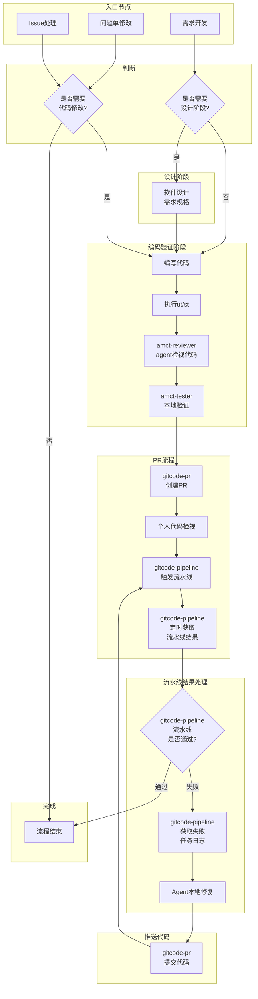

# AMCT 仓 Agent Skills 总览与规划

> 本仓 agent 的 skills 清单与演进规划。`[x]` 已实现、`[ ]` 规划中。
> 分发见下「单一源投影」；入口见根 `AGENTS.md` 与 [../README.md](../README.md)，架构见 [architecture.md](architecture.md)。

## 已实现 —— 量化 agent（本仓主体）

单编排入口 + 3 角色子代理 + 叶子技能：

- [x] **quant-workflow** — 量化全生命周期唯一编排入口（判阶段 / 路由 / 交互门 / 汇总，零执行）
- [x] **quant-tools/** 叶子：
  - [x] **scheme-recommendation** / **algorithm-recommendation** — 方案 / 算法推荐（规划）
  - [x] **quant-run** — 统一执行（直转评测 / 校准提取 / PTQ 训练 / 结果评测）
  - [x] **direct-quant-eval** / **algorithm-validation** — delta / 算法收益判读（只读结果）
  - [x] **deploy-export** — 部署权重导出 + `deploy_quantization.md` 交付
  - [x] **model-adapter** — 新模型适配
- [x] **子代理**：`quant-analyzer`（规划/只读）· `quant-implementer`（执行）· `quant-reviewer`（判读）
- [x] **hooks**：`pre_tool_use`（角色越界保护）· `subagent_stop`（自验证 + 重试上限）

## 已实现 —— 通用协作

- [x] **gitcode-issue** — 读取 Issue、读/回评论
- [x] **gitcode-pr** — 创建 PR、行内检视、cherry-pick
- [x] **default-skills** — 按需安装必备 skill

## 规划中 —— 仓级 dev-workflow（未实现）

面向「需求开发 / 问题单 / Issue → 设计 → 编码验证 → PR → 流水线」的完整研发流，待实现后接入：

- [ ] **superpowers** — 需求开发（软件设计 / 编码 / 用例）
- [ ] **amct-reviewer** — 按编码规范 / 军规 / 设计约束检视代码
- [ ] **amct-builder** — 编译 + 执行 UT/ST
- [ ] **amct-tester** — 生成用例并在 NPU 环境执行
- [ ] **gitcode-pipeline** — 触发 / 查询流水线、获取失败任务日志
- [ ] **install-cann-toolkit** — 下载并安装最新 CANN toolkit

规划流程：需求/问题单/Issue → （设计）→ 编码 → `amct-builder` UT/ST + `amct-reviewer` 检视 + `amct-tester` 真机验证 → `gitcode-pr` 提 PR → `gitcode-pipeline` 触发并轮询流水线 → 失败取日志、本地修、再提。

## 分发：单一源投影（Single Source of Truth）

`.agents/` 为**唯一源**（git tracked，含 skills/agents/hooks/docs + `settings.json`/`opencode.json`）；`scripts/init-agent.sh` 投影生成 `.claude/`（Claude Code）与 `.opencode/`（OpenCode）视图，**均 gitignored**，clone 后跑一次 `bash scripts/init-agent.sh` 生成。一处源、双端一致，不提交生成物、不双份维护。

## 附录：规划中 dev-workflow 流程图

> 下图为规划中的仓级研发流（需求/问题单/Issue → 编码 → 验证 → PR → 流水线）；待 `amct-reviewer` / `amct-builder` / `amct-tester` / `gitcode-pipeline` 等 skill 实现后接入（当前仅 `gitcode-pr` / `gitcode-issue` 已实现）。

