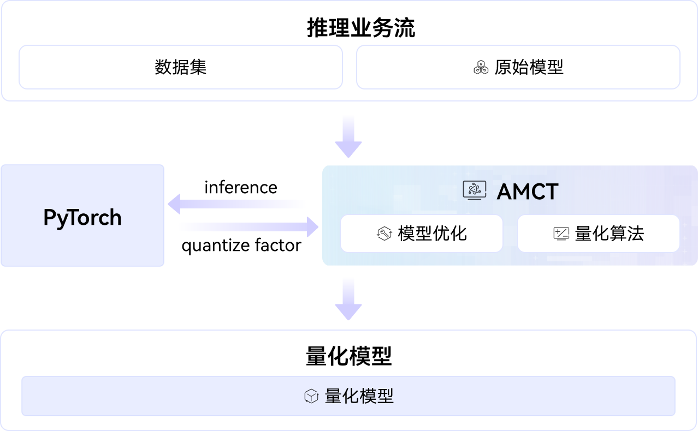

# AMCT

## 🔥Latest News

-   [2025/12/22] AMCT项目首次上线。

## 🚀概述

AMCT（Ascend Model Compression Toolkit，简称AMCT）是一款昇腾AI处理器亲和的深度学习模型压缩工具包，提供多种模型量化压缩特性。压缩后模型体积变小，部署到昇腾AI处理器可使能低比特运算，提高计算效率，达到性能提升的目标。AMCT部署架构图如下：



## 🔍目录结构

```
├── docs                           # AMCT工具文档介绍
├── README.md
├── build.sh                       # 工程编译脚本
├── requirements.txt               # 环境搭建需要的第三方依赖包
├── amct_pytorch                   # 源码
├── examples                       # 端到端样例开发和调用示例
└── tests                          # 测试工程目录
```

## ⚡️快速开始

若您希望快速体验该工具的使用和样例执行，请访问如下文档获取简易教程：

-   [构建验证](docs/build.md)：介绍工具的完整构建、测试与样例运行流程。
-   [样例执行](examples/README.md)：介绍如何端到端执行样例代码。

## 📖学习教程

若您希望深入了解AMCT工具的使用方法，请参见介绍：

-   [量化基础介绍](docs/量化概念.md)：介绍量化相关的概念，比如什么是activation量化、什么是weight量化等。
-   [量化接口介绍](docs/README.md)：介绍使用的量化接口。
-   [量化算法介绍](docs/算法介绍.md)：介绍量化算法，比如AWQ、GPTQ等。

## 📝相关信息

-   [贡献指南](CONTRIBUTING.md)
-   [安全声明](SECURITY.md)
-   [许可证](LICENSE)

