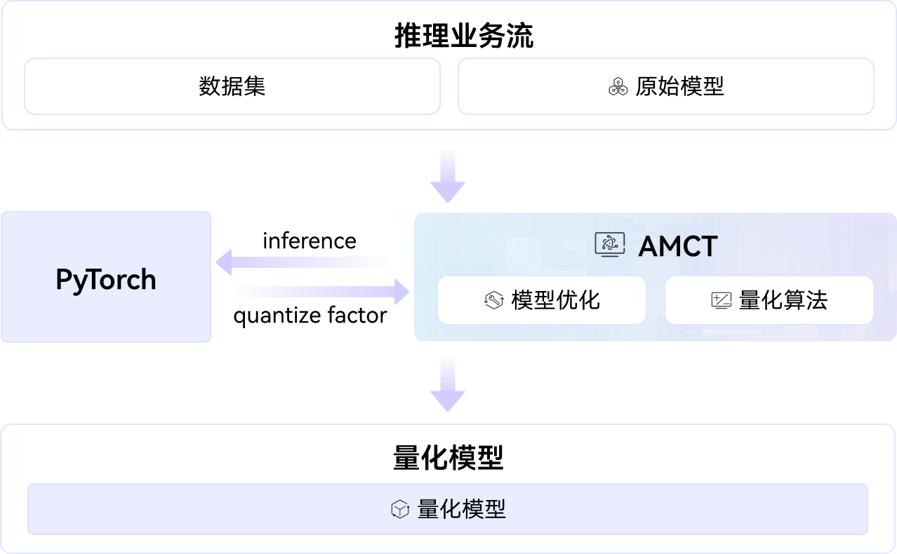

<div align="center">

# AMCT

**Ascend Model Compression Toolkit**

_Ascend NPU Native Model Compression Toolkit_

[](LICENSE)
[](docs/zh/quick_install.md)
[](requirements.txt)

[Quick Start](#-quick-start) · [Features](#-core-features) · [Samples](#-documentation-samples) · [FAQ](#-faq) · [Contribution](#-participate-in-contribution)

</div>

---

## 🔥 Latest Updates

- **[2026/05/28]** Added current mainstream LLM network quantization, PTQ algorithm support, and provided [DeepSeek-V4](./examples/models/deepseekv4/DeepSeekV4-Flash-Walkthrough.md) and [Qwen3.6-MoE](./examples/models/qwen3.6/Qwen3.6-Moe.md) one-stop samples
- **[2026/04/24]** Added [DeepSeek-V4](./amct_pytorch/experimental/deepseek-v4/README.md) model INT8 quantization support
- **[2026/04/17]** Added HiFloat8 quantile quantization (Quantile) algorithm
- **[2026/03/02]** Added HiFloat8 data direct conversion (Cast) algorithm
- **[2026/02/02]** Added HiFloat8 / MXFP8 / MXFP4 data quantization
- **[2025/12/22]** AMCT project first launched 🎉

## 🚀 Overview

AMCT is an Ascend NPU native model quantization compression tool. After quantization, the model size decreases, enabling low-bit operations on Ascend NPU, significantly improving inference performance. The deployment architecture is as follows:

<div align="center">
  
</div>

**Highlights:**

- **🎯 Hardware Affinity** —— Quantization results directly interface with Ascend NPU low-bit computation units
- **🔢 Multi-Precision Full Stack** —— INT8 / INT4 / MXFP8 / MXFP4 / HiFloat8 available
- **🚀 Large Model Ready** —— Native support for frontier models such as DeepSeek-V3.2 / V4


## ✨ Core Features

| Feature Category | Introduction |
|----------|------|
| **PTQ Quantization Algorithms** | Min-Max / AWQ / GPTQ / SmoothQuant and other post-training quantization algorithms, see [Algorithm Introduction](docs/zh/algorithm_brief.md) |
| **HiFloat8 Quantization** | Huawei self-developed 8-bit floating-point format, tapered precision + large dynamic range, see [HiFloat8 Introduction](docs/zh/context/hifloat8_quantization.md) |
| **NPU Custom Operators** | Self-developed operators based on NPU, Ascend C kernel implementation, see [amct_ops](amct_ops/README.md) |
| **Large Model Quantization** | DeepSeek-V3.2 / V4 quantization solutions, see [DeepSeek-V4](./amct_pytorch/experimental/deepseek-v4/README.md) |


## 📊 Performance Benefits

Quantization significantly reduces deployment costs:

| Precision Format | Weight Only (W) | Full Quantization (W+A) | Benefits |
|---------|------------|--------------|------|
| **INT8** | ✅ Min-Max / AWQ / GPTQ | ✅ Min-Max / SmoothQuant | Size **↓50%** · Throughput ↑ |
| **INT4** | ✅ AWQ / GPTQ | ✅ FlatQuant | Size **↓75%** · Low bandwidth friendly |
| **HiFloat8** | ✅ Cast / Quantile / OFMR | ✅ Cast / Quantile / OFMR | Size **↓50%** · Large dynamic range |
| **MXFP8** | ✅ MXQuant | ✅ MXQuant | Size **↓50%** · High precision |
| **MXFP4** | ✅ MXQuant | ✅ MXQuant | Size **↓75%** · Micro-scaling floating-point |


## 📦 Quick Start

### Environment Requirements

| Dependency | Version |
|------|------|
| Python | >=3.9 |
| PyTorch | 2.7.1 or 2.1.0 (NPU acceleration backend requires CPU PyTorch and matching `torch_npu`) |
| GCC / CMake / patch | ≥ 7.3 / ≥ 3.16 (recommended 3.20) / ≥ 2.7 |
| CANN (Toolkit & Ops) | ≥ 8.5.0 (requires pre-installed NPU driver / firmware) |

> ⚠️ For the NPU acceleration backend, install CPU PyTorch before installing the matching `torch_npu`. Do not mix non-CPU PyTorch and `torch_npu` in the same environment.

For complete environment deployment, please refer to [Quick Installation](docs/zh/quick_install.md).

### Installation & Verification

```bash
# 1. Clone source code and install dependencies
git clone https://gitcode.com/cann/amct.git
cd amct
pip3 install -r requirements.txt

# 2. Source code build packaging
bash build.sh --torch

# 3. Install (artifact located in build_out/)
#    ${version} obtained from file name in build_out/ directory, such as amct_pytorch-1.1.0-py3-none-linux_aarch64.tar.gz
#    ${arch}    is CPU architecture, such as x86_64, aarch64
pip3 install build_out/amct_pytorch-${version}-py3-none-linux_${arch}.tar.gz --user
```

> ⚠️ **Note**: If you install with `--no-build-isolation`, pip will not install
> build dependencies automatically. Run `pip install wheel` first, and then add
> `--no-build-isolation` to install the package. Otherwise, installation may
> fail with `error: invalid command 'bdist_wheel'`.

```bash
# Verify AMCT installation
python3 -c "import torch; assert '+cpu' in torch.__version__, 'must use CPU torch for NPU acceleration backend'"
python3 -c "import amct_pytorch as amct; print(f'successfully installed AMCT ')"
```

For more build options and local verification, please refer to [Build Guide](docs/zh/build.md).

### 🏃 One-Stop Platform Quick Experience

The "One-Stop Platform" is an NPU environment provided for developers, internally integrated with complete CANN environment, can be used directly. AMCT provides simplified "Quick Start" paths in corresponding sample READMEs for this platform, helping users complete NPU inference experience with minimal steps. Currently supported models are continuously expanding, please stay tuned:

| Practice                                                                           | Introduction                                                                                             |
|------------------------------------------------------------------------------|------------------------------------------------------------------------------------------------|
| [Qwen3.6-MoE](./examples/models/qwen3.6/Qwen3.6-Moe.md)                      | Complete Qwen3.6-MoE model quantization, data extraction, and PTQ in Atlas A3 environment, providing standard launch process and related configurations for one-stop platform scenarios, helping users quickly get started to complete an end-to-end NPU inference experience. |
| [DeepSeek-V4](examples/models/deepseekv4/DeepSeekV4-Flash-Walkthrough.md) | Complete DeepSeek-V4 Flash model single-card inference in Atlas A3 environment, providing standard launch process and related configurations for one-stop platform scenarios, helping users quickly get started to complete an end-to-end NPU inference experience.    |

## 📖 Documentation Samples

| Topic | Content |
|------|------|
| [Compression Concepts](docs/zh/compression_concepts.md) | Quantization, sparsity, distillation and other basic concepts |
| [LLM Quantization](docs/zh/AMCT_Pytorch_LLM.md) | Quantization features for large language models (LLM) |
| [Compression Features](docs/README.md) | Basic compression features supported by AMCT |
| [API Documentation](docs/zh/api/README.md) | Interface usage instructions |
| [Algorithm Introduction](docs/zh/algorithm_brief.md) | AWQ, GPTQ, SmoothQuant and other algorithm principles |

## 🔍 Directory Structure

```text
amct/
├── amct_pytorch/                  # PyTorch quantization compression core source code
│   ├── algorithms/                 # Quantization algorithm implementation
│   ├── cli/                        # Command-line entry
│   ├── common/                     # Common utilities, models, and data processing
│   ├── configs/                    # Quantization configuration templates
│   ├── experimental/               # Experimental features (HiFloat8, DeepSeek, etc.)
│   ├── quantization/               # Quantization data types and basic modules
│   └── workflows/                  # LLM quantization, evaluation, and deployment workflows
├── amct_ops/                      # AMCT custom NPU operators
├── examples/                      # End-to-end samples and usage examples
├── tests/                         # Unit tests
├── docs/                          # Tool documentation (concepts, APIs, algorithms, etc.)
├── cmake/                         # CMake build configuration
├── build.sh                       # Project compilation script
├── setup.py                       # Python package packaging entry
└── requirements.txt               # Python third-party dependencies
```

## ❓ FAQ

<details>
<summary><strong>Algorithm Selection: When to use AWQ / GPTQ / SmoothQuant?</strong></summary>

| Algorithm | Applicable Scenario | Core Idea |
|------|---------|---------|
| **AWQ** | Large model PTQ, pursuing low quantization error | Activation-aware weight quantization, protecting ~1% significant weights |
| **GPTQ** | Large model PTQ, emphasizing layer-by-layer optimization | Hessian matrix-based weight fine-tuning, minimizing quantization error |
| **SmoothQuant** | Activation distribution difficult scenarios | Migrate activation quantization difficulty to weights, smooth activation outliers |
| **Min-Max** | Entry-level scenarios, simple and fast | Directly take max and min values to calculate quantization factors |

**Recommendation**: For large model weight quantization, prefer AWQ or GPTQ; for W8A8 full quantization scenarios, recommend SmoothQuant; for entry-level learning, recommend Min-Max.

</details>

<details>
<summary><strong>How to handle accuracy drop after quantization?</strong></summary>

**Handling Path (by priority):**

1. **Adjust calibration data amount**: Increase `batch_num` (recommend batch_num × batch_size = 16 or 32)
2. **Fallback sensitive layers**: Identify quantization-sensitive layers (first layer, last layer, layers with few parameters), set `quant_enable: false` in configuration
3. **Adjust quantization algorithm**: Analyze model data distribution characteristics, use appropriate quantization algorithm
4. **Try Quantization-Aware Training (QAT)**: If PTQ cannot meet accuracy, use QAT for retraining

</details>

<details>
<summary><strong>"ModuleNotFoundError: No module named 'torch'" during installation?</strong></summary>

**Reason**: pip version > 25.2, build isolation causes torch not recognized.

**Solution**:

```bash
# Solution 1: Lower pip version
pip install pip==25.2

# Solution 2: Install wheel first, then add --no-build-isolation
pip install wheel
pip3 install build_out/amct_pytorch-${version}-py3-none-linux_${arch}.tar.gz --user --no-build-isolation
```

</details>

For more questions, please check [Compression Features Documentation](docs/README.md) or ask in [Issue](https://gitcode.com/cann/amct/issues).

## 💬 Community Discussion

Welcome to join the AMCT community and participate in discussion and exchange:

| Platform | Usage |
|------|------|
| [GitCode Issue](https://gitcode.com/cann/amct/issues) | Problem feedback, feature suggestions, technical discussion |
| [GitCode Discussions](https://gitcode.com/cann/amct/discussions) | Experience sharing, best practices, community interaction |
| [SIG Discussions](https://gitcode.com/cann/community/blob/master/CANN/sigs/tools/README.md) | Technical decisions, problem handling, project landing |

## 🤝 Participate in Contribution

Welcome to contribute code, algorithms, and documentation, see [Contributing Guide](CONTRIBUTING.md):

- **Simple bug fix**: Submit PR directly
- **New features / interface changes**: First discuss solution in [Issue](https://gitcode.com/cann/amct/issues), reach consensus then submit PR
- **Code style**: C/C++ follows Google standards (based on `.clang-format`), Python follows PEP8; enable `pre-commit` before submission

## 🙏 Acknowledgments

Thanks to all developers who contributed to AMCT!

This project is inspired by the following open source projects:

- [AWQ](https://github.com/mit-han-lab/llm-awq) - Activation-aware weight quantization
- [GPTQ](https://github.com/IST-DASLab/gptq) - GPTQ implementation reference
- [SmoothQuant](https://github.com/mit-han-lab/smoothquant) - Smooth activation quantization
- [FlatQuant](https://github.com/ruikangliu/FlatQuant) - Matrix flat quantization

## 📝 License

This project is open source under [Apache 2.0](LICENSE) agreement. Please read [Security Statement](SECURITY.md) and [Disclaimer](DISCLAIMER.md) before use.
