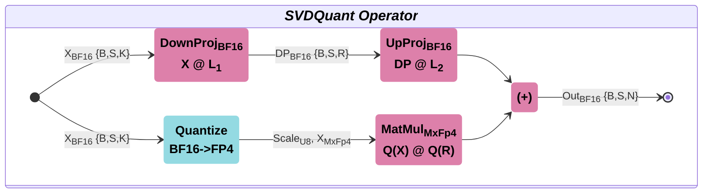

# SVDQuant — 使用混合Mxfp4/Bf16算子的SVD量化方法

SVDQuant 方法使用低秩分支来吸收异常值 

1. 激活异常值转移到权重中  
2. 权重分解为 `L1 & L2 + R`。高精度低秩分支（L1 & L2）用于处理权重异常值  
3. 算子实现为 `X @ L1 @ L2 + Q(X) @ Q(R)`  

该方法在大型语言模型和 AI 代理中具有有效应用。



## 支持的功能特性

- 在处理激活时支持批号。
- 预填充与解码LLM模式
- BF16激活/低秩权重和fp4x2_e2m1权重，用于低精度计算。
- SVDQuant运算符设计用于 Ascend950
- <1% 精度损失
- 目标 batch_num >= 1,  seq-len = [1, 32K]; Rank = 32, 64, 128
- K维度应为32的倍数。
- 形状种类繁多，但以下形状表现更佳 (Seq-len = 1, 32K; Rank = 32)。

|   N   |   K   |
| :---: | :---: |
| 10944 | 2048  |
| 2816  | 2048  |
| 2048  | 2816  |
| 1408  | 2048  |
| 2048  | 3072  |

## 接口说明

### svd_quant (x: Tensor, w: Tensor, s: Tensor, d: Tensor, u: Tensor) -> Tensor

混合 MxFp4/Bf16 精度的矩阵乘法。

**参数说明表**

`B`: 批量大小为零或更多批量维度  
`S`: 序列长度或激活行大小维度  
`N`: 权重列大小  
`K`: 激活列大小  
`ScaleK`: 源自K维度  
`R`: SVD 排名大小  

**输入参数**

NPU 设备

| Tensor | Shape        | torch.dType      | Description                  |
| :----: | :----------- | :--------------- | :--------------------------- |
|   x    | (B,S,K)      | bfloat16         | 激活张量，其中 `'B'` 为空或包含一个或多个批次维度 |
|   w    | (N,K)        | float4_e2m1fn_x2 | 权重低精度张量                      |
|   s    | (N,ScaleK,2) | float8_e8m0fnu   | 重量尺度张量                       |
|   d    | (K,R)        | bfloat16         | 向下投影低秩张量                     |
|   u    | (R,N)        | bfloat16         | 上投影低秩张量                      |

**返回值**:

NPU 设备

`torch.bfloat16` 张量, (B, S, N) 形状

**例外情况**:

`RuntimeError`: Input is not on NPU  
`RuntimeError`: Data Type is wrong  
`RuntimeError`: Invalid input shapes  
`RuntimeError`: K dimension should be a multiple of 32  
`RuntimeError`: Input shapes are incompatible  

---

## 目录结构

```text
svd_quant/            # SVDQuant components
├── op_host/          # Host part of SVDQuant
├── op_kernel/        # SVDQuant kernel files for Ascend950
├── python/
│  ├── svd_quant/
|  |  ├── csrc/       # PyTorch host implementation and TORCH_LIBRARY registration
|  |  └── __init__.py # Python package entry
│  └─ setup.py
├── CMakeLists.txt    # CMake build configuration
└── README.md         # Operator documentation
```

## 环境依赖

| SOC         | Platform                | Nominal UB / core |
| ----------- | ----------------------- | ----------------- |
| `ascend950` | Ascend950PR/Ascend950DT | 512 KB+           |

- CANN 9.0.0
- Python ≥ 3.9
- PyTorch + torch_npu（适配对应 CANN 版本）

## 编译与使用说明

### 1. CANN自定义算子编译与安装指导书 @ Ascend950

```bash
source $ASCEND_HOME_PATH/set_env.sh
path="amct"
cd $path$/amct_ops
bash ops_build.sh --soc ascend950 svd_quant
./output/CANN-custom_ops--linux.aarch64.run --install-path=$ASCEND_HOME_PATH/opp
source $ASCEND_HOME_PATH/opp/vendors/customize/bin/set_env.bash
```

### 2. PyTorch算子安装指南

```bash
cd $path$/amct_ops
pip install ./dist/amct-*.whl --force-reinstall --no-deps
```

### 3. 使用示例

```python
import torch
import torch_npu
import numpy as np
from amct_ops import svd_quant

# Select NPU Device
device = torch.device('npu:0')

# Setup Shapes
bs, seq_len, n, k, rank = (4, 32 * 1024, 512, 4096, 64)
a_shape = (bs, seq_len, k)
w_shape = (n, k)
dp_shape = (k, rank)
up_shape = (rank, n)

# Generate Tensors
x = torch.tensor(np.random.uniform(-10, 10, a_shape), dtype=torch.bfloat16).npu()
w = torch.tensor(np.random.uniform(-10, 10, w_shape), dtype=torch.bfloat16).npu()
dp = torch.tensor(np.random.uniform(-10, 10, dp_shape), dtype=torch.bfloat16).npu()
up = torch.tensor(np.random.uniform(-10, 10, up_shape), dtype=torch.bfloat16).npu()

# Quantize Weights
w_quant, scale = torch_npu.npu_dynamic_mx_quant(w, block_size=32, round_mode="round")

# SVDQuant Execution
svd_quant_out = torch.ops.amct.svd_quant(x, w_quant, scale,  dp, up)
```

## 性能验证

与低精度下降的MatMul BF16相比，SVDQuant在长上下文场景中具有性能优势。

**Test Platform**: Ascend950PR (ascend950, HBM 114688 MB), CANN 9.1.0  
**Scenario**: Batch size = 1, Seq-len = 32K, Rank = 32  

### MatMulV3 BF16 ↔ SVDQuant

| W Shape (N,K)   | BF16 (us) | SVDQuant (us) | Ratio |
|:------------:|:----:|:----:|:---:|
| (10944,2048) | 3446 | 2188 | 1.6 |
| (2816,2048)  | 888  | 691  | 1.3 |
| (1408,2048)  | 488  | 406  | 1.2 |
| (2048,2816)  | 885  | 719  | 1.2 |
| (2048,3072)  | 965  | 808  | 1.2 |

> 小权重矩阵<(2K, 2K) SVDQuant 的效果相对较低，因为目标是具有较大权重张量尺寸的长上下文。

## 精度验证

通过以下条件进行准确性验证：

**黄金数据**: 在低秩和低精度分支上，基于随机BF16数据（激活和权重张量）计算，使用反量化后的激活和权重  
**MxFp4 权重**: 初步计算使用 `torch_npu` 中的 `npu_dynamic_mx_quant` 算子，参数为 `block_size=32` 和 `round_mode="round"`。  
**相对耐受性**: 阈值设置为 `1e-02`  

## 测试方法

```bash
cd $path$/tests/amct_ops
pytest test_svd_quant.py
```

也可以先安装 wheel 后再执行测试：

```bash
cd $path$/amct_ops
pip install dist/amct-1.0-*.whl
pytest test_svd_quant.py
```

