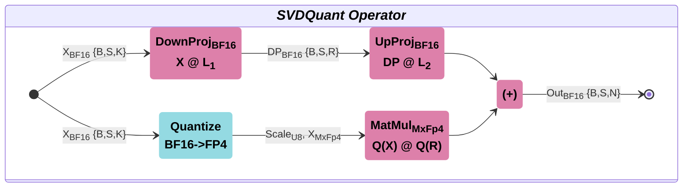

# SVDQuant — SVD Quantization With Mixed Mxfp4/Bf16 Operator

SVDQuant method uses a low-rank branch to absorb outliers

1. Activation outliers transferred to weights
2. Weight decomposed into `L1 & L2 + R`. High-precision low-rank branch (L1 & L2) is used to process weight outliers
3. The operator is implemented as X @ L1 @ L2 + Q(X) @ Q(R)

An effective for usage in Large Language Models and AI agentic.



## Supported Features

- The batch number is supported when processing activation
- Prefill and Decode LLM modes
- BF16 activation/low-rank weights and fp4x2_e2m1 weights for low-precision calculations
- An SVDQuant operator designed for Ascend950
- <1% accuracy drop
- Target batch_num >= 1,  seq-len = [1, 32K]; Rank = 32, 64, 128
- K dimension should be a multiple of 32
- Wide range of shapes, but the following shapes perform better (Seq-len = 1, 32K; Rank = 32)

|   N   |   K   |
| :---: | :---: |
| 10944 | 2048  |
| 2816  | 2048  |
| 2048  | 2816  |
| 1408  | 2048  |
| 2048  | 3072  |

## Interface Description

### svd_quant (x: Tensor, w: Tensor, s: Tensor, d: Tensor, u: Tensor) -> Tensor

Matrix multiplication of mixed MxFp4/Bf16 precision.

**Parameters description:**

`B`: batch size is zero or more batch dimensions  
`S`: sequence length or activation row size dimension  
`N`: weights column size  
`K`: activation column size  
`ScaleK`: derived from K-dimension  
`R`: SVD rank size  

**Input Parameters**

NPU device

| Tensor | Shape        | torch.dType      | Description                                                          |
| :----: | :----------- | :--------------- | :------------------------------------------------------------------- |
| x      | (B,S,K)      | bfloat16         | Activation tensor, where `'B'` is empty or one and more batch dimensions |
| w      | (N,K)        | float4_e2m1fn_x2 | Weight low-precision tensor                                          |
| s      | (N,ScaleK,2) | float8_e8m0fnu   | Weight scales tensor                                                 |
| d      | (K,R)        | bfloat16         | Down projection low-rank tensor                                      |
| u      | (R,N)        | bfloat16         | Up projection low-rank tensor                                        |

**Returns**:

NPU device

`torch.bfloat16` tensor, (B, S, N) shape

**Exceptions**:

`RuntimeError`: Input is not on NPU  
`RuntimeError`: Data Type is wrong  
`RuntimeError`: Invalid input shapes  
`RuntimeError`: K dimension should be a multiple of 32  
`RuntimeError`: Input shapes are incompatible  

---

## Directory Structure

```text
svd_quant/            # SVDQuant components
├── op_host/          # Host part of SVDQuant
├── op_kernel/        # SVDQuant kernel files for Ascend950
├── python/
│  ├── svd_quant/
|  |  ├── csrc/       # PyTorch host implementation and TORCH_LIBRARY registration
|  |  └── __init__.py # Python package entry
│  └─ setup.py
├── CMakeLists.txt    # CMake build configuration
└── README.md         # Operator documentation
```

## Environment Dependencies

| SOC         | Platform                | Nominal UB / core |
| ----------- | ----------------------- | ----------------- |
| `ascend950` | Ascend950PR/Ascend950DT | 512 KB+           |

- CANN 9.0.0
- Python ≥ 3.9
- PyTorch + torch_npu (matching corresponding CANN version)

## Compilation And Usage

### 1. CANN Custom Operator Compilation And Installation @ Ascend950

```bash
source $ASCEND_HOME_PATH/set_env.sh
bash amct_ops/ops_build.sh --soc ascend950
./amct_ops/output/CANN-custom_ops-*.run --quiet --install-path=$ASCEND_HOME_PATH/opp
source $ASCEND_HOME_PATH/opp/vendors/customize/bin/set_env.bash
```

### 2. PyTorch Operator Installation

```bash
pip install ./amct_ops/dist/amct_*.whl --force-reinstall --no-deps
```

### 3. Usage Example

```python
import torch
import torch_npu
import numpy as np
from amct_ops import svd_quant

# Select NPU Device
device = torch.device('npu:0')

# Setup Shapes
bs, seq_len, n, k, rank = (4, 32 * 1024, 512, 4096, 64)
a_shape = (bs, seq_len, k)
w_shape = (n, k)
dp_shape = (k, rank)
up_shape = (rank, n)

# Generate Tensors
x = torch.tensor(np.random.uniform(-10, 10, a_shape), dtype=torch.bfloat16).npu()
w = torch.tensor(np.random.uniform(-10, 10, w_shape), dtype=torch.bfloat16).npu()
dp = torch.tensor(np.random.uniform(-10, 10, dp_shape), dtype=torch.bfloat16).npu()
up = torch.tensor(np.random.uniform(-10, 10, up_shape), dtype=torch.bfloat16).npu()

# Quantize Weights
w_quant, scale = torch_npu.npu_dynamic_mx_quant(w, block_size=32, round_mode="round")

# SVDQuant Execution
svd_quant_out = torch.ops.amct.svd_quant(x, w_quant, scale,  dp, up)
```

## Performance Verification

SVDQuant gives performance advantages for long contexts in compare with MatMul BF16 with low-accuracy drop.

**Test Platform**: Ascend950PR (ascend950, HBM 114688 MB), CANN 9.1.0  
**Scenario**: Batch size = 1, Seq-len = 32K, Rank = 32  

### MatMulV3 BF16 ↔ SVDQuant

| W Shape (N,K)   | BF16 (us) | SVDQuant (us) | Ratio |
|:------------:|:----:|:----:|:---:|
| (10944,2048) | 3446 | 2188 | 1.6 |
| (2816,2048)  | 888  | 691  | 1.3 |
| (1408,2048)  | 488  | 406  | 1.2 |
| (2048,2816)  | 885  | 719  | 1.2 |
| (2048,3072)  | 965  | 808  | 1.2 |

> Small weights matrix <(2K, 2K) SVDQuant effectiveness is relatively low, because a target is long contexts with big weight tensor sizes.  

## Accuracy Verification

Accuracy verification is performed through the following conditions:

**Golden data**: calculated on random BF16 data (activation and weight tensors) on low-rank and low-precision branches with de-quantized activation and weights  
**MxFp4 weights**: preliminary calculated with `npu_dynamic_mx_quant` operator from `torch_npu` with `block_size=32` and `round_mode="round"`  
**Relative tolerance**: threshold is set to `1e-02`  

## Test Method

```bash
PYTHONPATH=amct_ops/staging python3 -m unittest tests.amct_ops.test_svd_quant
```

Can also install wheel first then run tests:

```bash
pip install ./amct_ops/dist/amct_*.whl --force-reinstall --no-deps
PYTHONPATH=amct_ops/staging python3 -m unittest tests.amct_ops.test_svd_quant
```
