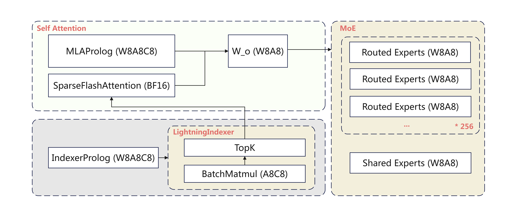

# NPU DeepSeek-V3.2 Quantization Training and Inference

The DeepSeek team has released the latest model DeepSeek-V3.2, which can use the sparse architecture **DeepSeek Sparse Attention (DSA)** to improve computational efficiency for long sequences and reduce inference costs. Long context scenarios and its novel DSA structure jointly present new demands for the inference optimization system.

## Quantization Strategy

Compared to BF16 inference, Int8 quantization can effectively reduce end-to-end latency and improve system throughput. Currently, this sample supports W8A8C8/W4A8C8 quantization, and the quantization architecture is as follows:

The MLA quantization positions are as follows:

- MLAProlog: Except for Q_b_proj using W8A8, other Linear layers are not quantized; KVCache is quantized to C8;
- Sparse Flash Attention: KVCache uses Int8 storage and BF16 computation;
- IndexerProlog: Except for Q_b_proj using W8A8, other Linear layers are not quantized; Indexer Q uses A8 quantization; Indexer Cache uses C8 quantization;
- Lightning Indexer: BatchMatmul uses Int8 computation;
- MoE: Routing experts use W8A8/W4A8 quantization, shared experts use W8A8 quantization;
- MLAEpilog: O_proj uses W8A8 quantization;
- LM_Head: Not quantized temporarily.

**Note:
W8A8: W8 refers to weights using static Per-Channel Int8 quantization, A8 refers to data using dynamic Per-Token Int8 quantization;
A8C8: A8 indicates that Q in Lightning Indexer uses dynamic Per-Token-Head Int8 quantization, and Indexer Cache uses dynamic Per-Token-Head Int8 quantization;
MLAEpilog: O_proj uses W8A8 quantization;
KVCache C8: Indicates that KVCache uses dynamic Per-Token-Head-Tile-128 Int8 quantization;**

### Quantization Purpose
The quantization positions in this sample are strongly coupled with Ascend hardware performance, providing competitive quantization for performance bottlenecks, making deployment friendly.

Under the current W8A8C8 quantization strategy, the quantization coverage of linear layers is relatively low. In MLA linear layers, only `q_b_proj` and `w_o_proj` are quantized, and in the Indexer module, only `wq_b_proj` is quantized. The main reason is that the IndexerProlog fusion operator is designed to have the output format of the `weights_proj` module as fp16 and does not perform quantization, so Linear layers associated with MLA input are uniformly not quantized. The advantage is that the same BF16 data can be input to IndexerProlog and MLAProlog.

Secondly, MLAProlog KVCache quantization strategy uses dynamic storage in 8-bit and computation in 16-bit. In ultra-long sequence scenarios, W8A8C8 quantization accuracy is close to lossless, while weight memory occupancy is optimized by 2x. MLA C8 computation in 16-bit obtains memory benefits, enabling high throughput. On the other hand, LightningIndexer's A8C8 obtains computational benefits, reducing LI computation latency, and TTFT and TPOT are also optimized simultaneously.

The W4A8C8 quantization version for `DeepSeek-V3.2` uses a learning-based quantization algorithm to optimize Clamp parameters, alleviating the difficulty of W4A8 outlier quantization, achieving superior quantization model accuracy. Meanwhile, the W4A8C8 version saves 2x MoE weight memory compared to W8A8C8. Therefore, in large EP scenarios, using W4A8 MoEGMM operators, the same card can accommodate more experts, saving resources and optimizing the compute-to-memory ratio, enabling single-machine deployment.