# 压缩特性介绍

模型压缩是在保证模型性能基本不变的前提下，通过减少参数量、计算量、内存占用与带宽需求，实现模型小型化与推理加速的技术合集。
模型压缩的核心的方法包括量化、剪枝、知识蒸馏和低秩分解等。

量化，是将FP32/FP16/BF16等高精度数据转为INT8/FP8/INT4/FP4等低精度数据，通过减少每个参数的比特数，降低存储占用与内存带宽，同时利用硬件低精度计算单元实现推理加速。
根据优化对象的不同，可以将量化分为权重量化、激活量化和KV-cache量化。上述关于压缩特性的概念解释请参见[压缩概念](./压缩概念.md)。

## AMCT量化流程

量化流程如下图所示：


蓝色部分为用户实现，灰色部分为用户调用AMCT提供的API实现，简要流程如下：

1. 用户首先构造PyTorch的原始模型（请确保原始模型可以正常推理）和量化配置，然后调用[quantize](./api/quantize.md)接口对原始模型进行修改，生成量化校准模型；修改过程中，使用的数据类别不同，量化算法不同。

2. 用户调用[convert](./api/convert.md)接口，将量化校准算子转换为NPU对应的量化部署算子，并输出量化部署模型（类型为torch.nn.Module）。

## 调用示例

以下是关键步骤的代码示例，不能直接拷贝编译运行，仅供参考。

```python
# 1.导入AMCT包
import amct_pytorch as amct

# 2.调用AMCT，量化模型
# 2.1 生成量化校准模型
# 建立待进行量化的网络图结构
ori_model = build_model()
model = copy.deepcopy(ori_model)
# 量化配置
cfg = {
        'batch_num': 1,
        'quant_cfg': {
            'weights': {
                'type': 'int8',
                'symmetric': True,
                'strategy': 'tensor',
            },
        },
        'algorithm': {'minmax'},
      }
# 调用量化接口生成量化校准模型
amct.quantize(model, cfg)

# 2.2 生成量化部署模型
# 调用接口将量化校准模型转换为量化部署模型
amct.convert(model)
```

<details>
<summary><strong>更多方式</strong></summary>

## 基于图的量化方式
AMCT提供了基于图的torch模型量化方式，这种量化方式通过将torch模型转成onnx模型来获取torch模型的图结构，并基于解析的图结构进行量化优化，最后生成onnx量化模型。

### 训练后量化

训练后量化根据量化后是否手动调优量化配置文件，分为[基于精度的自动量化](#基于精度的自动量化)和[手工量化](#手工量化)。训练后量化使用的量化算法请参见[算法介绍](算法介绍.md)。

#### 基于精度的自动量化

基于精度的自动量化是为了方便用户在对量化精度有一定要求时所使用的功能。该方法能够在保证用户所需的模型精度前提下，自动搜索模型的量化配置并执行训练后量化的流程，最终生成满足精度要求的量化模型。

基于精度的自动量化基本原理与手工量化相同，但是用户无需手动调整量化配置文件，大大简化了优化流程，提高量化效率。量化支持的层以及约束请参见[训练后量化支持的层及约束](./api/create_quant_config.md)。

##### 量化流程

接口调用流程如下图所示，蓝色部分为用户实现，灰色部分为用户调用AMCT提供的API实现：
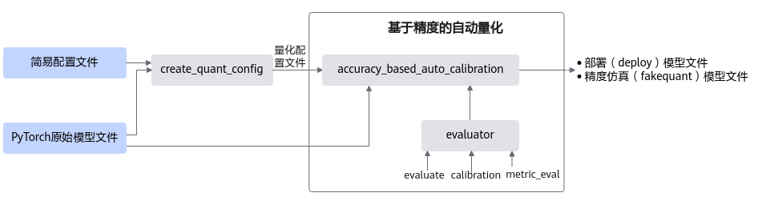

主要流程如下：

1. <a name="li1620271314520"></a>调用[create\_quant\_config](./api/create_quant_config.md)生成量化配置文件，然后调用[accuracy\_based\_auto\_calibration](./api/accuracy_based_auto_calibration.md)进行基于精度的自动量化。
2. <a name="li23141824486"></a>调用[accuracy\_based\_auto\_calibration](./api/accuracy_based_auto_calibration.md)中由用户传入的evaluator实例进行精度测试，得到原始模型精度。

   该过程还会调用[accuracy\_based\_auto\_calibration](./api/accuracy_based_auto_calibration.md)中的量化策略strategy模块，输出初始化的quant config量化配置文件，该文件记录所有层都可以进行量化。

3. 使用用户传入的初始量化配置文件（[1](#li1620271314520)中调用[create\_quant\_config](./api/create_quant_config.md)生成的）对模型进行训练后量化，得到量化后fake quant模型的精度。
4. 原始模型精度与量化后fake quant模型精度进行比较，如果精度达标，则输出量化后的部署模型和fake quant模型，如果不达标，则进行基于精度的自动量化流程：
   1.  进行原始PyTorch网络的推理， dump出每一层的输入activation数据，缓存起来；
   2.  利用训练后量化的量化因子构造量化层的单算子网络，利用缓存的activation数据计算量化后fake quant单算子网络的输出数据和原始PyTorch单算子网络输出的余弦相似度。
   3.  <a name="li411322192712"></a>将余弦相似度的列表传给[accuracy\_based\_auto\_calibration](./api/accuracy_based_auto_calibration.md)中的量化策略strategy模块，strategy模块基于[2](#li23141824486)中生成的初始化的量化配置文件，输出回退某些层后的新的quant config量化配置文件。
   4.  根据quant config量化配置文件重新进行训练后量化，得到回退后的fake quant模型。
   5.  调用[accuracy\_based\_auto\_calibration](./api/accuracy_based_auto_calibration.md)中的evaluator模块进行回退后的fake quant模型精度测试，查看精度是否达标：
       -   如果达标，则输出回退后的fake quant模型以及部署模型。
       -   如果不达标，则将余弦相似度排序最差的层回退，再次进行[4.c](#li411322192712)，输出新的量化配置。
       -   如果回退所有层后精度仍不达标，则不生成量化模型。

[accuracy\_based\_auto\_calibration](./api/accuracy_based_auto_calibration.md)接口内部基于精度的自动量化流程如下图所示。


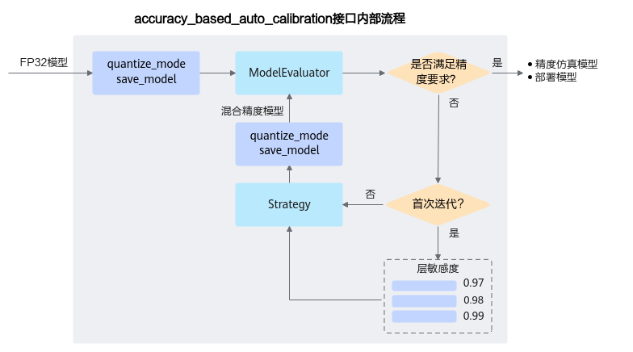

#####  调用示例

本示例演示使用AMCT进行基于精度的自动量化流程。该过程需要用户实现一个模型推理得到精度的回调函数，由于AMCT需要基于回调函数返回的精度数据进行量化层的筛选，因此回调函数的返回数值应尽可能反映模型的精度。

> [!NOTE]说明
>
> -   如下示例标有“由用户补充处理”的步骤，需要用户根据自己的模型和数据集进行补充处理，示例中仅为示例代码。
> -   如下示例调用AMCT的部分，函数入参请根据实际情况进行调整。
> -   以下是关键步骤的代码示例，不能直接拷贝编译运行，仅供参考。

```python
# 1.导入AMCT包
import os
import amct_pytorch as amct
from amct_pytorch.common.auto_calibration import AutoCalibrationEvaluatorBase

# 2.（由用户补充处理）使用原始待量化的模型和测试集，实现回调函数calibration()、evaluate()、metric_eval()
# 上述回调函数的入参要和基类AutoCalibrationEvaluatorBase保持一致。其中：
# calibration()完成校准的推理
# evaluate()完成模型的精度测试过程
# metric_eval()完成原始模型和量化fake quant模型的精度损失评估，当精度损失小于预期值时返回True，否则返回False
class ModelEvaluator(AutoCalibrationEvaluatorBase):
     # The evaluator for model
    def __init__(self, *args, **kwargs):
        # 成员变量初始化
        # 设置预期精度损失，此处请替换为具体的数值
        self.diff = expected_acc_loss
        pass

    def calibration(self, model_file, weights_file):
        # 进行模型的校准推理，推理的batch数要和量化配置的batch_num一致
        pass

    def evaluate(self, model_file, weights_file):
        # evaluate the input models, get the eval metric of model
        pass

    def metric_eval(self, original_metric, new_metric):
        # 评估原始模型精度和量化模型精度的精度损失是否满足预期，满足返回True, 精度损失数据；否则返回False, 精度损失数据
        loss = original_metric - new_metric
        if loss < self.diff:
            return True, loss
        return False, loss

# 3.（由用户补充处理）实例化pytorch模型，得到模型的对象
model = MyNet()

# 4.调用AMCT，进行基于精度的自动量化
# 4.1 生成量化配置
config_json_file = './config.json'
skip_layers = []
batch_num = 1
amct.create_quant_config(config_json_file, model, input_data,
                          skip_layers, batch_num)

scale_offset_record_file = os.path.join(TMP, 'scale_offset_record.txt')
result_path = os.path.join(RESULT, 'model')

# 4.2 初始化Evaluator
evaluator = AutoCalibrationEvaluator()

# 4.3 进行基于精度的量化配置自动搜索
amct.accuracy_based_auto_calibration(
        model=model,
        model_evaluator=evaluator,
        config_file=config_json_file,
        record_file=record_file,
        save_dir=result_path,
        input_data=input_data,
        input_names=['input'],
        output_names=['output'],
        dynamic_axes={
            'input': {0: 'batch_size'},
            'output': {0: 'batch_size'}
        },
        strategy='BinarySearch',
        sensitivity='CosineSimilarity'
    )
```

#### 手工量化

##### 量化流程

训练后量化接口调用流程如下图所示：

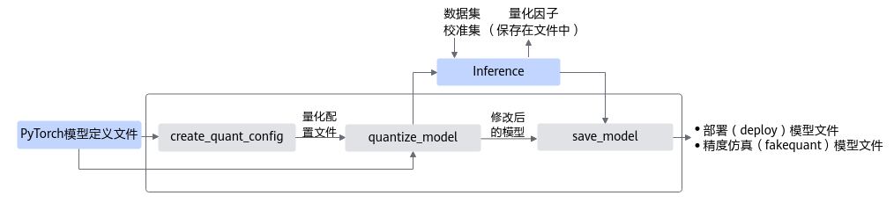

蓝色部分为用户实现，灰色部分为用户调用AMCT提供的API实现，工具使用分为如下场景：

1. 用户首先构造PyTorch的原始模型，然后使用[create\_quant\_config](./api/create_quant_config.md)生成量化配置文件。
2. 根据PyTorch模型和量化配置文件，即可调用[quantize\_model](./api/quantize_model.md)接口对原始PyTorch模型进行优化，优化后的PyTorch模型中包含了量化算法。
3. 使用校准集在PyTorch环境下执行前向推理，产生量化因子，并将量化因子输出到文件中。
4. 最后用户可以调用[save\_model](./api/save_model.md)接口保存量化后的模型，包括可在ONNX执行框架ONNX Runtime环境中进行精度仿真的模型文件和可部署在AI处理器的模型文件。
   - 精度仿真模型文件：ONNX格式的模型文件，模型名中包含fake\_quant，可以在ONNX Runtime环境进行精度仿真。

     fake\_quant模型主要用于验证量化后模型的精度，可以在ONNX Runtime环境下运行。进行前向推理的计算过程中，在fake\_quant模型中对卷积层等的输入数据和权重进行了量化反量化的操作，来模拟量化后的计算结果，从而快速验证量化后模型的精度。如下图所示，以INT8量化为例，Quant层、Conv2d卷积层和DeQuant层之间的数据都是float32数据类型的，其中Quant层将数据量化到INT8又反量化为float32，权重也是量化到INT8又反量化为float32，实际卷积层的计算是基于float32数据类型的，该模型用于在ONNX Runtime环境验证量化后模型的精度，不能够用于ATC工具转换成om模型。

     **图 2**  fake\_quant模型<a name="fig830317361367"></a>  
     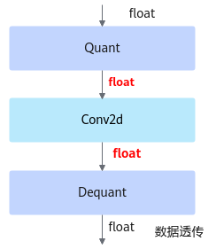

   - 部署模型文件：ONNX格式的模型文件，模型名中包含deploy，经过ATC转换工具转换后可部署到AI处理器。

     以INT8量化为例，deploy模型由于已经将权重等转换为INT8，INT32类型，因此不能在ONNX Runtime环境上执行推理计算。如下图所示，deploy模型的AscendQuant层将float32的输入数据量化为INT8，作为卷积层的输入，权重也是使用INT8数据类型作为计算，在deploy模型中的卷积层的计算是基于INT8，INT32数据类型的，输出为INT32数据类型经过AscendDeQuant层转换成float32数据类型传输给下一个网络层。

     **图 3**  deploy模型<a name="fig32095209306"></a>  
     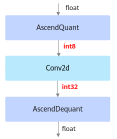

##### 调用示例

> [!NOTE]说明
>-   如下示例标有“由用户补充处理”的步骤，需要用户根据自己的模型和数据集进行补充处理，示例中仅为示例代码。
>-   如下示例调用AMCT的部分，函数入参请根据实际情况进行调整。

1. 导入AMCT包，并通过[工具构建](./build.md)中的环境变量设置日志级别。

   ```python
   import amct_pytorch as amct
   ```

2. <a name="li13259141318410"></a>（可选，由用户补充处理）在PyTorch原始环境中验证推理脚本及环境。

   建议使用原始待量化的模型和测试集，在PyTorch环境下推理，验证环境、推理脚本是否正常。

   推荐执行该步骤，请确保原始模型可以完成推理且精度正常；执行该步骤时，可以使用部分测试集，减少运行时间。

   ```python
   user_do_inference_torch(ori_model, test_data, test_iterations)
   ```

3. 调用AMCT，量化模型。
   1. 生成量化配置。

      ```python
      config_file = './tmp/config.json'
      skip_layers = []
      batch_num = 1
      amct.create_quant_config(config_file=config_file,
      			 model=ori_model,
                               input_data=ori_model_input_data,
      			 skip_layers=skip_layers,
      			 batch_num=batch_num)
      ```

   2. 修改图，在图中插入数据量化，权重量化等相关的算子，用于计算量化相关参数。

      ```python
      record_file = './tmp/record.txt'
      modified_onnx_model = './tmp/modified_model.onnx'
      calibration_model = amct.quantize_model(config_file=config_file,
      					modified_onnx_model=modified_onnx_model,
      					record_file=record_file,
                                              model=ori_model,
                                              input_data=ori_model_input_data)
      ```

   3. （由用户补充处理）基于PyTorch环境，使用修改后的模型（calibration\_model）在校准集（calibration\_data）上做模型推理，生成量化因子。

      该步骤执行时，需要注意如下两点：

      1.  校准集及其预处理过程数据要与模型匹配，以保证量化的精度。
      2.  前向推理次数为batch\_num，如果次数不足，由于校准算子没有将量化因子输出到record文件中，会导致后续读取record校验失败。

      ```python
      user_do_inference_torch(calibration_model, calibration_data, batch_num)
      ```

   4. 保存模型。

      根据量化因子，调用[save\_model](./api/save_model.md)接口，插入AscendQuant、AscendDequant等算子，保存为量化模型。

      ```python
      quant_model_path = './results/user_model'
      amct.save_model(modified_onnx_file=modified_onnx_file,
                      record_file=record_file,
                      save_path=quant_model_path)
      ```

4. （可选，由用户补充处理）基于ONNX Runtime的环境，使用量化后模型（quant\_model）在测试集（test\_data）上做推理，测试量化后仿真模型的精度。

   使用量化后仿真模型精度与[2](#li13259141318410)中的原始精度做对比，可以观察量化对精度的影响。

   ```python
   quant_model = './results/user_model_fake_quant_model.onnx'
   user_do_inference_onnx(quant_model, test_data, test_iterations)
   ```

##### 手工调优

执行训练后量化特性的精度如果不满足要求，可以尝试手动调整config.json文件中的参数，本节给出调整的原则，以及参数解释。

通过[create\_quant\_config](./api/create_quant_config.md)接口生成的config.json文件中的默认配置进行量化，若量化后的推理精度不满足要求，则可调整量化配置重复量化，直至精度满足要求。本节详细介绍手动调优流程，调整对象是训练后量化配置文件config.json中的参数，主要涉及3个阶段：

1. 调整校准使用的数据量。
2. 跳过量化某些层。
3. 调整量化算法及参数。

具体步骤如下：

1. 根据[create\_quant\_config](./api/create_quant_config.md)接口生成的默认配置进行量化。若精度满足要求，则调参结束，否则进行下一步。

2. <a name="li7823183151113"></a>手动修改batch\_num，调整校准使用的数据量。

   batch\_num控制量化使用数据的batch数目，可根据batch大小以及量化需要使用的图片数量调整。通常情况下：

   batch\_num越大，量化过程中使用的数据样本越多，量化后精度损失越小；但过多的数据并不会带来精度的提升，反而会占用较多的内存，降低量化的速度，并可能引起内存、显存、线程资源不足等情况；因此，建议batch\_num\*batch\_size为16或32（batch\_size表示每个batch使用的图片数量）。

3. 若按照[2](#li7823183151113)中的量化配置进行量化后，精度满足要求，则调参结束，否则进行下一步。

4. <a name="li1582383101111"></a>手动修改quant\_enable，跳过量化某些层。

   quant\_enable可以指定该层是否量化，取值为true时量化该层，取值为false时不量化该层，将该层的配置删除也可跳过该层量化。

   在整网精度不达标的时候需要识别出网络中的量化敏感层（量化后误差显著增大），然后取消对量化敏感层的量化动作，识别量化敏感层有两种方法：

   1. 依据网络模型结构，一般网络中首层、尾层以及参数量偏少的层，量化后精度会有较大的下降。
   2. 通过精度比对工具，逐层比对原始模型和量化后模型输出误差（例如以余弦相似度作为标准，需要相似度达到0.99以上），找到误差较大的层，优先对其进行回退。

5. 若按照[4](#li1582383101111)中的量化配置进行量化后，精度满足要求，则调参结束，否则进行下一步。

6. <a name="li6823133201119"></a>手动修改activation\_quant\_params和weight\_quant\_params，调整量化算法及参数：

   算法参数意义请参见[训练后量化配置参数](./context/训练后量化配置参数.md)，算法说明请参见[算法介绍](算法介绍.md)。

7. 若按照[6](#li6823133201119)中的量化配置进行量化后，精度满足要求，则调参结束，否则表明量化对精度影响很大，不能进行量化，去除量化配置。

**图 4**  调参流程<a name="zh-cn_topic_0240188709_fig10376759162410"></a>  
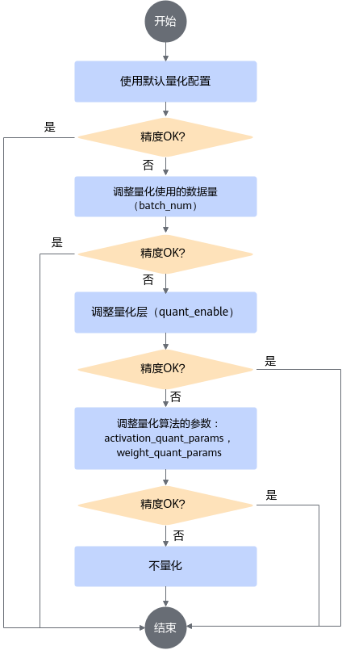

### 量化感知训练

#### 量化流程

量化感知训练接口调用流程如下图所示，如下流程中的训练环境借助PyTorch框架的CPU环境或者NPU环境，在该开源框架的推理脚本基础上，调用AMCT  API完成模型压缩，压缩后的部署模型需要使用ATC工具转换成适配AI处理器的离线模型后，然后才能在AI处理器上实现推理。量化感知训练使用的量化算法请参见[算法介绍](算法介绍.md)。


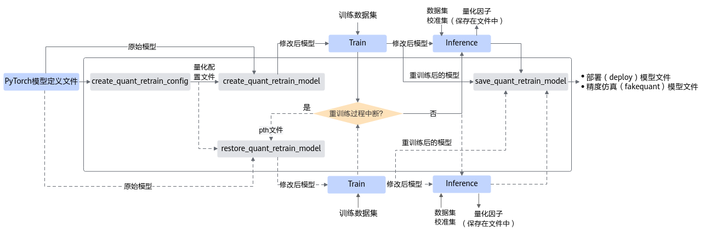

蓝色部分为用户实现，灰色部分为用户调用AMCT提供的API实现：

1. 用户首先构造PyTorch的原始模型，调用[create\_quant\_retrain\_config](./api/create_quant_retrain_config.md)接口生成量化配置文件。
2. 调用[create\_quant\_retrain\_model](./api/create_quant_retrain_model.md)接口对原始模型进行修改，修改后的模型中插入了数据量化、权重量化等相关算子，用于计算量化相关参数。
3. 对修改后的模型进行训练，如果训练未中断，将训练后的模型进行推理，进行推理的过程中，会将量化因子写出到record文件中。

   如果训练过程中断，则可基于保存的pth模型参数和量化配置文件，重新调用[restore\_quant\_retrain\_model](./api/restore_quant_retrain_model.md)接口，输出修改后的retrain network，继续进行量化感知的训练，然后进行推理。

4. 调用[save\_quant\_retrain\_model](./api/save_quant_retrain_model.md)接口，插入AscendQuant、AscendDequant等量化算子，保存量化模型。

#### 调用示例

> [!NOTE]说明
>1.  基于PyTorch环境进行训练，当前仅支持distributed模式（即DistributedDataParallel模式）的多卡训练，不支持DataParallel模式的多卡训练，使用DP模式训练会报错。
>2.  调用AMCT的部分，函数入参可以根据实际情况进行调整。量化感知训练基于用户的训练过程，请确保已经有基于PyTorch环境进行训练的脚本，并且训练后的精度正常。
>3.  使用AMCT的量化感知训练特性时，如果训练过程卡死，请检查当前服务器是否有其他ONNX Runtime程序在运行（可以用**top**命令查看服务器所有进程），如果有，请先暂停其他ONNX Runtime程序，重新执行量化感知训练。
>4.  参考本章节进行量化，模型中存在PyTorch自定义算子时，可能存在无法导出生成ONNX模型，从而导致量化失败的问题。具体报错信息如下：'Model cannot be quantized for it cannot be export to onnx!' 。此时，您可以参考[单算子模式的量化感知训练](#单算子模式的量化感知训练)章节，进行单算子模式的量化。
>5.  如下示例标有“由用户补充处理”的步骤，需要用户根据自己的模型和数据集进行补充处理，示例中仅为示例代码。

1. 导入AMCT包，并通过[工具构建](./build.md)中的环境变量设置日志级别。

   ```python
   import amct_pytorch as amct
   ```

2. <a name="li341817311449"></a>（可选，由用户补充处理）建议使用原始待量化的模型和测试集，在PyTorch环境下推理，验证环境、推理脚本是否正常。

   推荐执行该步骤，请确保原始模型可以完成推理且精度正常；执行该步骤时，可以使用部分测试集，减少运行时间。

   ```python
   ori_model.load()
   # 测试模型
   user_test_model(ori_model, test_data, test_iterations)
   ```

3. 调用AMCT，执行量化流程。
   1. 生成量化配置。

      实现该步骤前，应先恢复训练好的参数，如[1](zh-cn_topic_0000001113175684.md#li341817311449)中的ori\_model.load\(\)。

      ```python
      config_file = './tmp/config.json'
      simple_cfg = './retrain.cfg'
      amct.create_quant_retrain_config(config_file=config_file,
                                       model=ori_model,
                                       input_data=ori_model_input_data,
                                       config_defination=simple_cfg)
      ```

   2. <a name="li4981151425915"></a>修改模型。

      在模型ori\_model插入数据量化、权重量化等相关算子，用于计算量化相关参数，然后保存为新的训练模型retrain\_model。

      ```python
      record_file = './tmp/record.txt'
      quant_retrain_model = amct.create_quant_retrain_model(config_file=config_file,
      						      model=ori_model,
      						      record_file=record_file,
      						      input_data=ori_model_input_data)
      ```

   3. （由用户补充处理）使用修改后的图，创建反向梯度，在训练集上做训练，训练量化因子。
      1. 使用修改后的图，创建反向梯度。该步骤需要在[3.b](#li4981151425915)后执行。

         ```python
         optimizer = user_create_optimizer(quant_retrain_model)
         ```

      2. 从训练好的checkpoint恢复模型，并训练模型。

         注意：从训练好的checkpoint恢复模型参数后再训练；训练中保存的参数应该包括量化因子：前batch\_num次训练后会生成量化因子，如果训练次数少于batch\_num会导致失败。

         ```python
         quant_pth = './ckpt/user_model'
         user_train_model(optimizer, quant_retrain_model, train_data)
         ```

      3. 训练完成后，执行推理，计算量化因子并保存。

         ```python
         user_infer_graph(quant_retrain_model)
         ```

   4. 保存量化模型。

      根据量化因子以及用户重训练好的模型，调用[save\_quant\_retrain\_model](./api/save_quant_retrain_model.md)接口，插入AscendQuant、AscendDequant等算子，保存为量化模型。

      ```python
      quant_model_path = './result/user_model'
      amct.save_quant_retrain_model(config_file=config_file,
                                    model=quant_retrain_model,
                                    record_file=record_file,
                                    save_path=quant_model_path,
                                    input_data=ori_model_input_data)
      ```

      说明：如果重训练过程每一轮都调用该接口保存模型，可能会导致重训异常，建议重训练完毕后调用该接口保存模型。

4. （可选，由用户补充处理）基于ONNX Runtime的环境，使用量化后模型（quant\_model）在测试集（test\_data）上做推理，测试量化后仿真模型的精度。

   使用量化后仿真模型精度与[2](#li341817311449)中的原始精度做对比，可以观察量化对精度的影响。

   ```python
   quant_model = './results/user_model_fake_quant_model.onnx'
   user_do_inference_onnx(quant_model, test_data, test_iterations)
   ```

**如果训练过程中断，需要从ckpt中恢复数据，继续训练，则调用流程为：**

1. 导入AMCT包，并通过[工具构建](./build.md)中的环境变量设置日志级别。

   ```python
   import amct_pytorch as amct
   ```

2. 准备原始模型。

   ```python
   ori_model= user_create_model()
   ```

3. 调用AMCT，恢复量化训练流程。
   1. <a name="li413111408612"></a>修改模型，在模型ori\_model插入量化相关的算子，保存为新的训练模型retrain\_model。

      ```python
      config_file = './tmp/config.json'
      simple_cfg = './retrain.cfg'
      record_file = './tmp/record.txt'
      quant_pth_file = './ckpt/user_model_newest.ckpt'
      quant_retrain_model = amct.restore_quant_retrain_model(config_file=config_file,
      						       model=ori_model,
      						       record_file=record_file,
      	                                               input_data=ori_model_input_data,
      	                                               pth_file=quant_pth_file)
      ```

   2. （由用户补充处理）使用修改后的图，创建反向梯度，在训练集上做训练，训练量化因子。
      1. 使用修改后的图，创建反向梯度。该步骤需要在[3.a](#li413111408612)后执行。

         ```python
         optimizer = user_create_optimizer(retrain_model)
         ```

      2. 从训练好的checkpoint恢复模型，并训练模型。

         注意：从训练好的checkpoint恢复模型参数后再训练；训练中保存的参数应该包括量化因子：前batch\_num次训练后会生成量化因子，如果训练次数少于batch\_num会导致失败。

         ```python
         user_train_model(optimizer, retrain_model, train_data)
         ```

      3. 训练完成后，执行推理，计算量化因子并保存。

         ```python
         user_infer_graph(train_graph, retrain_ops[-1].output_tensor)
         ```

   3. 保存模型。

      ```python
      quant_model_path = './result/user_model'
      amct.save_quant_retrain_model(config_file=config_file,
                                    model=ori_model,
                                    record_file=record_file,
                                    save_path=quant_model_path,
                                    input_data=ori_model_input_data)
      ```

4. （可选，由用户补充处理）基于ONNX Runtime的环境，使用量化后模型（quant\_model）在测试集（test\_data）上做推理，测试量化后仿真模型的精度。

   使用量化后仿真模型精度与[2](#li341817311449)中的原始精度做对比，可以观察量化对精度的影响。

   ```python
   quant_model = './results/user_model_fake_quant_model.onnx'
   user_do_inference_onnx(quant_model, test_data, test_iterations)
   ```

#### 手工调优

执行量化感知训练特性后的精度如果不满足要求，可以尝试手动调整config.json文件中的参数，本节给出调整的原则，以及参数解释。

通过[create\_quant\_retrain\_config](./api/create_quant_retrain_config.md)接口生成的config.json文件中的默认配置进行量化，若量化后的推理精度不满足要求，则按照如下步骤调整量化配置文件中的参数。

1. 根据[create\_quant\_retrain\_config](./api/create_quant_retrain_config.md)接口生成的默认配置进行量化。若精度满足要求，则调参结束，否则进行下一步。

2. INT8量化场景下，可以将部分量化层取消量化，即将其"retrain\_enable"参数修改为"false"，通常模型首尾层对推理结果影响较大，故建议优先取消首尾层的量化；如果用户有推荐的clip\_max和clip\_min的参数取值，则可以按照如下方式修改量化配置文件：

   ```json
   {
       "version":1,
       "batch_num":1,
       "layername1":{
           "retrain_enable":true,
           "retrain_data_config":{
               "algo":"ulq_quantize",
               "clip_max":3.0,
               "clip_min":-3.0
           },
           "retrain_weight_config":{
               "algo":"arq_retrain",
               "channel_wise":true
           }
       },
       "layername2":{
           "retrain_enable":true,
           "retrain_data_config":{
               "algo":"ulq_quantize",
               "clip_max":3.0,
               "clip_min":-3.0
           },
           "retrain_weight_config":{
               "algo":"arq_retrain",
               "channel_wise":true
           }
       }
   }
   ```

3. 完成配置后，精度满足要求则调参结束；否则表明量化感知训练对精度影响很大，不能进行量化感知训练，去除量化感知训练配置。

配置文件中参数说明请参见[量感知训练配置参数说明](./context/量化感知训练配置参数.md)。

### 单算子模式的量化感知训练

#### 功能介绍

参考[量化感知训练](#量化感知训练)章节进行基础量化时，量化的内部处理逻辑需要将原始模型转换成ONNX模型，并在ONNX模型基础上进行图的修改操作，此时若模型中存在Pytorch自定义算子时，可能存在无法导出生成ONNX模型，从而导致量化失败的问题。

单算子模式的量化感知训练功能，提供由Pytorch原生算子转换生成的自定义QAT算子，基于该算子进行量化因子的重训练，量化因子作为算子参数保存在QAT单算子中，**无需导出ONNX模型**，可以避免上述量化感知训练方案中的算子导出异常问题。训练完成后，通过**torch.onnx.export**机制，建立QAT算子与ONNX原生算子的映射关系，将Pytorch模型中QAT算子计算获得的参数传递给ONNX原生量化算子，完成模型导出。简易示意图如下图所示。

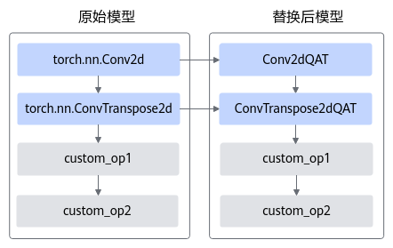

实现原理如下图所示（以torch.nn.Conv2d算子为例进行说明）：

在torch原生算子torch.nn.Conv2d中插入ARQ权重量化，ULQ数据量化算子，进行量化因子的重训练，将量化因子作为算子参数保存在Conv2dQAT单算子中，最终调用torch.onnx.export接口，将QAT自定义算子通过映射关系导出成ONNX原生量化算子QuantizeLinear与DequantizeLinear，带有此两个量化算子的模型又称QDQ（Quantize and DeQuantize，简称QDQ）ONNX模型，QDQ格式模型具体介绍请参见[Link](https://onnxruntime.ai/docs/performance/quantization.html)。

QDQ ONNX模型不能直接通过ATC工具转成适配AI处理器的离线模型，需要通过[QAT模型适配CANN模型](<https://hiascend.com/document/redirect/CannCommunityToolAmct_ConvertQAT_Model>)特性，将该模型适配成CANN模型后，然后才能使用ATC工具进行下一步的转换。


该功能支持Training from scratch和Fine-tune两种使用方法：

- Training from scratch：**使用QAT算子直接构图**，从零开始训练。您可以在模型构建脚本中调用[单算子模式](./api/README.md)提供的直接构造接口构造QAT算子，使用该算子进行模型构建。
- Fine-tune：**在已有网络基础上，对待量化算子进行替换**，相比于Training from scratch更为常用。如果您已经完成模型构建，您可以调用[单算子模式](./api/README.md)提供的基于原生算子构造接口，进行QAT算子构造；之后可以参考下文样例中的算子替换方案，对网络模型中的待量化算子进行替换。

QAT算子规格如下表所示：

<a name="table69463311346"></a>

<table><thead align="left"><tr id="row179476303418"><th class="cellrowborder" valign="top" width="16.05839416058394%" id="mcps1.2.5.1.1"><p id="p629775412918"><a name="p629775412918"></a><a name="p629775412918"></a>待量化算子类型</p>
</th>
<th class="cellrowborder" valign="top" width="15.418458154184583%" id="mcps1.2.5.1.2"><p id="p59476317345"><a name="p59476317345"></a><a name="p59476317345"></a>替换后算子类型</p>
</th>
<th class="cellrowborder" valign="top" width="50.34496550344964%" id="mcps1.2.5.1.3"><p id="p89470353414"><a name="p89470353414"></a><a name="p89470353414"></a>限制</p>
</th>
<th class="cellrowborder" valign="top" width="18.17818218178182%" id="mcps1.2.5.1.4"><p id="p59471732344"><a name="p59471732344"></a><a name="p59471732344"></a>备注</p>
</th>
</tr>
</thead>
<tbody><tr id="row2094723143420"><td class="cellrowborder" valign="top" width="16.05839416058394%" headers="mcps1.2.5.1.1 "><p id="p1929725415291"><a name="p1929725415291"></a><a name="p1929725415291"></a>torch.nn.Conv2d</p>
</td>
<td class="cellrowborder" valign="top" width="15.418458154184583%" headers="mcps1.2.5.1.2 "><p id="p59474320349"><a name="p59474320349"></a><a name="p59474320349"></a>Conv2dQAT</p>
</td>
<td class="cellrowborder" valign="top" width="50.34496550344964%" headers="mcps1.2.5.1.3 "><a name="ul143605432616"></a><a name="ul143605432616"></a><ul id="ul143605432616"><li>padding_mode为zeros</li><li>只支持4维输入</li></ul>
</td>
<td class="cellrowborder" rowspan="4" valign="top" width="18.17818218178182%" headers="mcps1.2.5.1.4 "><p id="p713110161816"><a name="p713110161816"></a><a name="p713110161816"></a>复用层（共用weight和bias参数）不支持量化。</p>
</td>
</tr>
<tr id="row9947536345"><td class="cellrowborder" valign="top" headers="mcps1.2.5.1.1 "><p id="p4297185402911"><a name="p4297185402911"></a><a name="p4297185402911"></a>torch.nn.ConvTranspose2d</p>
</td>
<td class="cellrowborder" valign="top" headers="mcps1.2.5.1.2 "><p id="p17947113143414"><a name="p17947113143414"></a><a name="p17947113143414"></a>ConvTranspose2dQAT</p>
</td>
<td class="cellrowborder" valign="top" headers="mcps1.2.5.1.3 "><a name="ul154411347463"></a><a name="ul154411347463"></a><ul id="ul154411347463"><li>padding_mode为zeros</li><li>只支持4维输入</li></ul>
</td>
</tr>
<tr id="row1494715383411"><td class="cellrowborder" valign="top" headers="mcps1.2.5.1.1 "><p id="p5344050319"><a name="p5344050319"></a><a name="p5344050319"></a>torch.nn.Conv3d</p>
</td>
<td class="cellrowborder" valign="top" headers="mcps1.2.5.1.2 "><p id="p1894713320342"><a name="p1894713320342"></a><a name="p1894713320342"></a>Conv3dQAT</p>
</td>
<td class="cellrowborder" valign="top" headers="mcps1.2.5.1.3 "><a name="ul72031530619"></a><a name="ul72031530619"></a><ul id="ul72031530619"><li>padding_mode为zeros，</li><li>dilation_d为1</li><li>只支持5维输入</li></ul>
</td>
</tr>
<tr id="row594718313414"><td class="cellrowborder" valign="top" headers="mcps1.2.5.1.1 "><p id="p715801183117"><a name="p715801183117"></a><a name="p715801183117"></a>torch.nn.Linear</p>
</td>
<td class="cellrowborder" valign="top" headers="mcps1.2.5.1.2 "><p id="p49474316347"><a name="p49474316347"></a><a name="p49474316347"></a>LinearQAT</p>
</td>
<td class="cellrowborder" valign="top" headers="mcps1.2.5.1.3 "><p id="p199471231348"><a name="p199471231348"></a><a name="p199471231348"></a>不支持channel wise</p>
</td>
</tr>
</tbody>
</table>

#### 调用示例

Training from scratch方式代码样例：

```python
import torch
import torch.nn as nn

import amct_pytorch as amct
from amct_onnx.convert_model import convert_qat_model
from amct_pytorch.nn.module.quantization.conv2d import Conv2dQAT
from amct_pytorch.nn.module.quantization.linear import LinearQAT


# QAT算子量化配置项
config = {
    "retrain_data_config": {
        "dst_type": "INT8",
        "batch_num": 10,
        "fixed_min": False,
        "clip_min": None,
        "clip_max": None
    },
    "retrain_weight_config": {
        "dst_type": "INT8",
        "weights_retrain_algo": "arq_retrain",
        "channel_wise": False
    }
}

# 使用QAT单算子构造Lenet网络
net = torch.nn.Sequential(
    Conv2dQAT(1, 6, kernel_size=5, padding=2, config=config), nn.Sigmoid(),
    nn.AvgPool2d(kernel_size=2, stride=2),
    Conv2dQAT(6, 16, kernel_size=5, config=config), nn.Sigmoid(),
    nn.AvgPool2d(kernel_size=2, stride=2),
    nn.Flatten(),
    LinearQAT(16 * 5 * 5, 120, config=config), nn.Sigmoid(),
    LinearQAT(120, 84, config=config), nn.Sigmoid(),
    LinearQAT(84, 10, config=config)
)

# 训练
train(net, train_data, test_data)
# 导出中间模型
torch.onnx.export(model, data, 'inter_model.onnx')

# 导出fake quant模型与deploy模型
# 生成lenet_fake_quant_model.onnx，可在 ONNX 执行框架 ONNX Runtime 进行精度仿真的模型。
# 生成lenet_deploy_model.onnx，可在AI 处理器部署的模型文件。
convert_qat_model('inter_model.onnx', './outputs/lenet')

# 使用fake quant模型进行精度仿真
validate_onnx('./outputs/lenet_fake_quant_model.onnx', val_data)
```

Fine-tune方式代码样例：

```python
import torch
from torchvision.models.resnet import resnet101

import amct_pytorch as amct
from amct_onnx.convert_model import convert_qat_model
from amct_pytorch.nn.module.quantization.conv2d import Conv2dQAT

model = resnet101(pretrained=True)
# QAT算子量化配置项
config = {
    "retrain_data_config": {
        "dst_type": "INT8",
        "batch_num": 10,
        "fixed_min": False,
        "clip_min": None,
        "clip_max": None
    },
    "retrain_weight_config": {
        "dst_type": "INT8",
        "weights_retrain_algo": "arq_retrain",
        "channel_wise": True
    }
}

def _set_module(model, submodule_key, module):
    # 将模型中原生算子替换为qat算子
    tokens = submodule_key.split('.')
    sub_tokens = tokens[:-1]
    cur_mod = model
    for s in sub_tokens:
        cur_mod = getattr(cur_mod, s)
    setattr(cur_mod, tokens[-1], module)

for name, module in model.named_modules():
    # 遍历原图中各节点，将类型为Conv2d的torch原生算子替换为自定义QAT单算子
    if isinstance(module, torch.nn.Conv2d):
        qat_module = Conv2dQAT.from_float(
            module, config=config)
        _set_module(model, name, qat_module)

# 训练流程
train_and_val(model, train_data, test_data)
# 导出中间模型
torch.onnx.export(model, data, 'inter_model.onnx')

# 导出fake quant模型与deploy模型
# 生成resnet101_fake_quant_model.onnx，可在 ONNX 执行框架 ONNX Runtime 进行精度仿真的模型。
# 生成resnet101_deploy_model.onnx，可在AI 处理器部署的模型文件。
convert_qat_model('inter_model.onnx', './outputs/resnet101')

# 使用fake quant模型进行精度仿真
validate_onnx('./outputs/resnet101_fake_quant_model.onnx', val_data)
```


### 量化数据均衡预处理

在一些数据分布不均匀的场景，由于离群值的影响，对数据进行per-tensor量化得到的结果误差较大，而per-channel量化可以获得更低的误差。但由于当前硬件不支持数据per-channel量化，仅支持权重per-channel量化；在该背景下AMCT设计出一套方法，本节将给出详细介绍。

通过数据均衡预处理接口计算出均衡因子，将模型数据与权重进行数学等价换算，均衡模型数据与权重的分布，将数据的量化难度迁移一部分至权重，从而降低量化误差。该特性支持的层及约束请参见[量化支持的层及约束](./api/create_quant_config.md)。

#### 量化流程

均衡预处理接口调用流程如下图所示。

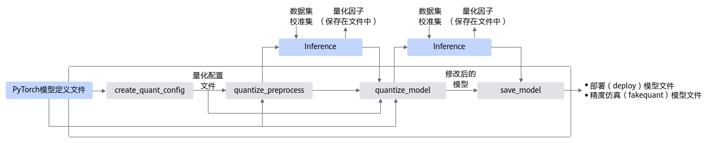

蓝色部分为用户实现，灰色部分为用户调用AMCT提供的API实现，工具使用分为如下场景：

1.  用户首先构造PyTorch的原始模型，并在简易配置文件_dmp\_quant.cfg_中设置dmq参数（简易配置文件配置参数请参见[训练后量化简易配置文件](./context/训练后量化简易配置文件.md)中的DMQBalancer），然后将配置文件传入[create\_quant\_config](./api/create_quant_config.md)。
2.  <a name="li16458161113715"></a>根据PyTorch模型和量化配置文件，即可调用[quantize\_preprocess](./api/quantize_preprocess.md)接口对原始PyTorch模型进行优化，优化后的PyTorch模型中包含了均衡量化算法。
3.  使用校准集在PyTorch环境下执行**一次**前向推理，产生均衡量化因子，并将均衡量化因子输出到文件中。
4.  根据PyTorch模型、量化配置文件和record文件，即可调用[quantize\_model](./api/quantize_model.md)接口对原始PyTorch模型再次进行优化，优化后的PyTorch模型中包含了量化算法。
5.  使用校准集在PyTorch环境下执行前向推理，产生量化因子，并将量化因子输出到文件中。
6.  最后用户可以调用[save\_model](./api/save_model.md)接口保存量化后的模型，包括可在ONNX执行框架ONNX Runtime环境中进行精度仿真的模型文件和可部署在AI处理器的模型文件。

#### 调用示例

> [!NOTE]说明 
>-   如下示例标有“由用户补充处理”的步骤，需要用户根据自己的模型和数据集进行补充处理，示例中仅为示例代码。
>-   如下示例调用AMCT的部分，函数入参请根据实际情况进行调整。

1. 导入AMCT包，并通过[工具构建](./build.md)中的环境变量设置日志级别。

   ```python
   import amct_pytorch as amct
   ```

2. （可选，由用户补充处理）在PyTorch原始环境中验证推理脚本及环境。

   建议使用原始待量化的模型和测试集，在PyTorch环境下推理，验证环境、推理脚本是否正常。

   推荐执行该步骤，请确保原始模型可以完成推理且精度正常；执行该步骤时，可以使用部分测试集，减少运行时间。

   ```python
   user_do_inference_torch(ori_model, test_data, test_iterations)
   ```

3. 调用AMCT，量化模型。
   1. 生成量化配置。

      用户在简易配置文件_dmp\_quant.cfg_中设置dmq参数，并将配置文件通过config\_defination参数传入[create\_quant\_config](./api/create_quant_config.md)。

      ```python
      config_defination = os.path.join(PATH, 'dmp_quant.cfg')
      config_file = './tmp/config.json'
      skip_layers = []
      batch_num = 1
      amct.create_quant_config(config_file=config_file,
      			        model=ori_model,
                                      input_data=ori_model_input_data,
      			        skip_layers=skip_layers,
      			        batch_num=batch_num,
                                      config_defination=config_defination)
      ```

   2. 修改图，在图中插入均衡量化算子，用于计算均衡量化因子。

      ```python
      record_file = './tmp/record.txt'
      modified_onnx_model = './tmp/modified_model.onnx'
      calibration_model = amct.quantize_preprocess(config_file=config_file,
      					            record_file=record_file,
                                                          model=ori_model,
                                                          input_data=ori_model_input_data)
      ```

   3. （由用户补充处理）基于PyTorch环境，使用修改后的模型（calibration\_model）在校准集（calibration\_data）上做模型推理，找到均衡量化因子。

      该步骤执行时，需要注意如下两点：

      1.  校准集及其预处理过程数据要与模型匹配，以保证量化的精度。
      2.  前向推理的次数为1，如果次数超过1次，每执行一次推理，record中均衡量化因子会被记录一次，后续过程会失败。

      ```python
      user_do_inference_torch(calibration_model, calibration_data, test_iterations=1)
      ```

   4. 修改图，在图中插入数据量化，权重量化等相关的算子，用于计算量化相关参数。

      ```python
      modified_onnx_model = './tmp/modified_model.onnx'
      calibration_model = amct.quantize_model(config_file=config_file,
      					       modified_onnx_model=modified_onnx_model,
      					       record_file=record_file,
                                                     model=ori_model,
                                                     input_data=ori_model_input_data)
      ```

   5. （由用户补充处理）基于PyTorch环境，使用修改后的模型（calibration\_model）在校准集（calibration\_data）上做模型推理，生成量化因子。

      该步骤执行时，需要注意如下两点：

      1.  校准集及其预处理过程数据要与模型匹配，以保证量化的精度。
      2.  前向推理的次数为batch\_num，如果次数不够，后续过程会失败。

      ```python
      user_do_inference_torch(calibration_model, calibration_data, batch_num)
      ```

   6. 保存模型。

      根据量化因子，调用[save\_model](./api/save_model.md)接口，插入AscendQuant、AscendDequant等算子，保存为量化模型。

      ```python
      quant_model_path = './results/user_model'
      amct.save_model(modified_onnx_file=modified_onnx_file,
                             record_file=record_file,
                             save_path=quant_model_path)
      ```

4. （可选，由用户补充处理）基于ONNX Runtime的环境，使用量化后模型（quant\_model）在测试集（test\_data）上做推理，测试量化后仿真模型的精度。

   使用量化后仿真模型精度与[2](#li16458161113715)中的原始精度做对比，可以观察量化对精度的影响。

   ```python
   quant_model = './results/user_model_fake_quant_model.onnx'
   user_do_inference_onnx(quant_model, test_data, test_iterations)
   ```


### KV Cache量化

KV Cache（Key-Value Cache）是一种缓存技术，通过存储键值对的形式来复用计算结果，以达到提高性能和降低内存消耗的目的。在大规模训练和推理中，随着batch\_size和sequence\_length的不断增长，KV Cache占用的内存开销也快速增大，甚至会超过模型本身；而对KV Cache进行INT8量化可以大幅度减少模型运行中的内存消耗，降低模型部署成本。

**KV Cache量化支持的层：torch.nn.Linear，原始数据类型为float32和float16**。

#### 量化流程

KV Cache量化接口调用流程如下图所示。

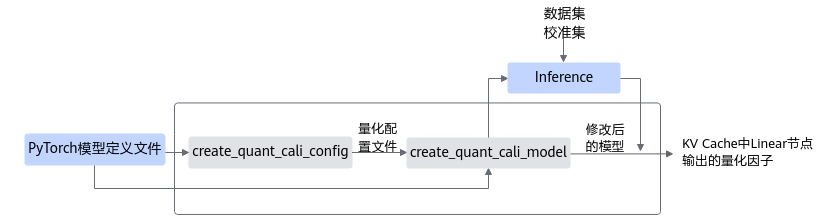

蓝色部分为用户实现，灰色部分为用户调用AMCT提供的API实现，简要流程如下：

1.  用户首先构造PyTorch的原始模型，然后使用[create\_quant\_cali\_config](./api/create_quant_cali_config.md)生成量化配置文件。
2.  根据PyTorch模型和量化配置文件，找到模型对应的待量化Linear算子，即可调用[create\_quant\_cali\_model](./api/create_quant_cali_model.md)接口对原始PyTorch模型进行修改，在Linear输出后添加IFMR/HFMG量化算子。
3.  使用校准集在PyTorch环境下执行前向推理，根据量化算法配置调用IFMR/HFMG量化算法对输出做校准，并将结果依据对应格式输出到量化因子文件中。

**如果用户需要支持更多算子类型，或者用户自定义了其他操作，则可以使用[QuantCalibrationOp](./api/QuantCalibrationOp.md)接口，进行构图，然后进行量化校准，并输出量化因子文件。**

#### 调用示例

> [!NOTE]说明
>-   如下示例标有“由用户补充处理”的步骤，需要用户根据自己的模型和数据集进行补充处理，示例中仅为示例代码。
>-   如下示例调用AMCT的部分，函数入参请根据实际情况进行调整。

1. 导入AMCT包，并通过[工具构建](./build.md)中的环境变量设置日志级别。

   ```python
   import amct_pytorch as amct
   ```

2. （可选，由用户补充处理）在PyTorch原始环境中验证推理脚本及环境。

   建议使用原始待量化的模型和测试集，在PyTorch环境下推理，验证环境、推理脚本是否正常。

   推荐执行该步骤，请确保原始模型可以完成推理且精度正常；执行该步骤时，可以使用部分测试集，减少运行时间。

   ```python
   user_do_inference_torch(ori_model, test_data, test_iterations)
   ```

3. 调用AMCT，量化模型。
   1. 解析量化配置quant.cfg，生成量化配置文件。

      ```python
      config_file = './tmp/config.json'
      amct.create_quant_cali_config(config_file=config_file,
      			         model=ori_model,
      			         quant_layers=None,
      			         config_defination="./configs/quant.cfg")
      ```

   2. 修改图，在图插入量化相关的算子，用于计算量化相关参数。

      找到模型对应的待量化Linear算子，在Linear输出后插入IFMR/HFMG量化算子，在线校准计算对应量化因子，以便后续将输出量化为INT8。

      ```python
      record_file = './tmp/record.txt'
      calibration_model = amct.create_quant_cali_model(config_file=config_file,
      					            record_file=record_file,
      					            model=ori_model)
      ```

   3. （由用户补充处理）基于PyTorch环境，使用修改后的模型（calibration\_model）在校准集（calibration\_data）上做模型推理，生成量化因子。

      该步骤执行时，需要注意如下两点：

      1.  校准集及其预处理过程数据要与模型匹配，以保证量化的精度。
      2.  前向推理的次数为batch\_num，如果次数不够，后续过程会失败。

      校准过程中如果提示\[IFMR\]: Do layer xxx data calibration failed!错误信息，则请参见[校准执行过程中提示“\[IFMR\]: Do layer xxx data calibration failed!”](zh-cn_topic_0000002548668601.md)解决。

      ```python
      user_do_inference_torch(calibration_model, calibration_data, batch_num)
      ```

   4. 输出量化因子文件。


## 稀疏
AMCT提供了基于图的torch模型稀疏方法，这种方法通过将torch模型转成onnx模型来获取torch模型的图结构，并基于解析的图结构进行稀疏优化，最后生成onnx量化模型。

### 通道稀疏

#### 自动通道稀疏
##### 功能介绍

当前通道稀疏支持对不同的层做不同稀疏率的稀疏处理，但逐层设置稀疏率对用户的使用门槛较高，对于某一层，如何选择稀疏率（即配置中的prune\_ratio）是比较困难的，手工尝试的配置需要进行重训练，耗费时间多。针对上述问题，引入自动通道稀疏搜索特性，根据用户模型来计算各通道的稀疏敏感度（影响精度）以及稀疏收益（影响性能），然后搜索策略依据稀疏敏感度和稀疏收益来搜索最优的逐层通道稀疏率，以平衡精度和性能。

- 稀疏敏感度：稀疏敏感度定义为当前通道稀疏后对整网精度的影响估计，稀疏敏感度越大代表当前通道稀疏后整网精度损失越大，默认算法根据loss\(w - w<sub>i</sub>\)的泰勒展开计算通道稀疏敏感度。支持用户自定义计算方式。裁剪第i个通道后，稀疏敏感度计算公式如下：

  

  采用近似估计的方法对loss\(w - w<sub>i</sub>\)进行泰勒展开，目前考虑到计算量只算一阶。

- 稀疏收益：当前通道的稀疏收益用比特复杂度表示，为计算量化Flops与计算比特位宽之积：

  

  其中，Flops为浮点计算量，act\_bit为数据的数据精度，wts\_bit为权重的数据精度。

自动通道稀疏搜索流程如下图所示，支持稀疏的层以及规格请参见[通道稀疏支持的层以及约束](./api/create_prune_retrain_model.md)。


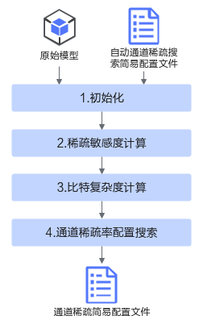

各流程简要说明如下：

1. 初始化：初始化动作首先需要解析用户模型以及稀疏配置（可选），分析网络中可通道稀疏层及其对应的通道稀疏配置（是否有用户指定配置稀疏率），生成通道稀疏配置生成的搜索空间：解析用户目标压缩率配置。

   - 搜索空间：为支持通道稀疏的层，但是没有通过override\_layer\_configs或者override\_layer\_types配置稀疏率。
   - 压缩率：定义为原模型比特复杂度与稀疏后模型比特复杂度之比。

2. 敏感度计算：计算每个通道的稀疏敏感度，内置基于损失估计的敏感度计算方法，使用泰勒展开的一次项估计裁剪该通道后网络loss的变化；支持用户自定义敏感度计算方法。

3. 比特复杂度计算：计算每个通道的比特复杂度，视为通道的稀疏收益。

4. 通道稀疏率配置搜索：默认采用[自动通道稀疏搜索算法](算法介绍.md)，搜索满足用户指定压缩率的最优通道稀疏率配置；支持用户自定义求解器。

   > [!NOTE]说明 
   > 自动通道稀疏搜索特性只是生成通道稀疏的简易配置文件，若想得到最终稀疏后模型，还需要进行[手工稀疏](#手工稀疏)，将上述生成的简易配置文件作为入参传入通道稀疏。

##### 稀疏流程

接口调用流程如下图所示，蓝色部分为用户实现，灰色部分为用户调用AMCT提供的API实现。

用户准备好PyTorch的模型、自动通道稀疏搜索配置文件，调用[auto\_channel\_prune\_search](./api/auto_channel_prune_search.md)，根据压缩率、各通道的稀疏敏感度以及稀疏收益，执行自动通道稀疏搜索，得到可用作通道稀疏的简易配置文件。其中，sensitivity模块与search\_alg模块用户可以自定义或者使用接口内部默认方法。

- sensitivity模块实现计算各通道的稀疏敏感度。
- search\_alg模块实现了基于通道敏感度与通道稀疏收益进行稀疏通道搜索的过程。

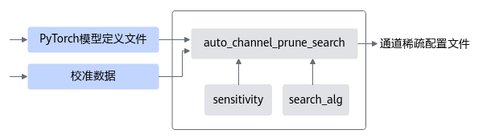

##### 调用示例

本示例演示了使用AMCT进行自动通道稀疏搜索的流程，该过程需要用户传入PyTorch模型与校准数据，用户可选择自定义实现sensitivity模块与search\_alg模块。

> [!NOTE]说明 
>-   如下示例标有“由用户补充处理”的步骤，需要用户根据自己的模型和数据集进行补充处理，示例中仅为示例代码。
>-   如下示例调用AMCT的部分，函数入参请根据实际情况进行调整。

1. 导入AMCT包，并通过[工具构建](./build.md)中的环境变量设置日志级别。

   ```python
   import amct_pytorch as amct
   ```

2. （可选，由用户补充处理）实现sensitivity模块，获取各个layer各通道的敏感度，为后续的搜索算法提供数据。可参考系统默认sensitivity模块：_AMCT安装目录_

   amct\_pytorch/auto\_channel\_prune\_search.py下的TaylorLossSensitivity方法，简要流程如下：

   ```python
   from amct.common.auto_channel_prune.sensitivity_base import SensitivityBase
   
   class Sensitivity(SensitivityBase)
       def __init__(self)
           pass
       def setup_initialization(self, graph_tuple, input_data, test_iteration):
           # 必要的初始化
           # graph_tuple (graph, graph_info)
           pass
       def get_sensitivity(self, search_records):
           # 获取敏感度方法，计算后写到record中
           pass
   ```

3. （可选，由用户补充处理）实现搜索算法search\_alg模块，需要用户实现channel\_prune\_search回调接口，根据通道敏感度与通道稀疏收益进行稀疏通道搜索。可参考系统默认search\_alg模块：_AMCT安装目录_/amct\_pytorch/common/auto\_prune/search\_channel\_base.py文件中GreedySearch方法。

   ```python
   from amct.common.auto_prune.search_channel_base import SearchChannelBase
   
   class Search(SearchChannelBase)
       def __init__(self)
           # 初始化
           pass
   
       def channel_prune_search(self, graph_info, search_records, prune_config):
           """
           输入：
           graph_info: dict，包含图中各算子的通道数量与比特复杂度信息，可用于计算压缩率
           search_records: protobuf对象，包含待搜索的可稀疏层
           prune_config: 三元组-目标压缩率（float）、昇腾亲和优化开关（bool）、单层最大稀疏率（float）
           输出：
           dict，key为待搜索的可稀疏层层名，value为01组成的list，对应该通道是否应稀疏
           """
           pass
   ```

4. （可选，由用户补充处理）获取PyTorch模型，在环境下推理，验证环境、推理脚本是否正常。执行该步骤时，可以使用部分测试集，减少运行时间。

   ```python
   ori_model.load()
   # 测试模型
   user_test_model(ori_model, test_data, test_iterations)
   ```

5. （由用户补充处理）构造校准数据。

   ```python
   input_data = []
   for _ in range(test_iteration):
       input_data.append(user_load_feed_dict())
   ```

6. 调用AMCT，进行自动通道稀疏搜索。

   ```python
   output_prune_cfg = './prune.cfg'
   amct.auto_channel_prune_search(
       model=model, 
       config=cfg_file, 
       input_data=input_data,
       output_cfg=output_prune_cfg,
       sensitivity='TaylorLossSensitivity',
       search_alg='GreedySearch')
   ```


#### 手工稀疏

##### 稀疏流程

通道稀疏功能接口调用流程如下图所示，如下流程中的训练环境借助PyTorch框架的CPU环境或者NPU环境，在该开源框架的推理脚本基础上，调用AMCT  API完成模型压缩，压缩后的部署模型需要使用ATC工具转换成适配AI处理器的离线模型后，然后才能在AI处理器上实现推理：

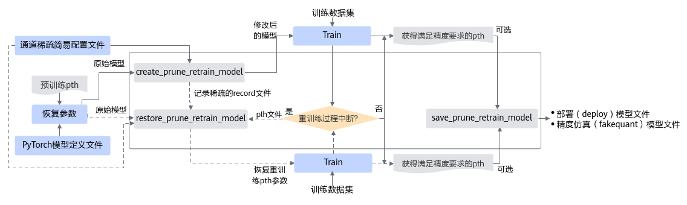

蓝色部分为用户实现，灰色部分为用户调用AMCT提供的API实现：

1.  用户首先构造PyTorch的原始模型，调用[create\_prune\_retrain\_model](./api/create_prune_retrain_model.md)接口对原始模型进行修改，在图结构中插入通道稀疏mask算子，修改后的模型参数量被裁剪。
2.  对修改后的模型进行训练，直至精度满足要求；如果训练过程中断，则可基于原始模型和记录稀疏信息的文件，重新调用[restore\_prune\_retrain\_model](./api/restore_prune_retrain_model.md)接口稀疏模型，继续进行量化感知的训练，直至精度满足要求。
3.  根据最终的重训练好的通道稀疏模型，生成满足精度要求的pth文件；或者调用[save\_prune\_retrain\_model](./api/save_prune_retrain_model.md)接口，生成最终ONNX仿真模型以及部署模型。


##### 调用示例

> [!NOTE]说明 
>1.  如下示例标有“由用户补充处理”的步骤，需要用户根据自己的模型和数据集进行补充处理，示例中仅为示例代码。
>2.  调用AMCT的部分，函数入参可以根据实际情况进行调整。稀疏基于用户的训练过程，请确保已经有基于PyTorch环境进行训练的脚本，并且训练后的精度正常。

1. 导入AMCT包，并通过[工具构建](./build.md)中的环境变量设置日志级别。

   ```python
   import amct_pytorch as amct
   ```

2. <a name="li341817311449"></a>（可选，由用户补充处理）建议使用原始待稀疏的模型和测试集，在PyTorch环境下推理，验证环境、推理脚本是否正常。

   推荐执行该步骤，请确保原始模型可以完成推理且精度正常；执行该步骤时，可以使用部分测试集，减少运行时间。

   ```python
   ori_model.load()
   # 测试模型
   user_test_model(ori_model, test_data, test_iterations)
   ```

3. 调用AMCT，执行带稀疏算子的训练流程。
   1. 对原始模型进行修改，在图结构中插入通道稀疏mask算子。

      实现该步骤前，应先恢复训练好的参数，如[2](#li341817311449)中的ori\_model.load\(\)。

      ```python
      simple_cfg = './retrain.cfg'
      record_file = './tmp/record.txt'
      prune_retrain_model = amct.create_prune_retrain_model(model=ori_model,
                                      input_data=ori_model_input_data,
                                      config_defination=simple_cfg,
                                      record_file=record_file)
      ```

   2. （由用户补充处理）使用修改后的图，创建反向梯度，在训练集上做训练。
      1. 使用修改后的图，创建反向梯度。

         该步骤需要在稀疏模型后执行。

         ```python
         optimizer = user_create_optimizer(prune_retrain_model)
         ```

      2. 从训练好的checkpoint恢复模型，并训练模型。

         注意：从训练好的checkpoint恢复模型参数后再训练。

         ```python
         quant_pth = './ckpt/user_model'
         user_train_model(optimizer, prune_retrain_model, train_data)
         ```

   3. （可选）如果调用[save\_prune\_retrain\_model](./api/save_prune_retrain_model.md)接口，则需要参考该步骤，如果保存为pth文件则不需要。

      保存模型，实现通道稀疏。

      ```python
      prune_retrain_model = amct.save_prune_retrain_model(
           model=pruned_retrain_model,
           save_path=save_path,
           input_data=input_data)
      ```

4. （由用户补充处理）基于ONNX Runtime的环境，使用通道稀疏后模型（prune\_retrain\_model）在测试集（test\_data）上做推理，测试量化后仿真模型的精度。

   使用稀疏后仿真模型精度与[2](#li341817311449)中的原始精度做对比，可以观察通道稀疏对精度的影响。

   ```python
   prune_retrain_model = './results/user_model_fake_prune_model.onnx'
   user_do_inference_onnx(prune_retrain_model, test_data, test_iterations)
   ```

**如果训练过程中断，需要从ckpt中恢复数据，继续训练，则调用流程为：**

1. 准备原始模型。

   ```python
   ori_model= user_create_model()
   ```

2. 调用AMCT，恢复量化训练流程。
   1. 修改模型，在图结构中插入通道稀疏mask算子，保存为新的prune\_model。

      ```python
      model = ori_model
      input_data = ori_model_input_data
      record_file = './tmp/record.txt'
      config_defination = './prune_cfg.cfg'
      save_pth_path = /your/path/to/save/tmp.pth
      model.load_state_dict(torch.load(state_dict_path))
      prune_retrain_model = amct.restore_prune_retrain_model(model=ori_model,
                                                             input_data=ori_model_input_data,
                                                             record_file=record_file,
                                                             config_defination='./prune_cfg.cfg',
                                                             save_pth_path=/your/path/to/save/tmp.pth,
                                                             'state_dict')
      ```

   2. （由用户补充处理）使用修改后的模型，恢复断点，创建反向梯度，在训练集上做训练。
      1. 从稀疏后训练中断的checkpoint恢复模型参数。

         ```python
         quant_pth = './ckpt/user_prune_model'
         user_train_model(optimizer, prune_retrain_model, train_data)
         ```

      2. 使用修改后的图，创建反向梯度。

         该步骤需要在恢复模型参数后执行。

         ```python
         optimizer = user_create_optimizer(prune_retrain_model)
         ```

      3. 从训练好的checkpoint恢复模型，并训练模型。

         注意：从训练好的checkpoint恢复模型参数后再训练。

         ```python
         user_train_model(optimizer, prune_retrain_model, train_data)
         ```

   3. （可选）如果调用[save\_prune\_retrain\_model](./api/save_prune_retrain_model.md)接口，则需要参考该步骤，如果保存为pth文件则不需要。

      保存模型，实现通道稀疏。

      ```python
      prune_retrain_model = amct.save_prune_retrain_model(
           model=pruned_retrain_model,
           save_path=save_path,
           input_data=input_data)
      ```

3. （由用户补充处理）基于ONNX Runtime的环境，使用通道稀疏后模型（prune\_retrain\_model）在测试集（test\_data）上做推理，测试量化后仿真模型的精度。

   使用稀疏后仿真模型精度与[2](#li341817311449)中的原始精度做对比，可以观察通道稀疏对精度的影响。

   ```python
   prune_retrain_model = './results/user_model_fake_prune_model.onnx'
   user_do_inference_onnx(prune_retrain_model, test_data, test_iterations)
   ```


##### 后续处理

如果稀疏后输出的模型为pth格式，则需要参考该章节，如果调用[save\_prune\_retrain\_model](./api/save_prune_retrain_model.md)接口，则不需要。

由于输出的pth模型无法直接用于推理，需要用户自行将pth模型转成ONNX网络模型，或者调用[save\_prune\_retrain\_model](./api/save_prune_retrain_model.md)接口保存为最终ONNX仿真模型以及部署模型，然后才能使用ATC工具进行模型转换。调用[save\_prune\_retrain\_model](./api/save_prune_retrain_model.md)接口的调用示例如下：

```python
prune_retrain_model = amct.10.6.3-save_prune_retrain_model(
     model=pruned_retrain_model,
     save_path=save_path,
     input_data=input_data)
```

##### 手工调优

稀疏后，如果精度不满足要求，可以参见本节提供的方法进行调优。

如果按照某组配置稀疏模型后，经过重训练精度未满足要求，则可以修改简易配置文件（文件配置请参见[量化感知训练简易配置文件](./context/量化感知训练简易配置文件.md)）重新稀疏模型并重训练。常用的方法包括：

-   调整稀疏率，由简易配置文件中的**prune\_ratio**参数控制，用户可尝试减小稀疏率并重新进行稀疏来进行调试。
-   某些层不做稀疏，由简易配置文件中的**regular\_prune\_skip\_layers**参数控制，通过该参数配置不需要稀疏的层。


### 4选2结构化稀疏

#### 稀疏流程

4选2结构化稀疏功能接口调用流程如下图所示，如下流程中的训练环境借助PyTorch框架的CPU环境或者NPU环境，在该开源框架的推理脚本基础上，调用AMCT  API完成模型压缩，压缩后的部署模型需要使用ATC工具转换成适配AI处理器的离线模型后，然后才能在AI处理器上实现推理：

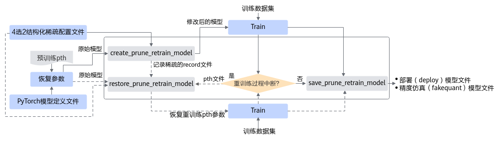

蓝色部分为用户实现，灰色部分为用户调用AMCT提供的API实现：

1.  用户首先构造PyTorch的原始模型，调用[create\_prune\_retrain\_model](./api/create_prune_retrain_model.md)接口对原始模型进行修改，把待稀疏的算子替换成插入了4选2结构化稀疏的算子。
2.  对修改后的模型进行训练，直至精度满足要求；如果训练过程中断，则可基于原始模型和记录稀疏信息的文件，重新调用[restore\_prune\_retrain\_model](./api/restore_prune_retrain_model.md)接口稀疏模型，继续进行量化感知的训练，直至精度满足要求。
3.  根据用户最终的重训练好的4选2结构化稀疏模型，调用[save\_prune\_retrain\_model](./api/save_prune_retrain_model.md)接口，还原替换的算子并对weight进行稀疏，生成最终ONNX仿真模型以及部署模型。

#### 调用示例

> [!NOTE]说明 
>1.  如下示例标有“由用户补充处理”的步骤，需要用户根据自己的模型和数据集进行补充处理，示例中仅为示例代码。
>2.  调用AMCT的部分，函数入参可以根据实际情况进行调整。稀疏基于用户的训练过程，请确保已经有基于PyTorch环境进行训练的脚本，并且训练后的精度正常。

1. <a name="li341817311449"></a>（可选，由用户补充处理）建议使用原始待量化的模型和测试集，在PyTorch环境下推理，验证环境、推理脚本是否正常。

   推荐执行该步骤，请确保原始模型可以完成推理且精度正常；执行该步骤时，可以使用部分测试集，减少运行时间。

   ```python
   ori_model.load()
   # 测试模型
   user_test_model(ori_model, test_data, test_iterations)
   ```

2. 调用AMCT，执行4选2结构化稀疏流程。
   1. 对原始模型进行修改，把待稀疏的算子替换成插入了4选2结构化稀疏的算子。

      实现该步骤前，应先恢复训练好的参数，如[1](zh-cn_topic_0000001314585948.md#li341817311449)中的ori\_model.load\(\)。

      ```python
      simple_cfg = './retrain.cfg'
      record_file = './tmp/record.txt'
      prune_retrain_model = amct.create_prune_retrain_model(model=ori_model,
                                      input_data=ori_model_input_data,
                                      config_defination=simple_cfg,
                                      record_file=record_file)
      ```

   2. （由用户补充处理）使用修改后的图，创建反向梯度，在训练集上做训练。
      1. 使用修改后的图，创建反向梯度。

         该步骤需要在稀疏模型后执行。

         ```python
         optimizer = user_create_optimizer(prune_retrain_model)
         ```

      2. 从训练好的checkpoint恢复模型，并训练模型。

         注意：从训练好的checkpoint恢复模型参数后再训练。

         ```python
         quant_pth = './ckpt/user_model'
         user_train_model(optimizer, prune_retrain_model, train_data)
         ```

   3. 调用[save\_prune\_retrain\_model](./api/save_prune_retrain_model.md)接口，保存模型，还原替换的算子并对weight进行结构化稀疏，生成最终ONNX仿真模型以及部署模型。

      ```python
      prune_retrain_model = amct.save_prune_retrain_model(
           model=pruned_retrain_model,
           save_path=save_path,
           input_data=input_data)
      ```

3. （可选，由用户补充处理）基于ONNX Runtime的环境，使用稀疏后模型（prune\_retrain\_model）在测试集（test\_data）上做推理，测试量化后仿真模型的精度。

   使用稀疏后仿真模型精度与[1](#li341817311449)中的原始精度做对比，可以观察4选2结构化稀疏对精度的影响。

   ```python
   prune_retrain_model = './results/user_model_fake_prune_model.onnx'
   user_do_inference_onnx(prune_retrain_model, test_data, test_iterations)
   ```

**如果训练过程中断，需要从ckpt中恢复数据，继续训练，则调用流程为：**

1. 准备原始模型。

   ```python
   ori_model= user_create_model()
   ```

2. 调用AMCT，恢复量化训练流程。
   1. 修改模型，把待稀疏的算子替换成插入了4选2结构化稀疏的算子，保存为新的prune\_model。

      ```python
      model = ori_model
      input_data = ori_model_input_data
      record_file = './tmp/record.txt'
      config_defination = './prune_cfg.cfg'
      save_pth_path = /your/path/to/save/tmp.pth
      model.load_state_dict(torch.load(state_dict_path))
      prune_retrain_model = amct.restore_prune_retrain_model(model=ori_model,
                                                             input_data=ori_model_input_data,
                                                             record_file=record_file,
                                                             config_defination='./prune_cfg.cfg',
                                                             save_pth_path=/your/path/to/save/tmp.pth,
                                                             'state_dict')
      ```

   2. （由用户补充处理）使用修改后的模型，恢复断点，创建反向梯度，在训练集上做训练。
      1. 从稀疏后训练中断的checkpoint恢复模型参数。

         ```python
         quant_pth = './ckpt/user_prune_model'
         user_train_model(optimizer, prune_retrain_model, train_data)
         ```

      2. 使用修改后的图，创建反向梯度。

         该步骤需要在恢复模型参数后执行。

         ```python
         optimizer = user_create_optimizer(prune_retrain_model)
         ```

      3. 从训练好的checkpoint恢复模型，并训练模型。

         注意：从训练好的checkpoint恢复模型参数后再训练。

         ```python
         user_train_model(optimizer, prune_retrain_model, train_data)
         ```

   3. 调用[save\_prune\_retrain\_model](./api/save_prune_retrain_model.md)接口，保存模型，还原替换的算子并对weight进行结构化稀疏，生成最终ONNX仿真模型以及部署模型。

      ```python
      prune_retrain_model = amct.save_prune_retrain_model(
           model=pruned_retrain_model,
           save_path=save_path,
           input_data=input_data)
      ```

3. （可选，由用户补充处理）基于ONNX Runtime的环境，使用稀疏后模型（prune\_retrain\_model）在测试集（test\_data）上做推理，测试量化后仿真模型的精度。

   使用稀疏后仿真模型精度与[1](#li341817311449)中的原始精度做对比，可以观察4选2结构化稀疏对精度的影响。

   ```python
   prune_retrain_model = './results/user_model_fake_prune_model.onnx'
   user_do_inference_onnx(prune_retrain_model, test_data, test_iterations)
   ```


#### 手工调优

稀疏后，如果精度不满足要求，可以参见本节提供的方法进行调优。

如果按照某组配置稀疏模型后，经过重训练精度未满足要求，则可以修改简易配置文件（文件配置请参见[量化感知训练简易配置文件](./context/量化感知训练简易配置文件.md)）重新稀疏模型并重训练。常用的方法包括：

-   调整更新间隔（计算哪些元素被保留的间隔），由简易配置文件中的**update\_freq**参数控制，用户可尝试将更新间隔改为正整数并重新进行稀疏来进行调试，一般来说更新间隔越小精度收益越大。
-   某些层不做稀疏，由简易配置文件中的**regular\_prune\_skip\_layers**参数控制，通过该参数配置不需要稀疏的层。


### 组合压缩

组合压缩是针对同一个网络模型，既进行量化又进行稀疏的操作，具体支持什么样的组合压缩方式，本章节给出详细介绍。

#### 组合压缩方式

目前组合压缩支持如下组合方式，使用AMCT进行压缩时，每层可压缩算子每次只能选择其中一种组合压缩方式，简要流程如下图所示。

-   [手工稀疏](#手工稀疏)+[量化感知训练](#量化感知训练)  INT8量化
-   [4选2结构化稀疏](#4选2结构化稀疏)+[量化感知训练](#量化感知训练)  INT8量化

当前组合压缩特性的压缩配置由用户手动处理（故又称之为静态组合压缩，压缩配置文件配置方法请参见[量化感知训练简易配置文件](./context/量化感知训练简易配置文件.md)），通过手动设置全局量化位宽和稀疏率（通道稀疏比例）或更新4选2稀疏的间隔，实现模型自动压缩.

支持组合压缩的层以及约束请分别参见[手工稀疏](#手工稀疏)、[4选2结构化稀疏](#4选2结构化稀疏)和[量化感知训练](#量化感知训练)。

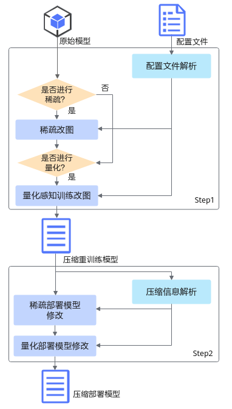

#### 组合压缩场景介绍
当前组合压缩支持如下几种场景，实际使用时，可以通过简易配置文件中的参数进行控制。如下场景中的整网量化指[量化感知训练](#量化感知训练)，其中：

-   整网量化：量化方式二选一。

    -   整网（全局）量化配置参数：retrain\_data\_quant\_config/retrain\_weight\_quant\_config
    -   部分层差异化配置参数：override\_layer\_configs或override\_layer\_types

    参数优先级：override\_layer\_configs\>override\_layer\_types\>retrain\_data\_quant\_config/retrain\_weight\_quant\_config

-   整网稀疏：包括通道稀疏和4选2结构化稀疏，使用时二选一。

    -   整网（全局）稀疏配置参数：prune\_config
    -   部分层差异化稀疏参数：override\_layer\_configs或override\_layer\_types

    参数优先级：override\_layer\_configs\>override\_layer\_types\>retrain\_data\_quant\_config/retrain\_weight\_quant\_config

关于上述参数的详细解释请参见[量化感知训练简易配置文件](./context/量化感知训练简易配置文件.md)。

**表 1**  组合压缩场景介绍

<a name="zh-cn_topic_0000001265077702_table1841654916270"></a>
<table><thead align="left"><tr id="zh-cn_topic_0000002517028698_row3417134942711"><th class="cellrowborder" valign="top" width="19.14191419141914%" id="mcps1.2.4.1.1"><p id="zh-cn_topic_0000002517028698_p641794972716"><a name="zh-cn_topic_0000002517028698_p641794972716"></a><a name="zh-cn_topic_0000002517028698_p641794972716"></a>组合压缩场景</p>
</th>
<th class="cellrowborder" valign="top" width="51.27512751275128%" id="mcps1.2.4.1.2"><p id="zh-cn_topic_0000002517028698_p17417114911276"><a name="zh-cn_topic_0000002517028698_p17417114911276"></a><a name="zh-cn_topic_0000002517028698_p17417114911276"></a>配置参数</p>
</th>
<th class="cellrowborder" valign="top" width="29.58295829582958%" id="mcps1.2.4.1.3"><p id="zh-cn_topic_0000002517028698_p146370141022"><a name="zh-cn_topic_0000002517028698_p146370141022"></a><a name="zh-cn_topic_0000002517028698_p146370141022"></a>说明</p>
</th>
</tr>
</thead>
<tbody><tr id="zh-cn_topic_0000002517028698_row19417549112711"><td class="cellrowborder" valign="top" width="19.14191419141914%" headers="mcps1.2.4.1.1 "><p id="zh-cn_topic_0000002517028698_p124171149182711"><a name="zh-cn_topic_0000002517028698_p124171149182711"></a><a name="zh-cn_topic_0000002517028698_p124171149182711"></a>整网量化+整网稀疏</p>
</td>
<td class="cellrowborder" valign="top" width="51.27512751275128%" headers="mcps1.2.4.1.2 "><a name="zh-cn_topic_0000002517028698_ul189333368587"></a><a name="zh-cn_topic_0000002517028698_ul189333368587"></a><ul id="zh-cn_topic_0000002517028698_ul189333368587"><li>量化参数：retrain_data_quant_config/retrain_weight_quant_config</li><li>稀疏参数：prune_config</li></ul>
<p id="zh-cn_topic_0000002517028698_p11121392577"><a name="zh-cn_topic_0000002517028698_p11121392577"></a><a name="zh-cn_topic_0000002517028698_p11121392577"></a>不配置override_layer_configs或override_layer_types</p>
</td>
<td class="cellrowborder" valign="top" width="29.58295829582958%" headers="mcps1.2.4.1.3 "><p id="zh-cn_topic_0000002517028698_p10387131415315"><a name="zh-cn_topic_0000002517028698_p10387131415315"></a><a name="zh-cn_topic_0000002517028698_p10387131415315"></a>-</p>
</td>
</tr>
<tr id="zh-cn_topic_0000002517028698_row6418104912278"><td class="cellrowborder" valign="top" width="19.14191419141914%" headers="mcps1.2.4.1.1 "><p id="zh-cn_topic_0000002517028698_p2418104912271"><a name="zh-cn_topic_0000002517028698_p2418104912271"></a><a name="zh-cn_topic_0000002517028698_p2418104912271"></a>部分层差异化量化+整网稀疏</p>
</td>
<td class="cellrowborder" valign="top" width="51.27512751275128%" headers="mcps1.2.4.1.2 "><a name="zh-cn_topic_0000002517028698_ul1961884514588"></a><a name="zh-cn_topic_0000002517028698_ul1961884514588"></a><ul id="zh-cn_topic_0000002517028698_ul1961884514588"><li>量化参数：retrain_data_quant_config/retrain_weight_quant_config+override_layer_configs或override_layer_types</li><li>稀疏参数：prune_config</li></ul>
</td>
<td class="cellrowborder" valign="top" width="29.58295829582958%" headers="mcps1.2.4.1.3 "><p id="zh-cn_topic_0000002517028698_p18418104922711"><a name="zh-cn_topic_0000002517028698_p18418104922711"></a><a name="zh-cn_topic_0000002517028698_p18418104922711"></a>配置特性参数时，首先要指定全局配置，否则该特性不使能。</p>
</td>
</tr>
<tr id="zh-cn_topic_0000002517028698_row104181492272"><td class="cellrowborder" valign="top" width="19.14191419141914%" headers="mcps1.2.4.1.1 "><p id="zh-cn_topic_0000002517028698_p1041811493272"><a name="zh-cn_topic_0000002517028698_p1041811493272"></a><a name="zh-cn_topic_0000002517028698_p1041811493272"></a>整网量化+部分层差异化稀疏</p>
</td>
<td class="cellrowborder" valign="top" width="51.27512751275128%" headers="mcps1.2.4.1.2 "><a name="zh-cn_topic_0000002517028698_ul7935131418596"></a><a name="zh-cn_topic_0000002517028698_ul7935131418596"></a><ul id="zh-cn_topic_0000002517028698_ul7935131418596"><li>量化参数：retrain_data_quant_config/retrain_weight_quant_config</li><li>稀疏参数：prune_config+override_layer_configs或override_layer_types</li></ul>
</td>
<td class="cellrowborder" valign="top" width="29.58295829582958%" headers="mcps1.2.4.1.3 "><p id="zh-cn_topic_0000002517028698_p113296231735"><a name="zh-cn_topic_0000002517028698_p113296231735"></a><a name="zh-cn_topic_0000002517028698_p113296231735"></a>配置特性参数时，首先要指定全局配置，否则该特性不使能。</p>
</td>
</tr>
<tr id="zh-cn_topic_0000002517028698_row2418104914273"><td class="cellrowborder" valign="top" width="19.14191419141914%" headers="mcps1.2.4.1.1 "><p id="zh-cn_topic_0000002517028698_p441844932719"><a name="zh-cn_topic_0000002517028698_p441844932719"></a><a name="zh-cn_topic_0000002517028698_p441844932719"></a>部分层量化+部分层差异化稀疏</p>
</td>
<td class="cellrowborder" valign="top" width="51.27512751275128%" headers="mcps1.2.4.1.2 "><a name="zh-cn_topic_0000002517028698_ul19449126706"></a><a name="zh-cn_topic_0000002517028698_ul19449126706"></a><ul id="zh-cn_topic_0000002517028698_ul19449126706"><li>量化参数：retrain_data_quant_config/retrain_weight_quant_config+override_layer_configs或override_layer_types</li><li>稀疏参数：prune_config+override_layer_configs或override_layer_types</li></ul>
</td>
<td class="cellrowborder" valign="top" width="29.58295829582958%" headers="mcps1.2.4.1.3 "><p id="zh-cn_topic_0000002517028698_p4158172415318"><a name="zh-cn_topic_0000002517028698_p4158172415318"></a><a name="zh-cn_topic_0000002517028698_p4158172415318"></a>配置特性参数时，首先要指定全局配置，否则该特性不使能。</p>
</td>
</tr>
<tr id="zh-cn_topic_0000002517028698_row141864913279"><td class="cellrowborder" valign="top" width="19.14191419141914%" headers="mcps1.2.4.1.1 "><p id="zh-cn_topic_0000002517028698_p17418154942719"><a name="zh-cn_topic_0000002517028698_p17418154942719"></a><a name="zh-cn_topic_0000002517028698_p17418154942719"></a>整网量化</p>
</td>
<td class="cellrowborder" valign="top" width="51.27512751275128%" headers="mcps1.2.4.1.2 "><p id="zh-cn_topic_0000002517028698_p1969818452012"><a name="zh-cn_topic_0000002517028698_p1969818452012"></a><a name="zh-cn_topic_0000002517028698_p1969818452012"></a>retrain_data_quant_config/retrain_weight_quant_config</p>
<p id="zh-cn_topic_0000002517028698_p151467471206"><a name="zh-cn_topic_0000002517028698_p151467471206"></a><a name="zh-cn_topic_0000002517028698_p151467471206"></a>不配置override_layer_configs或override_layer_types</p>
</td>
<td class="cellrowborder" valign="top" width="29.58295829582958%" headers="mcps1.2.4.1.3 "><p id="zh-cn_topic_0000002517028698_p041864916271"><a name="zh-cn_topic_0000002517028698_p041864916271"></a><a name="zh-cn_topic_0000002517028698_p041864916271"></a>-</p>
</td>
</tr>
<tr id="zh-cn_topic_0000002517028698_row0418449192712"><td class="cellrowborder" valign="top" width="19.14191419141914%" headers="mcps1.2.4.1.1 "><p id="zh-cn_topic_0000002517028698_p5418249162714"><a name="zh-cn_topic_0000002517028698_p5418249162714"></a><a name="zh-cn_topic_0000002517028698_p5418249162714"></a>部分层差异化量化</p>
</td>
<td class="cellrowborder" valign="top" width="51.27512751275128%" headers="mcps1.2.4.1.2 "><p id="zh-cn_topic_0000002517028698_p341919495279"><a name="zh-cn_topic_0000002517028698_p341919495279"></a><a name="zh-cn_topic_0000002517028698_p341919495279"></a>retrain_data_quant_config/retrain_weight_quant_config+override_layer_configs或override_layer_types</p>
</td>
<td class="cellrowborder" valign="top" width="29.58295829582958%" headers="mcps1.2.4.1.3 "><p id="zh-cn_topic_0000002517028698_p135712271031"><a name="zh-cn_topic_0000002517028698_p135712271031"></a><a name="zh-cn_topic_0000002517028698_p135712271031"></a>配置特性参数时，首先要指定全局配置，否则该特性不使能。</p>
</td>
</tr>
<tr id="zh-cn_topic_0000002517028698_row74191249152720"><td class="cellrowborder" valign="top" width="19.14191419141914%" headers="mcps1.2.4.1.1 "><p id="zh-cn_topic_0000002517028698_p104194493272"><a name="zh-cn_topic_0000002517028698_p104194493272"></a><a name="zh-cn_topic_0000002517028698_p104194493272"></a>整网稀疏</p>
</td>
<td class="cellrowborder" valign="top" width="51.27512751275128%" headers="mcps1.2.4.1.2 "><p id="zh-cn_topic_0000002517028698_p3419849142717"><a name="zh-cn_topic_0000002517028698_p3419849142717"></a><a name="zh-cn_topic_0000002517028698_p3419849142717"></a>prune_config</p>
<p id="zh-cn_topic_0000002517028698_p250381119119"><a name="zh-cn_topic_0000002517028698_p250381119119"></a><a name="zh-cn_topic_0000002517028698_p250381119119"></a>不配置override_layer_configs或override_layer_types</p>
</td>
<td class="cellrowborder" valign="top" width="29.58295829582958%" headers="mcps1.2.4.1.3 "><p id="zh-cn_topic_0000002517028698_p124190499278"><a name="zh-cn_topic_0000002517028698_p124190499278"></a><a name="zh-cn_topic_0000002517028698_p124190499278"></a>-</p>
</td>
</tr>
<tr id="zh-cn_topic_0000002517028698_row10181133810426"><td class="cellrowborder" valign="top" width="19.14191419141914%" headers="mcps1.2.4.1.1 "><p id="zh-cn_topic_0000002517028698_p181811138154214"><a name="zh-cn_topic_0000002517028698_p181811138154214"></a><a name="zh-cn_topic_0000002517028698_p181811138154214"></a>部分层差异化稀疏</p>
</td>
<td class="cellrowborder" valign="top" width="51.27512751275128%" headers="mcps1.2.4.1.2 "><p id="zh-cn_topic_0000002517028698_p137714231911"><a name="zh-cn_topic_0000002517028698_p137714231911"></a><a name="zh-cn_topic_0000002517028698_p137714231911"></a>prune_config+override_layer_configs或override_layer_types</p>
</td>
<td class="cellrowborder" valign="top" width="29.58295829582958%" headers="mcps1.2.4.1.3 "><p id="zh-cn_topic_0000002517028698_p187228733"><a name="zh-cn_topic_0000002517028698_p187228733"></a><a name="zh-cn_topic_0000002517028698_p187228733"></a>配置特性参数时，首先要指定全局配置，否则该特性不使能。</p>
</td>
</tr>
</tbody>
</table>

#### 压缩流程

组合压缩接口调用流程如下图所示，如下流程中的训练环境借助PyTorch框架的CPU环境或者NPU环境，在该开源框架的推理脚本基础上，调用AMCT  API完成模型压缩，压缩后的部署模型需要使用ATC工具转换成适配AI处理器的离线模型后，然后才能在AI处理器上实现推理：

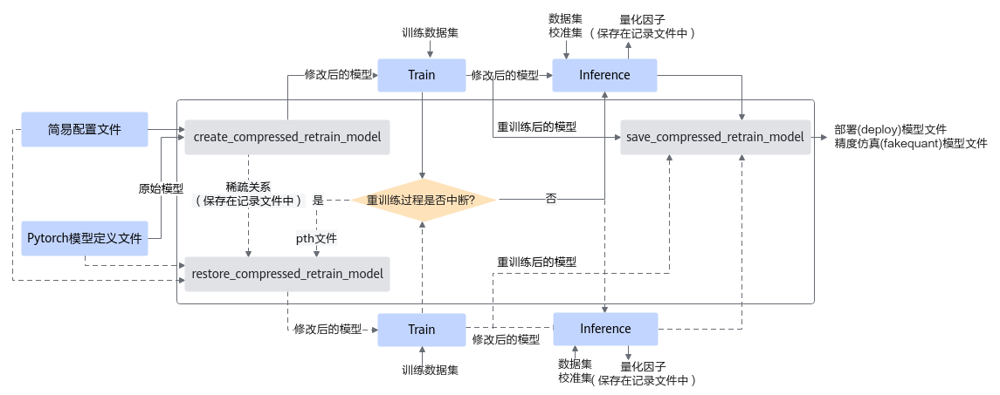

蓝色部分为用户实现，灰色部分为用户调用AMCT提供的API实现：

1.  用户构造Pytorch的原始模型，调用[create\_compressed\_retrain\_model](./api/create_compressed_retrain_model.md)接口对原始模型进行修改，修改后的模型包含了稀疏和量化相关的算子。
2.  对修改后的模型进行训练，如果训练未中断，将训练后的模型进行推理，在推理的过程中，会将量化因子写出到record文件中，然后调用[save\_compressed\_retrain\_model](./api/save_compressed_retrain_model.md)接口保存精度仿真模型以及部署模型；如果训练过程中断，则可基于保存的pth模型参数，重新调用[restore\_compressed\_retrain\_model](./api/restore_compressed_retrain_model.md)接口，输出根据稀疏关系稀疏好并插入了量化算子的模型，并且重新加载中断前保存模型的权重，继续进行训练，然后进行推理，最后调用[save\_compressed\_retrain\_model](./api/save_compressed_retrain_model.md)接口保存量化后的模型。

#### 调用示例

> [!NOTE]说明 
>1.  基于PyTorch环境进行训练，当前仅支持distributed模式（即DistributedDataParallel模式）的多卡训练，不支持DataParallel模式的多卡训练，使用DP模式训练会报错。
>2.  调用AMCT的部分，函数入参可以根据实际情况进行调整。组合压缩基于用户的训练过程，请确保已经有基于PyTorch环境进行训练的脚本，并且训练后的精度正常。
>3.  使用AMCT的量化感知训练特性时，如果训练过程卡死，请检查当前服务器是否有其他ONNX Runtime程序在运行（可以用**top**命令查看服务器所有进程），如果有，请先暂停其他ONNX Runtime程序，重新执行量化感知训练。
>4.  如下示例标有“由用户补充处理”的步骤，需要用户根据自己的模型和数据集进行补充处理，示例中仅为示例代码。

1.  导入AMCT包，并通过[工具构建](./build.md)中的环境变量设置日志级别。

    ```python
    import amct_pytorch as amct
    ```

2.  <a name="li2796152115712"></a>（可选，由用户补充处理）建议使用原始待量化的模型和测试集，在PyTorch环境下推理，验证环境、推理脚本是否正常。

    推荐执行该步骤，请确保原始模型可以完成推理且精度正常；执行该步骤时，可以使用部分测试集，减少运行时间。

    ```python
    ori_model.load() 
    # 测试模型 
    user_test_model(ori_model, test_data, test_iterations)
    ```

3.  调用AMCT，执行组合压缩流程。
    1.  <a name="li7715155181310"></a>修改模型，对模型ori\_model进行稀疏并插入量化相关的算子，保存成新的训练模型retrain\_model。

        实现该步骤前，应先恢复训练好的参数，如[2](#li2796152115712)中的ori\_model.load\(\)。

        ```python
        simple_cfg = './compressed.cfg'
        record_file = './tmp/record.txt'
        compressed_retrain_model = amct.create_compressed_retrain_model(
                                        model=ori_model,
                                        input_data=ori_model_input_data,
                                        config_defination=simple_cfg,
                                        record_file=record_file)
        ```

    2.  （由用户补充处理）使用修改后的图，创建反向梯度，在训练集上做训练，训练量化因子。
        1.  使用修改后的图，创建反向梯度。

            该步骤需要在[3.a](#li7715155181310)后执行。

            ```python
            optimizer = user_create_optimizer(compressed_retrain_model)
            ```

        2.  从训练好的checkpoint恢复模型，并训练模型。

            注意：从训练好的checkpoint恢复模型参数后再训练；训练中保存的参数应该包括量化因子：前batch\_num次训练后会生成量化因子，如果训练次数少于batch\_num会导致失败。

            ```python
            compressed_pth = './ckpt/user_model' 
            user_train_model(optimizer, compressed_retrain_model, train_data)
            ```

        3.  训练完成后，执行推理，计算量化因子并保存。

            ```python
            user_infer_graph(compressed_retrain_model)
            ```

    3.  保存模型。

        ```python
        save_path = '/.result/user_model'
        amct.save_compressed_retrain_model(
             model=compressed_retrain_model,
             record_file=record_file,
             save_path=save_path,
             input_data=ori_model_input_data)
        ```

4.  （可选，由用户补充处理）基于ONNX Runtime的环境，使用组合压缩后模型（compressed\_model）在测试集（test\_data）上做推理，测试组合压缩后仿真模型的精度。使用组合压缩后仿真模型精度与[1](zh-cn_topic_0000001217658691.md#li2796152115712)中的原始精度做对比，可以观察组合压缩对精度的影响。

    ```python
    compressed_model = './results/user_model_fake_quant_model.onnx' 
    user_do_inference_onnx(compressed_model, test_data, test_iterations)
    ```

**如果训练过程中断，需要从ckpt中恢复数据，继续训练，则调用流程为：**

1.  导入AMCT包，并通过[工具构建](./build.md)中的环境变量设置日志级别。

    ```python
    import amct_pytorch as amct
    ```

2.  准备原始模型。

    ```python
    ori_model = user_create_model()
    ```

3.  调用AMCT，执行组合压缩流程。
    1.  修改模型，对模型ori\_model进行稀疏并插入量化相关的算子，加载权重参数，保存成新的训练模型retrain\_model。

        ```python
        simple_cfg = './compressed.cfg'
        record_file = './tmp/record.txt'
        compressed_pth_file = './ckpt/user_model_newest.ckpt'
        compressed_retrain_model = amct.restore_compressed_retrain_model(
                                        model=ori_model,
                                        input_data=ori_model_input_data,
                                        config_defination=simple_cfg,
                                        record_file=record_file,
                                        pth_file=compressed_pth_file)
        ```

    2.  （由用户补充处理）使用修改后的图，创建反向梯度，在训练集上做训练，训练量化因子。
        1.  使用修改后的图，创建反向梯度。

            该步骤需要在[3.a](#li7715155181310)后执行。

            ```python
            optimizer = user_create_optimizer(compressed_retrain_model)
            ```

        2.  从训练好的checkpoint恢复模型，并训练模型。

            注意：从训练好的checkpoint恢复模型参数后再训练；训练中保存的参数应该包括量化因子：前batch\_num次训练后会生成量化因子，如果训练次数少于batch\_num会导致失败。

            ```python
            compressed_pth = './ckpt/user_model' 
            user_train_model(optimizer, compressed_retrain_model, train_data)
            ```

        3.  训练完成后，执行推理，计算量化因子并保存。

            ```python
            user_infer_graph(compressed_retrain_model)
            ```

    3.  保存模型。

        ```python
        save_path = '/.result/user_model'
        amct.save_compressed_retrain_model(
             model=compressed_retrain_model,
             record_file=record_file,
             save_path=save_path,
             input_data=ori_model_input_data)
        ```

4.  （可选，由用户补充处理）基于ONNX Runtime的环境，使用组合压缩后模型（compressed\_model）在测试集（test\_data）上做推理，测试组合压缩后仿真模型的精度。使用组合压缩后仿真模型精度与[1](zh-cn_topic_0000001217658691.md#li2796152115712)中的原始精度做对比，可以观察组合压缩对精度的影响。

    ```python
    compressed_model = './results/user_model_fake_quant_model.onnx' 
    user_do_inference_onnx(compressed_model, test_data, test_iterations)
    ```

#### 手工调优
组合压缩后，模型精度不满足要求，则需要参见[稀疏](#稀疏)下的手动调优章节和[量化感知训练](#量化感知训练)下的章节分别进行调优。

## 逐层蒸馏

AMCT提供了基于图的torch模型量化蒸馏方法，这种方法通过将torch模型转成onnx模型来获取torch模型的图结构，并基于解析的图结构进行蒸馏优化，最后生成onnx量化模型。

本节详细介绍逐层蒸馏支持的层，接口调用流程和示例。

- 支持做蒸馏和量化的算子：
  -   torch.nn.Linear：复用层（共用weight和bias参数）不支持量化。
  -   torch.nn.Conv2d：padding\_mode为zeros才支持量化，复用层（共用weight和bias参数）不支持量化。

- 支持做蒸馏的激活算子：
  -   torch.nn.ReLU
  -   torch.nn.LeakyReLU
  -   torch.nn.Sigmoid
  -   torch.nn.Tanh
  -   torch.nn.Softmax

- 支持做蒸馏的归一化算子

  torch.nn.BatchNorm2d：复用层（共用weight和bias参数）不支持蒸馏。

### 蒸馏流程

调用流程如下图所示。


蓝色部分为用户实现，灰色部分为用户调用AMCT提供的API实现，逐层蒸馏特性主要分为4个部分，创建蒸馏配置、创建蒸馏模型、蒸馏量化模型和保存量化模型，详情如下：

1.  创建蒸馏配置，用户首先构造PyTorch的原始模型，然后使用[create\_distill\_config](./api/create_distill_config.md)接口，将用户自定义的蒸馏配置与AMCT算法定义的蒸馏配置相结合，输出网络每一层的蒸馏配置信息。
2.  创建蒸馏模型，调用[create\_distill\_model](./api/create_distill_model.md)接口对原始模型进行修改，根据蒸馏配置信息生成一个待蒸馏的量化模型。
3.  蒸馏模型，调用[distill](./api/distill.md)接口，根据用户配置的模型推理和优化方法，结合蒸馏配置信息，对网络进行分块蒸馏，得到蒸馏后的性能优化的量化模型。
4.  保存量化模型，最后调用[save\_distill\_model](./api/save_distill_model.md)接口保存已蒸馏优化的量化模型，包括可在ONNX执行框架ONNX Runtime环境中进行精度仿真的模型文件和可部署在AI处理器的模型文件。

### 调用示例

> [!NOTE]说明
>-   如下示例标有“由用户补充处理”的步骤，需要用户根据自己的模型和数据集进行补充处理，示例中仅为示例代码。
>-   如下示例调用AMCT的部分，函数入参请根据实际情况进行调整。

1. 导入AMCT包，并通过[工具构建](./build.md)中的环境变量设置日志级别。

   ```python
   import amct_pytorch as amct
   ```

2. <a name="li13259141318410"></a>（可选，由用户补充处理）在PyTorch原始环境中验证推理脚本及环境。

   建议使用原始待量化的模型和测试集，在PyTorch环境下推理，验证环境、推理脚本是否正常。

   推荐执行该步骤，请确保原始模型可以完成推理且精度正常；执行该步骤时，可以使用部分测试集，减少运行时间。

   ```python
   user_do_inference_torch(ori_model, test_data, test_iterations)
   ```

3. 调用AMCT，蒸馏模型。
   1. 调用[create\_distill\_config](./api/create_distill_config.md)接口生成蒸馏配置。输出的蒸馏配置中包含用户自定义的和自动查找到的蒸馏结构。

      ```python
      config_file = './tmp/config.json'
      simple_cfg = './distill.cfg'
      amct.create_distill_config(config_file=config_file,
                                   model=ori_model,
                                   input_data=ori_model_input_data,
                                   config_defination=simple_cfg)
      ```

   2. 调用[create\_distill\_model](./api/create_distill_model.md)接口创建蒸馏模型。

      对待蒸馏的浮点模型进行量化，将浮点模型中的待压缩算子替换为CANN量化算子。

      ```python
      compress_model = amct.create_distill_model(
                       config_file=config_file,
                       model=ori_model,
                       input_data=ori_model_input_data)
      ```

   3. 逐层蒸馏。

      调用[distill](./api/distill.md)接口进行逐层蒸馏。针对配置中的蒸馏结构进行蒸馏。

      ```python
      distill_model = amct.distill(
                      model=ori_model,
                      compress_model,
                      config_file=config_file,
                      train_loader,
                      epochs=1,
                      lr=1e-3,
                      sample_instance=None, 
                      loss=loss,
                      optimizer=optimizer)
      ```

   4. 保存蒸馏模型。

      调用[save\_distill\_model](./api/save_distill_model.md)接口，插入AscendQuant、AscendDequant等算子，保存为蒸馏模型。

      ```python
      amct.save_distill_model(
                       model, 
                       "./model/distilled",
                       input_data,
                       record_file="./results/records.txt",
                       input_names=['input'],
                       output_names=['output'],
                       dynamic_axes={'input':{0: 'batch_size'},
                                     'output':{0: 'batch_size'}})
      ```

4. （可选，由用户补充处理）基于ONNX Runtime的环境，使用蒸馏后模型（quant\_model）在测试集（test\_data）上做推理，测试蒸馏后仿真模型的精度。

   使用量化后仿真模型精度与[2](#li13259141318410)中的原始精度做对比，可以观察量化对精度的影响。

   ```python
   quant_model = './results/user_model_fake_quant_model.onnx'
   user_do_inference_onnx(quant_model, test_data, test_iterations)
   ```


## 张量分解
张量分解通过分解卷积核的张量，将一个卷积转化成两个小卷积的堆叠来降低推理开销，如用户模型中存在大量卷积，且卷积核shape普遍大于\(64, 64, 3, 3\)时推荐使用张量分解。

目前仅支持满足如下条件的卷积进行分解：

-   group=1、dilation=\(1,1\)、stride<3
-   kernel\_h\>2、kernel\_w\>2

卷积是否分解由AMCT自动判断，即便满足上述条件，也不一定会分解；例如，用户使用的PyTorch原始模型中存在torch.nn.Conv2d层，且该层满足上述条件，才有可能将相应的Conv2d层分解成两个Conv2d层。

通常情况下，分解后模型的精度会比原始模型有所下降，因此在分解之后，需通过fine-tune（微调）来提高精度。最后使用AMCT将分解后的模型转换成可以在AI处理器部署的量化模型，以便在模型推理时获得更好的性能。

该场景为可选操作，用户自行决定是否进行原始模型的分解。


### 分解约束

如果torch.nn.Conv2d层的权重shape过大，会造成分解时间过长或分解异常中止，为防止出现该情况，执行分解动作前，请先参见如下约束或参考数据：

-   **分解工具性能参考数据：**

    -   CPU: Intel\(R\) Xeon\(R\) CPU E5-2699 v4 @ 2.20GHz
    -   内存: 512G

    分解单层卷积：

    -   shape\(512, 512, 5, 5\)，大约耗时7秒。
    -   shape\(1024, 1024, 3, 3\)，大约耗时12秒。
    -   shape\(1024, 1024, 5, 5\)，大约耗时52秒。
    -   shape\(2048, 2048, 3, 3\)，大约耗时89秒。
    -   shape\(2048, 2048, 5, 5\)，大约耗时374秒。

-   **内存超限风险提醒**：

    分解大卷积核存在内存超限风险参考数值：分解shape为\(2048, 2048, 5, 5\)的卷积核约需9G内存。
    
### 分解方式
张量分解有两种使用方式，在线张量分解和离线张量分解，用户可以根据实际情况选择其中一个方式进行分解。详细说明如下：

1.  **在线张量分解**

    即直接分解原始网络模型并进行fine-tune：在训练代码中引入张量分解接口，对已包含预训练权重的模型进行分解，然后进行fine-tune。

    该流程在张量分解时直接修改模型结构并更新权重，分解后的模型可直接使用，其优点是使用方便，仅需一步操作；而缺点是每次调用脚本都要重新进行分解计算，需要耗费一定时间。

1.  **离线张量分解**

    即先分解原始网络模型，然后再进行fine-tune：首先将含有预训练权重的模型调用张量分解接口进行分解，保存分解信息文件和分解后的权重；后续使用时，在训练脚本中引入张量分解接口，读取保存的分解信息文件对模型结构进行分解，然后加载保存的分解后的权重，再进行fine-tune。

    该流程先将分解信息和分解后的权重保存下来，然后在fine-tune时快速加载使用，其优点是可以一次分解，多次使用，使用时加载几乎不耗费时间；而缺点是需要两步操作，且需保存分解后的权重并在使用时加载。

### 分解流程

接口调用流程如下图所示。
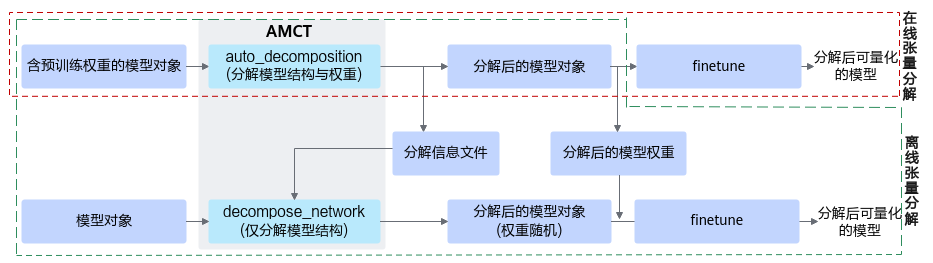

1.  **在线分解流程**

    在训练脚本中，准备好含有预训练权重的torch.nn.Module模型对象，在将模型参数传递给优化器之前，将模型对象传递给[auto\_decomposition](./api/auto_decomposition.md)接口进行张量分解，得到分解后的模型对象，即可直接对其进行fine-tune。

2.  **离线分解流程**

    1.  <a name="li265516506413"></a>在任意脚本中，准备好含有预训练权重的torch.nn.Module模型对象，将模型对象和分解信息文件保存路径传递给[auto\_decomposition](./api/auto_decomposition.md)接口进行张量分解，得到分解后的模型对象和保存的分解信息文件，并对分解后的模型权重进行保存。
    2.  <a name="li1228813421049"></a>fine-tune时，在训练脚本中，在将模型参数传递给优化器之前，将模型对象和[2.a](#li265516506413)中得到的分解信息文件路径传递给[decompose\_network](./api/decompose_network.md)接口，该接口会将模型结构修改为分解后的结构，然后加载[2.a](zh-cn_topic_0000001152857864.md#li265516506413)保存的分解后的模型权重，对模型进行fine-tune。

    > [!NOTE]说明 
    >离线分解时，[2.a](#li265516506413)步骤在调用[auto\_decomposition](./api/auto_decomposition.md)接口后，用户需要自行保存分解后模型权重；[2.b](#li1228813421049)步骤在调用完成[decompose\_network](./api/decompose_network.md)后，用户需自行加载所保存的分解后的模型权重。
    >此方案设计目的是方便用户自由控制权重文件的存取，例如在权重文件中存储自定义信息。

张量分解后会将1个卷积分解为2个串联的卷积，模型的其中一层卷积分解前后情况如下图所示。

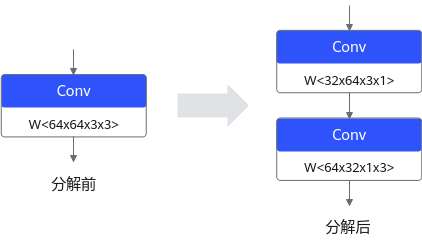


### 调用示例
> [!NOTE]说明：
> 以下示例中，\(\*\)表示用户已有的代码，...表示用户已有代码的省略，此处仅为示例，实际用户代码可能不同，请根据实际情况进行调整。

1.  **在线张量分解**

    在训练脚本中，调用[auto\_decomposition](./api/auto_decomposition.md)分解含有预训练权重的PyTorch模型，然后直接fine-tune。

    ```python
    from amct_pytorch.tensor_decompose import auto_decomposition
    net = Net()                                          # (*) 构建模型对象
    net.load_state_dict(torch.load("src_path/net.pth"))  # (*) 加载模型权重
    net, changes = auto_decomposition(model=net)         # 执行张量分解
    optimizer = build_optimizer(net, ...)                # (*) 构建优化器（将模型参数传递给优化器）
    train(net, optimizer, ...)                           # (*) fine-tune
    ```

2.  **离线张量分解**
    1.  在任意脚本中，调用[auto\_decomposition](./api/auto_decomposition.md)分解含有预训练权重的PyTorch模型，保存分解信息文件和分解后的模型权重。

        ```python
        from amct_pytorch.tensor_decompose import auto_decomposition
        net = Net()                                                                 # (*) 构建模型对象
        net.load_state_dict(torch.load("src_path/weights.pth"))                     # (*) 加载模型权重
        net, changes = auto_decomposition(                                          # 执行张量分解，并保存分解信息文件
            model=net,
            decompose_info_path="decomposed_path/decompose_info.json"               # 分解信息文件保存路径
        )
        torch.save(net.state_dict(), "decomposed_path/decomposed_weights.pth")      # 保存分解后的模型权重
        ```

    2.  在训练脚本中，调用[decompose\_network](./api/decompose_network.md)，根据[2.a](#li265516506413)得到的分解信息文件将模型结构修改为分解后的结构，再加载[2.a](#li265516506413)保存的分解后的模型权重，进行fine-tune。

        ```python
        from amct_pytorch.tensor_decompose import decompose_network
        net = Net()                                                                 # (*) 构建用户模型对象
        net, changes = decompose_network(                                           # 加载分解信息文件，将模型结构修改为张量分解后的结构
            model=net,
            decompose_info_path="decomposed_path/decompose_info.json"               # 上一步保存的分解信息文件路径
        )
        net.load_state_dict(torch.load("decomposed_path/decomposed_weights.pth"))   # 加载上一步保存的分解后模型权重
        optimizer = build_optimizer(net, ...)                                       # (*) 构建优化器（将模型参数传递给优化器）
        train(net, optimizer, ...)                                                  # (*) fine-tune
        ```


</details>

