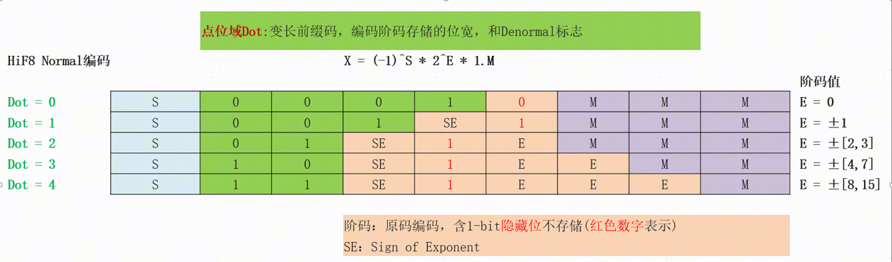
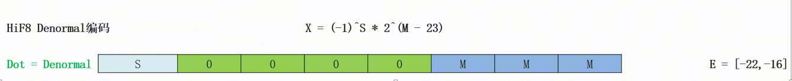
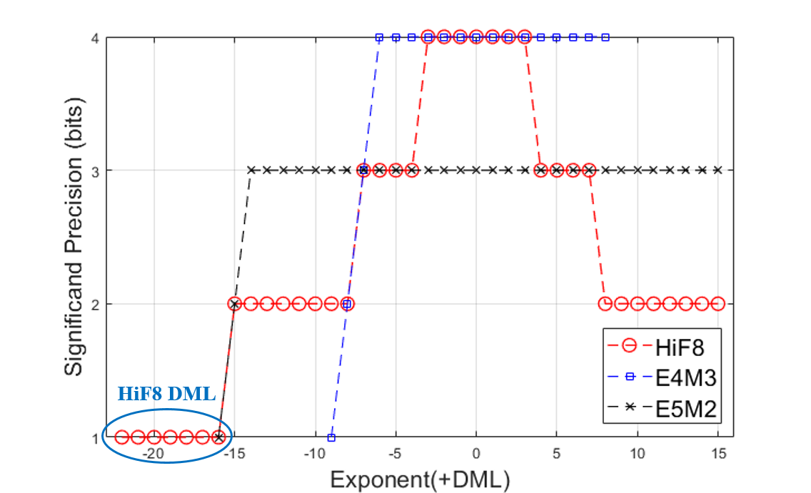
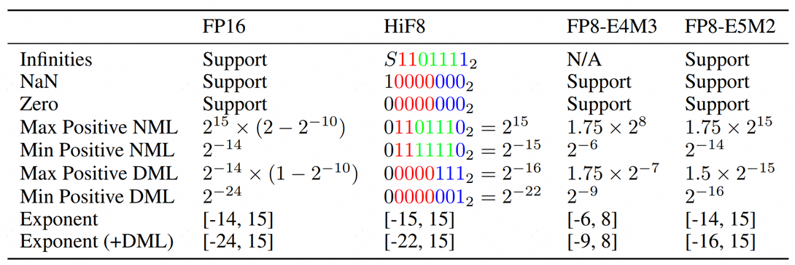
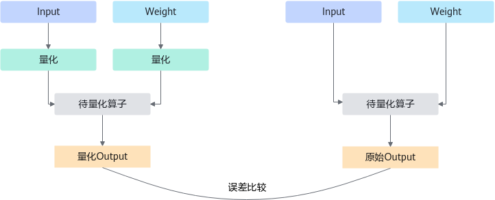

# HiFloat8 数据格式&量化算法介绍

## 1. 格式简介

HiFloat8 是华为自研的 8-bit 浮点数据格式。相较于传统 FP8 格式，HiFloat8 通过变长前缀编码的点位域（Dot）优化阶码和尾数的分配，显著提升了动态范围和表示精度。

### 字段结构

HiFloat8 由 **符号（Sign）**、**点位（Dot）**、**阶码（Exponent）** 和 **尾数（Mantissa）** 四个字段组成：

| 字段 | 宽度（bit） | 说明 |
| --- | --- | --- |
| 符号（S） | 1 | 数值符号，1 表示负，0 表示正 |
| 点位（D） | 2~4 | 指示阶码位宽及编码模式 |
| 阶码（E） | 0~4 | 采用符号-幅度编码（Sign-Magnitude） |
| 尾数（M） | 1~3 | 省略前导 1 的尾数位 |

**字段说明：**

- **符号域（Sign Field）**：1 位，决定数值正负。1 表示负，0 表示正。
- **点位域（Dot Field）**：2~4 位，采用前缀编码，显式指示阶码位宽和 Normal/Denormal 标志。
- **阶码域（Exponent Field）**：0~4 位，有符号整数编码，最高位为符号位。
- **尾数域（Mantissa Field）**：1~3 位，无符号整数编码。对于规格化数，尾数表示有效数字的小数部分（二进制小数点右侧）。

**Dot 编码表：**

| 位宽 | 编码 | 编码值 |
| --- | --- | --- |
| 2 | `11` | 4 |
| 2 | `10` | 3 |
| 2 | `01` | 2 |
| 3 | `001` | 1 |
| 4 | `0001` | 0 |
| 4 | `0000` | Denormal (DML) |

### Normal 编码模式

Normal（规格化）编码模式确保不同位宽阶码对应的指数范围互不重叠，实现**无冗余编码**。HiFloat8 采用 Sign-Magnitude 编码方案，将幅值最高位设为隐含位，不占用存储空间。

**编码规则：**

- **Dot = 0**：阶码不占位宽，E = 0。
- **Dot = 1~4**：阶码幅值最高位固定为 1（图中的红色数字）。

具体对应关系：

- Dot = 1 时，E = ±1，不包含已编码的 0。
- Dot = 2 时，E = ±[2, 3]，不包含已编码的 [-1, 1]。
- 以此类推，Dot 域指示的 0~4 五种位宽阶码共编码 [-15, 15] 的指数，无重复。

**精度渐变特性：**

HiFloat8 采用大位宽 Dot 域匹配小位宽阶码域的设计，实现尾数精度的平滑渐变：

- E ∈ [-3, 3]：3-bit 尾数。
- 阶码幅值增大时，尾数位宽逐渐收缩至 1-bit。

这种精度渐变特性是 HiFloat8 优于 Posit 格式的关键所在。

### Denormal 编码模式

为支持更大动态范围，HiFloat8 采用不同于 IEEE 754 风格的 Denormal 方案。

**编码规则：**

- Dot 域指示 Denormal 模式时，不保留阶码域，3-bit 尾数空间用于映射极小值的指数表示。
- Normal 模式：支持 [-15, 15] 共 31 个指数。
- Denormal 模式：支持 [-22, -16] 共 7 个指数。
- 整体覆盖 [-22, 15] 共 38 个指数，接近 FP16 的 [-24, 15] 范围。

**连续性：**

[-15, -8] 区间为 1-bit 尾数，[-22, -16] 区间对应 0-bit 尾数，Normal 到 Denormal 的过渡在精度上保持连续，无突变。

### 特殊值

| 条件 | 输出 | HiFloat8（二进制） | HiFloat8（十六进制） | 含义 |
| --- | --- | --- | --- | --- |
| S=0, D=DML, M=3'b0 | Zero | `00000000` | `0x00` | 零 |
| S=1, D=DML, M=3'b0 | NaN | `10000000` | `0x80` | 非数字 |
| D=4, Es=4'b0111, M=1 | ±Inf | `X1101111` | `0x6F`/`0xEF` | 正负无穷大 |

HiFloat8 完整支持 Zero、NaN 和 ±Inf 特殊值。不区分正 0 和负 0，采用单一编码，节省编码空间，是一种数值表达完备且高效的 8-bit 单格式。

## 2. 核心特性

HiFloat8 专为大模型（LLM）训推设计，具有三大核心优势：

### 锥形精度（Tapered Precision）

传统 FP8（E4M3/E5M2）因阶码位宽固定，难以同时兼顾动态范围与精度。考虑到神经网络参数与激活值呈类高斯分布，HiFloat8 采用锥形精度分布，将更高精度集中在高频数值区间。

**精度分段：**

| 区间 | 指数范围 | 有效位 |
| --- | --- | --- |
| 高精度区间 | E ∈ [-3, 3] | 4-bit |
| 中精度区间 | E ∈ ±[4, 7] | 3-bit |
| 低精度区间 | E ∈ ±[8, 15] | 2-bit |
| 极小值区间 | E ∈ [-22, -16] | 1-bit |

#### 无冗余编码

阶码采用原码编码，固定 1-bit 高位设为隐含位，确保不同位宽阶码的表达范围互不重叠。

#### 大动态范围

HiFloat8 在 8-bit 限制下，通过锥形精度特性匹配数据分布，在保证训练与推理精度的前提下显著扩大动态范围，提供能力更全面的 8-bit 单格式。

## 3. 核心算法

### Cast（数据直转）

**算法原理：**

Cast 是最简单的量化算法，无需校准数据，直接将高精度浮点数（Float16/BFloat16）转换为 HiFloat8 格式。

**转换流程：**

1. 激活数据，从 Float16/BFloat16 直转到 HiFloat8 。
2. 权重数据，离线统计weight最大值，缩放到 HiFloat8 高精度表示范围内。

**适用场景：**

- 对部署速度要求高的场景。
- 模型数据分布相对集中。
- 对精度损失容忍度较高。

**算法优势：**

- 无需校准数据和额外计算，部署最简单。
- 推理速度最快，无额外开销。
- 得益于 HiFloat8 的大动态范围和高精度特性，Float16/BFloat16 直接转换时精度损失较小。

### Quantile（分位数量化）

**算法原理：**

Quantile 算法考虑模型数值分布特征，通过分位数统计动态调整量化范围，避免极值点对量化精度的影响。

**算法流程：**

以 512 个 batch 的校准数据为例：

1. **初始化**：记录首个 batch 的最大值作为初始量化阈值。
2. **滑动平均**：对后续 batch 的最大值进行指数滑动平均，平滑极值影响。
3. **计算缩放因子**：根据最终统计值计算量化缩放因子。

**数学表示：**

$$
\begin{align*}
&q_{max0} = batch_{max0} \\ 
&q_{max1} = 0.99 \times q_{max0} + 0.01 \times batch_{max1} \\ 
&q_{max2} = 0.99 \times q_{max1} + 0.01 \times batch_{max2} \\ 
&... \\ 
&q_{max511} = 0.99 \times q_{max510} + 0.01 \times batch_{max511} \\ 
&scale_d = q_{max511} / 16 \\ 
&scale_w = max(weight) / 16
\end{align*}
$$

其中，$batch_{max_i}$ 表示第 $i$ 个 batch 的最大值，$scale_d$ 和 $scale_w$ 分别为激活值和权重的量化缩放因子。

**适用场景：**

- 需要较高量化精度的场景。
- 数据分布存在异常值或离群点。
- 有校准数据可用。

**算法优势：**

- 精度高于 Cast 算法。
- 量化校准资源消耗小。
- 有效抑制极值点影响。

### OFMR（输出特征图重构）

**算法原理：**

OFMR（Output FeatureMap Reconstruct）是一种基于输出误差最小化的量化因子搜索算法，通过比较量化前后模型输出的差异，确定最优量化参数。

**算法流程：**

1. **基准推理**：使用原始高精度模型推理，记录各层输出特征图。
2. **候选搜索**：遍历候选量化因子集合，对每个候选因子执行量化推理。
3. **误差评估**：计算量化输出与原始输出的误差（如 MSE、余弦相似度等）。
4. **最优选择**：选取误差最小的量化因子作为最终参数。

    

**适用场景：**

- 对量化精度要求极高的场景。
- 训练后量化（PTQ）。
- 有充足校准数据和计算资源。

**算法优势：**

- 直接优化最终输出，量化精度高。
- 无需重新训练模型。
- 可针对特定任务定制优化目标。

**注意事项：**

- 需要校准数据集，计算成本较高。
- 搜索空间较大时，耗时较长。
