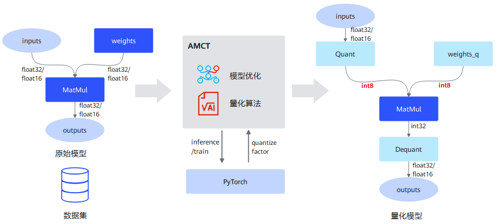
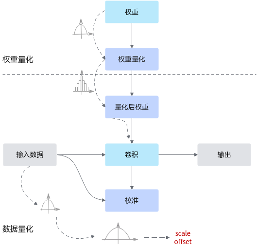
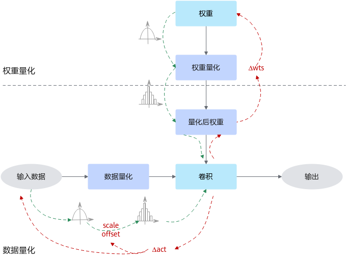
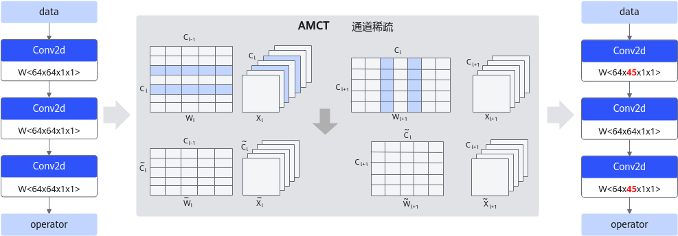
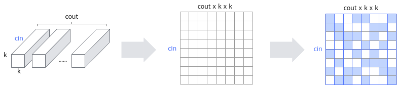
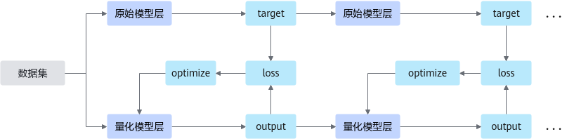
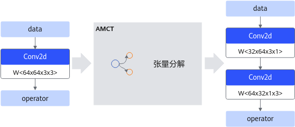
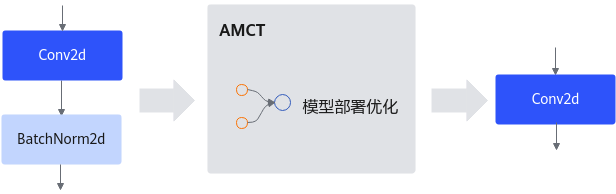

# 压缩概念

本节给出模型压缩过程中用到的概念，并介绍了不同压缩方法的原理。

## 量化

量化是指对模型的权重（weight）和数据（activation）进行低比特处理，让最终生成的网络模型更加轻量化，从而达到节省网络模型存储空间、降低传输时延、提高计算效率，达到性能提升与优化的目标。

AMCT将量化和模型转换分开，实现对模型中可量化算子的独立量化，并输出量化后的模型。该模型可以在昇腾AI处理器上运行，达到提升推理性能的目的。以量化到INT8数据类型为例，其运行原理如下图所示。

**图 1**  量化运行原理  

量化根据是否需要重训练，分为训练后量化（Post-Training Quantization，简称PTQ）和量化感知训练（Quantization-Aware Training，简称QAT），概念解释如下：

### 数据类型概念

#### HIFloat8（HiF8）

HIFloat8（HiF8）是AI处理器定制的新8比特浮点数据格式，由Sign位（符号位，表示数值的正负）、Dot位、Exponet位（指数位，用于表示数值的范围）和Mantissa位（尾数为，用于表示数值的有效数字）组成。HiF8在IEEE 754的基础上扩增了一个点位域（Dot），用于动态调整阶码域位宽和尾数域位宽。

其中，S为HiF8符号域数值，E为HiF8阶码域数值，M为HiF8尾数域数值，dot位为0b’0000时，HiF8数据为Denormal value。

转换原则如下，用户可在配置文件中自行配置，详情请参见[config详细配置](./api/quantize.md)：

- float32/bfloat16/float16的NAN转换为HiF8的NAN。
- float32/bfloat16/float16的INF转换为HiF8的INF，符号位不变。
- float32/bfloat16/float16绝对值大于HiF8的可表示范围上限，转换为HiF8的MAX，符号位不变。
- float32/bfloat16/float16绝对值小于HiF8的可表示范围下限，转换为HiF8的0。

其他值按照舍入模式进行转换。

**注意：** HiF8或float8数据由于本身数据精度问题，当原始输入数据中存在绝对值小于`1.5*2^-10`的数据时，转换为float8的精度无法保证；原始数据中存在绝对值小于`1.5*10^-24`的数据时，转换为HiF8的精度无法保证。

#### FLOAT8（float8）

float8是float16的衍生物，有E4M3和E5M2两种编码格式。当前仅支持E4M3编码格式。

- E4M3包含4比特指数、3比特尾数以及1比特符号位，训练时前向传播使用。
- E5M2包含5比特指数、2比特尾数以及1比特符号位，训练时反向传播使用。E4M3相比E5M2数据范围更小，但是精度更高，多用于推理场景。

转换原则如下，用户可在配置文件中自行配置，详情请参见[config详细配置](./api/quantize.md)：

- float32/bfloat16/float16的NAN转换为float8的NAN。
- float32/bfloat16/float16绝对值大于float8的可表示范围上限，转换为float8的MAX，符号位不变。
- float32/bfloat16/float16绝对值小于float8的可表示范围下限，转换为float8的0。

其他值按照“Round to nearest, tie to Even”的舍入模式进行转换。

#### MXFP8

MXFP8是基于Microscaling（微缩放）格式的低精度8位浮点数表示方法，它由scale（缩放因子）和element（元素）组成，多个element共享一个scale；相比传统的16位浮点数（fp16）或32位浮点数（fp32），能显著减少数据存储和传输需求，减少大模型显存占用，从而提升产品推理竞争力。

FP8_E4M3FN是FP8数据格式的一种，一种8位浮点量化格式，包含4比特指数、3比特尾数以及1比特符号位（FP8_E4M3FN）；而MXFP8比FP8多了Shared Exponent（一种数据表示方法，多个元素共享一个指数（exponent），通过微缩放技术，相比FP8能够提供更高的精度和更细的量化粒度。

转换原则如下，用户可在配置文件中配置该类型，详情请参见[config详细配置](./api/quantize.md)：

- float32/bfloat16/float16到float8的转换：

  - float32/bfloat16/float16的NAN转换为float8的NAN。
  - float32/bfloat16/float16绝对值大于float8的可表示范围上限，转换为float8的MAX，符号位不变。
  - float32/bfloat16/float16绝对值小于float8的可表示范围下限，转换为float8的0。

  其余值按照“Round to nearest, tie to Even”的舍入模式(RINT)转换到FP8_E4M3FN。

- MXFP8数据格式转换：对于torch.nn.Linear算子Weight Tensor数据，按照-1轴方向，每32个数据计算一个shared exponent，计算公式如下：

  

#### MXFP4

MXFP4也是基于Microscaling（微缩放）格式的低精度4位浮点数表示方法，它由scale（缩放因子）和element（元素）组成，多个element共享一个scale；相比传统的16位浮点数（fp16）或32位浮点数（fp32），能显著减少数据存储和传输需求，减少大模型显存占用，从而提升产品推理竞争力。

FP4_E2M1是FP4数据格式的一种，一种4位浮点量化格式，包含2比特指数、1比特尾数以及1比特符号位（FP4_E2M1）；而MXFP4比FP4多了Shared Exponent（一种数据表示方法，多个元素共享一个指数（exponent），通过微缩放技术，相比FP4能够提供更高的精度和更细的量化粒度。

转换原则如下，用户可在配置文件中配置该类型，详情请参见[config详细配置](./api/quantize.md)：

- float16/bfloat16到FP4_E2M1的转换：小于FP4_E2M1的数值转换到FP4_E2M1最小值，大于FP4_E2M1的数值转换到FP4_E2M1最大值，NAN和INF不支持转换，其余值按照“Round to nearest, tie to Even”的舍入模式(RINT)转换到FP4_E2M1。

- MXFP4数据格式转换：对于torch.nn.Linear算子Weight Tensor数据，按照-1轴方向，每32个数据计算一个shared exponent，计算公式如下：

  

#### FP4_E2M1

FP4_E2M1是FP4数据格式的一种，一种4位浮点量化格式，包含2比特指数、1比特尾数以及1比特符号位（FP4_E2M1）。

float16/bfloat16高精度到FP4_E2M1低精度的转换原则如下，用户可在配置文件中配置该类型，详情请参见[config详细配置](./api/quantize.md)：

小于FP4_E2M1的数据最小值转换为FP4_E2M1最小值，大于FP4_E2M1的数值转换到FP4_E2M1最大值，NAN和INF不支持转换，其余值按照“Round to nearest, tie to Even”的舍入模式(RINT)转换到FP4_E2M1。

FP4_E2M1能够表达的数值有16个，分别为`{±0，±0.5，±1，±1.5，±2，±3，±4，±6}`。

#### FP4_E1M2

FP4_E1M2也是FP4数据格式的一种，一种4位浮点量化格式，包含1比特指数、2比特尾数以及1比特符号位（FP4_E1M2）。

float16/bfloat16高精度到FP4_E1M2低精度的转换原则如下，用户可在配置文件中配置该类型，详情请参见[config详细配置](./api/quantize.md)：

小于FP4_E1M2数据最小值转换为FP4_E1M2最小值，大于FP4_ E1M2的数值转换到FP4_ E1M2最大值，NAN和INF不支持转换，其余值按照“Round to nearest, tie to Even”的舍入模式(RINT)转换到FP4_E1M2。

FP4_E1M2能够表达的数值有16个，分别为`{±0.0, ±0.25, ±0.5, ±0.75, ±1.0, ±1.25, ±1.5, ±1.75}`，低精度到高精度转换不涉及尾数舍入和NAN/INF特殊值处理。

#### INT8
使用8比特的int8数据来表示比如32比特的float32数据，将float的矩阵乘运算转换为int8的矩阵乘运算，加速运算和实现模型压缩。

#### INT4
使用4比特的int4数据来表示比如32比特的float32数据。相较于int8量化，int4量化可以实现更优的量化效果，但可能带来更大的精度损失。

#### 总体说明

- HiF8相比于float8能更好的兼顾精度和动态范围，而MXFP8和MXFP4可以减少大模型显存占用。
- MXFP8和MXFP4：有专门的硬件加速单元，处理量化因子速度更快。
- FP4_E2M1和FP4_E1M2：对于均匀分布的数据，建议用FP4_E1M2；如果是高斯分布，建议使用FP4_E2M1。

### 训练后量化

训练后量化是指在模型训练结束之后进行的量化，对训练后模型中的权重由浮点数量化到低比特整数，并通过少量校准数据基于推理过程对数据（activation）进行校准量化，从而尽可能减少量化过程中的精度损失。训练后量化简单易用，只需少量校准数据，适用于追求高易用性和缺乏训练资源的场景。

通常，训练后的模型权重已经确定，因此可以根据权重的数值离线计算得到权重的量化参数。而通常数据是在线输入的，因此无法准确获取数据的数值范围，通常需要一个较小的有代表性的数据集来模拟在线数据的分布，利用该数据集执行前向推理，得到对应的中间浮点结果，并根据这些浮点结果离线计算出数据的量化参数。其原理如下图所示。    

 

### 量化感知训练

量化感知训练是指在重训练过程中引入量化，通过重训练提高模型对量化效应的能力，从而获得更高的量化模型精度的一种量化方式。量化感知训练借助用户完整训练数据集，在训练过程中引入伪量化的操作（从浮点量化到定点，再还原到浮点的操作），用来模拟前向推理时量化带来的误差，并借助训练让模型权重能更好地适应这种量化的信息损失，从而提升量化精度。

通常，量化感知训练相比训练后量化，精度损失会更小，但主要缺点是整体量化的耗时会更长；此外，量化过程需要的数据会更多，通常是完整训练数据集。
其运行原理如下图所示。

​    

量化过程中的其他概念解释如下：

### 权重（weight）量化

权重量化是指根据权重的数值分布情况，将权重处理到低比特。

### 激活（activation）量化

激活量化又称为数据量化，是指根据数据的数值分布情况，将输入的数据（activation）处理到低比特。每一层的数据分布是未知且巨大的，只能在前向过程（推理或者训练）中确定，因此数据量化是基于推理或者训练过程的。

### 校准数据集

量化场景中，做前向推理使用的数据集。该数据集的分布代表着所有数据集的分布，获取校准集时应该具有代表性，推荐使用测试集的子集作为校准数据集。如果数据集不是模型匹配的数据集或者代表性不够，则根据校准集计算得到的量化因子，在全数据集上表现较差，量化损失大，量化后精度低。

### 量化因子

将浮点数量化为整数的参数，包括缩放因子（scale），偏移量（offset）。将浮点数量化为整数（以INT8为例）的公式如下：

$$
int\_val=clip(round(float\_val/scale+offset),-128,127)
$$

- scale：量化因子，浮点数的缩放因子，该参数又分为：
  - scale_d：数据量化scale因子，仅支持对数据进行统一量化。
  - scale_w：权重量化scale因子，支持标量（对当前层的权重进行统一量化）、向量两种模式。
- offset：量化因子，偏移量，该参数又分为：
  - offset_d：数据量化offset因子，仅支持对数据进行统一量化。
  - offset_w：权重量化offset因子，同scale_w一样支持标量和向量两种模式，且需要同scale_w维度一致。

### 量化粒度

是指对神经网络中Matmul等矩阵类算子的不同输入Tensor采用不同的量化计算级别，常见的量化计算粒度包括：

  > [!NOTE]说明
  >
  >- m、n、k变量分别表示Tensor计算的不同轴大小。
  >- 左矩阵、右矩阵分别指cube算子中用于矩阵乘法计算的两个输入Tensor，一般左矩阵代表激活activation、右矩阵代表权重weight，请用户按实际情况理解和使用。

#### per-channel量化

简称C量化，量化对象是右矩阵，每个channel分别使用独立的量化参数。假设右矩阵shape为(k, n)，k为reduce轴，生成量化参数的shape为(n, )。

#### per-group量化

简称G量化，量化对象既可以是左矩阵，也可以是右矩阵（AMCT仅支持右矩阵），在reduce轴上对数据分组，每组使用独立的量化参数。

假设右矩阵shape为(k, n)，k为reduce轴，在k轴上分组，group size为gs，生成量化参数的shape为(k/gs, n)。

#### per-tensor量化

简称T量化，量化对象既可以是左矩阵，也可以是右矩阵，每个Tensor共用一个相同的量化参数。

假设左矩阵shape为(m, k)，右矩阵shape为(k, n)，k为reduce轴，生成量化参数的shape为(1, )。

#### per-token量化

简称K量化，量化对象是左矩阵，每个token分别使用独立的量化参数。

假设左矩阵shape为(m, k)，k为reduce轴，生成量化参数的shape为(m, )。

## 稀疏

稀疏是通过结构剪枝的方式，对模型中的部分算子实现权重的稀疏化，从而得到一个参数量更小、计算量更小的网络模型。AMCT目前有两种稀疏方式：通道稀疏和4选2结构化稀疏。每次只能使能其中一种稀疏方式，即对于同一层可压缩算子，通道稀疏和4选2结构化稀疏不能同时配置。

通道稀疏与**4选2结构化稀疏**相比，稀疏颗粒度更大，对模型的精度影响也越大，但是能够获取到的性能收益也越大，用户可以根据实际情况选择一种稀疏方式。

###  通道稀疏

通道稀疏基于重训练，通过裁剪网络通道数，在保持网络功能的前提下缩减模型参数量，从而降低整网的计算量。由于通道稀疏本身是依据通道的重要性进行裁剪，会裁剪掉重要性相对较低的通道，但是直接裁剪通道对网络精度影响较大，故裁剪后的模型需要进行重训练，以保证业务精度。通道稀疏的实现通常包括两个步骤：首先是通道选择，需要选择合适的通道组合以保留丰富的信息；然后是重建，需要使用选择的通道对下一层的输出进行重建。通道稀疏原理如下图所示。

### 4选2结构化稀疏

**由于硬件约束，Atlas 推理系列产品、Atlas 训练系列产品、Ascend 950PR/Ascend 950DT不支持4选2结构化稀疏特性。**

4选2结构化稀疏基于重训练，在每4个连续的权重中保留2个重要性相对较高的权重，其余权重置0。因为稀疏的粒度较小，因此4选2结构化稀疏可以保留较多重要信息，具有细粒度稀疏的精度优势；同时4选2结构化稀疏在专门设计的硬件上可以降低运算量，具有结构化稀疏的性能优势。与通道稀疏不同的是，4选2稀疏并不改变权重的形状，因此不会影响上层或下层的算子。

原理如下图所示，在cin维度上相邻的4个元素为一组，在每组4个元素中保留绝对值最大的两个元素，如果cin不是4的倍数，填0补齐到4的倍数。 

## 组合压缩

组合压缩是结合了**稀疏**和**量化**的特性，根据配置文件先进行稀疏，然后进行量化；在稀疏时根据相应算法插入稀疏算子，然后量化时，对稀疏后的模型插入数据和权重的量化层和SearchN的层，生成组合压缩模型，以期望得到更高的性能收益。生成组合压缩模型后，对模型进行重训练，保存为既可以进行精度仿真又可以部署的量化模型。

## 逐层蒸馏

蒸馏量化是模型压缩的一种方法，利用原始模型的监督信息，对量化模型进行训练，以达到更好量化精度的目的。

将预训练好的原始模型作为教师网络，以教师网络层的输出做为目标，对学生网络进行监督训练，通过计算教师网络和学生网络输出预测值的损失，进行梯度更新，最终得到一个更高精度的量化模型。

-   相比训练后量化，知识蒸馏的量化可以取得更好的精度结果。
-   相比量化感知训练，知识蒸馏的量化不需要有标签的数据集，且可以在更短的量化时间内获得不错的量化结果。

## 张量分解

深度学习运算，尤其是CV（计算机视觉）类任务运算，包含大量的卷积运算，而张量分解通过分解卷积核的张量，可以将一个大卷积核分解为两个小卷积核的连乘，即将卷积核分解为低秩的张量，从而降低存储空间和计算量，降低推理开销。

以1个64\*64\*3\*3的卷积分解为32\*64\*3\*1和64\*32\*1\*3的级联卷积为例，可以减少1 - \(32\*64\*3\*1 + 64\*32\*1\*3\) / 64\*64\*3\*3 = 66.7%的计算量，在计算结果近似的情况下带来更具性价比的性能收益。张量分解运行原理如下图所示（以PyTorch框架为例）。

## 模型部署优化

主要为算子融合，是指通过数学等价，将模型中的多个算子运算融合单算子运算，以减少实际前向过程中的运算量，如将卷积层和BN层融合为一个卷积层。

其运行原理如下图所示（以PyTorch框架为例）。

