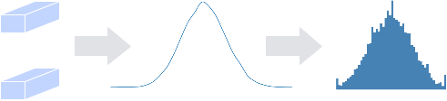
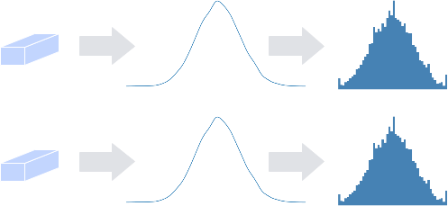
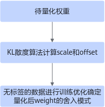
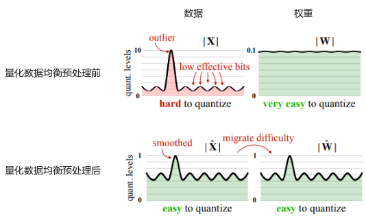
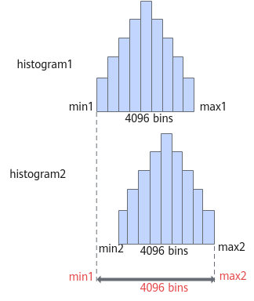
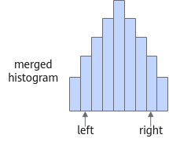
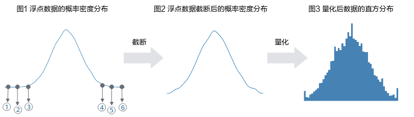
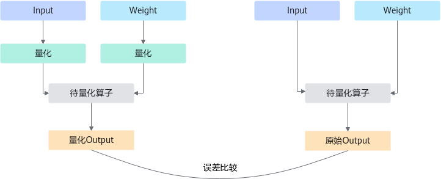
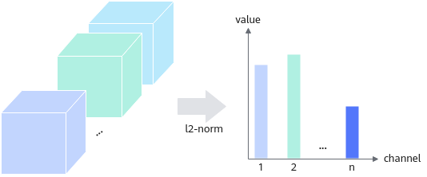
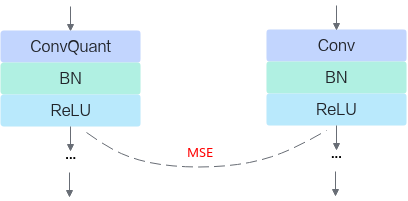

# 算法介绍

## 仅权重量化算法

### ARQ

ARQ （Adaptive Range Quantization）算法是对权重直接量化的算法。该算法提供了两种方式，channel\_wise（是否对每个channel采用不同的量化因子，参数解释请参见[训练后量化配置参数](./context/训练后量化配置参数.md)量化和非channel\_wise量化，量化原理图如下所示：

**图 1**  非channel\_wise量化<a name="fig7600113961719"></a>  


**图 2**  channel\_wise量化<a name="fig6351104815177"></a>  


量化配置中ARQuantize（以PyTorch框架为例，参数解释请参见[表1](训练后量化简易配置文件.md#zh-cn_topic_0240188735_table1225503375617)）提供的参数channel\_wise用来选择量化方式：

- channel\_wise为False时，选择[图1](#fig7600113961719)量化方式，所有filter一起分析数据分布，进行量化，某一层的所有不同channel共用一个量化因子。
- channel\_wise为True时，选择[图2](#fig6351104815177)的量化方式，每个filter独立做数据分析，进行量化，同一层的每个channel有独立的量化因子。

一般来说，每一个filter独立进行量化，即进行[图2](#fig6351104815177)的量化，量化精度较高；如果每个filter的数据量比较少，量化效果会比较差，此时推荐使用[图1](#fig7600113961719)的量化。

注意：全连接层、平均下采样层Pooling（下采样方式为AVE，且非global pooling）没有channel，设置channel\_wise为True时，会提示错误信息。

### ADA

在对神经网络进行量化时，主要方法是将每个浮点权重分配给其最接近的定点值。但这不是最佳的量化策略。本文引入的AdaRound\(Adaptive Rounding\)，**一种用于训练后量化的更好的权重舍入机制，它可以适应数据和任务损失，**并且仅需要少量未标记的数据。

ADA权重量化算法用于PTQ流程，由于量化后的权重舍入模式会影响模型精度，ADA主要是对舍入模式进行微调，针对每个量化数据自适应向上或向下舍入模式，需要未标记的数据进行训练调优以确定不同的舍入模式。整体流程如下图所示，先将权重用KL散度算法计算weight初始量化因子scale和offset，然后使用无标签的数据进行训练，调整weight的舍入模式。

**图 1**  ADA权重量化算法<a name="fig432315576612"></a>  


量化后的weight计算公式如下：

，其中n和p分别是量化后的上下界。

训练过程主要是对alpha参数进行优化，目标是使得h\(alpha\)等于0或1：


，其中和是伸缩参数，分别取值为1.1和-0.1。

将原始weight量化，量化完成后加上h\(alpha\)将其反量化，将反量化的weight引入最后的算子计算中，最终输出带量化误差的结果：


损失函数计算如下：


正则项（Loss函数的后半部分），用以约束h\(alpha\)向0和1两个值收敛，在迭代初期较大值可以使得正则项对整体损失的影响比重变大，就会促使优化过程快速调整h\(alpha\)，接近最优解的区域。迭代后期，此时h\(alpha\)已经处于最优解区域，使用较小，不会因为微小的参数变动导致正则项剧烈变化，从而让模型在微调参数时更加稳健，避免因过度调整而错过最优解，使h\(alpha\)逼近最优解。


### AWQ

AWQ（Activation-aware Weight Quantization，感知激活权重量化）是一种针对大模型的训练后量化（Post-Training Quantization，简称PTQ）方法，通过感知激活的权重量化策略，在保持模型精度的同时显著降低内存占用并提升推理速度。该算法认为并非所有权重对量化误差的敏感度都相同，仅保护约1%的显著权重即可大幅减少误差。使用少量校准数据，采用网格搜索在预设范围内寻找最优缩放因子，对显著权重进行放大后再量化，通过缩小量化间隔降低误差。

算法详细介绍请参见[Link](https://arxiv.org/abs/2306.00978)。

### GPTQ

GPTQ（Generative Pre-trained Transformer Quantization）是一种针对大模型的仅权重训练后量化（PTQ）方法，核心思路是逐层贪心量化，通过数学优化最小化量化误差。针对每个量化算子，根据激活值计算海森矩阵，分块将权重进行微调，最小化量化误差，最终输出调整后的权重以及量化因子。

算法详细介绍请参见[Link](https://arxiv.org/abs/2210.17323)。


## 全量化算法


### DMQ均衡算法

该算法用于训练后量化场景。

DMQ（Diagonal Matrix Quantization Balancer）在计算量化因子之前对数据进行均衡处理，将数据的量化难度转移一部分至权重。如下图所示，X为数据，W为权重。



均衡原理为：

1. 针对待量化算子的输入数据的每个通道，计算出均衡因子。

2. 将数据除以均衡因子，同时权重乘以均衡因子，使得待量化算子的计算结果在均衡前后是数学等价的。

### HFMG数据量化算法

该算法用于训练后量化场景。

HFMG（Histogram Feature Map Glutton）算法通过直方图的方式来记录激活数据的数据分布，通过搜索的方式确定最佳的量化截断位置。量化原理如下所示：

1. 第一步根据输入激活数据创建直方图。
2. 若有更多batch的数据则对每个batch的数据创建一个直方图，然后进行直方图合并的操作，如[图1](#fig1126323519407)所示。
3. 基于激活数据的直方图根据搜索的方式确定数据的截断点，如[图2](#fig1419882412)所示。

该量化算法的数据放在内存中，和[IFMR数据量化算法](#IFMR数据量化算法)相比，更节省内存。该算法与IFMR数据量化算法同一层不能同时配置。

create\_quant\_config接口量化默认使用的为IFMR数据量化算法，如果想使用HFMG数据量化算法，则只能通过create\_quant\_config接口config\_defination参数配置简易配置文件方式实现。

**图 1**  直方图合并过程<a name="fig1126323519407"></a>  


**图 2**  搜索得到最优的左右截断位置<a name="fig1419882412"></a>  


如果未获得最优的量化效果，则可以改变直方图的bin个数（直方图中的一个最小单位直方图形），选择量化误差更小的一组参数作为最终的量化结果。HFMG算法中，num\_of\_bins配置参数用来调整直方图的bin的数目，参数说明请参见**训练后量化简易配置文件\>HFMGQuantize**的配置参数。通常情况下，num\_of\_bins数值越大，直方图拟合原始数据分布的能力越强，可能获得更佳的量化效果，但训练后量化过程的耗时也会更长。


### IFMR数据量化算法

IFMR（Input Feature Map Reconstruction）算法在某个数据分布下，通过搜索的方式确定最佳量化方式。该算法用于训练后量化场景，量化原理图如下所示：

**图 1**  IFMR数据量化算法<a name="fig11850413154412"></a>  


上图中序号\[1,3\]代表\[clip\_min\_start, clip\_min\_end\]、2代表clip\_min、 \[4,6\]代表\[clip\_max\_start, clip\_max\_end\]、5代表clip\_max。

该算法中量化过程分为两步，如[图1](#fig11850413154412)所示，第一步，将浮点数截断到\[clip\_min, clip\_max\]范围，即[图1](#fig11850413154412)中的\[2,5\]点；第二步，将浮点数据量化到int范围。通常情况下，数据分布处于边界附近的数值比较稀疏，均可做截断处理，以提高量化精度。

为获得最佳量化效果，可以不断改变截断范围\[clip\_min, clip\_max\]，选择量化效果最好的一组范围作为最终的量化结果。IFMR算法中，clip\_min和clip\_max用来设置搜索范围和搜索步长，遍历查询得到最优的量化效果。量化配置中FMRQuantize（以PyTorch框架为例，参数解释请参见[表1](训练后量化简易配置文件.md#zh-cn_topic_0240188735_table1225503375617)）提供的参数则用来调整截断范围。

- clip\_min（即[图1](#fig11850413154412)中的序号2）的遍历取值范围为\[clip\_min\_start, clip\_min\_end\] （即[图1](#fig11850413154412)中的\[1,3\]），步长为search\_step。
- clip\_max（即[图1](#fig11850413154412)中的序号5）的遍历取值范围为\[clip\_max\_start, clip\_max\_end\] （即[图1](#fig11850413154412)中的\[4,6\]），步长为search\_step。

在数据降序序列中，根据min\_percentile参数获得clip\_min\_init，从而得到clip\_min\_start、clip\_min\_end参数，其中：

- clip\_min\_start =clip\_min\_init\*search\_range\_start
- clip\_min\_end= clip\_min\_init\* search\_range\_end

在数据升序序列中，根据max\_percentile参数获得clip\_max\_init，从而得到clip\_max\_start、clip\_max\_end参数，其中：

- clip\_max\_start =clip\_max\_init\*search\_range\_start
- clip\_max\_end=clip\_max\_init\* search\_range\_end

通常情况下，搜索范围\[clip\_min\_start, clip\_min\_end\]越大、搜索步长search\_step越小，可能获得更高的量化精度，但量化耗时更多。


### MIN-MAX

该算法是统计数据（activation）和权重（weight）中数据的最大值最小值，根据最大值和最小值，将数据缩放到量化位宽的边界值范围，然后根据量化公式计算出对应的缩放因子scale与偏移值offset。

在初始化时，根据权重量化颗粒度（比如PER_TENSOR）离线计算weight的最大值和最小值，离线计算得到scale_w/offset_w，添加到record对象中。前向传播时，获取当前batch的最大最小值，并刷新全局最大最小值。获取weight和activation的min/max值后，根据下面公式，计算scale和offset（对于weight，只支持对称场景，offset为0）。

- 对称量化场景

  ```
  if abs(max) > abs(min):
      scale = abs(max)/(2^(quant_bit-1)-1)
  else:
      scale = abs(max)/(2^(quant_bit-1))
      
  offset = 0
  ```

- 非对称量化场景

  ```
  scale=(max-min)/(2^quant_bit-1)
    
  offset=-2^(quant_bit-1)-min/scale
  ```


### OFMR

OFMR（Output FeatureMap Reconstruct）算法在某个数据分布下，通过搜索的方式确定最佳量化因子。该算法用于训练后量化，量化原理图如下所示：

1. 推理原始模型，获取待量化模型的原始输出。
2. 遍历所有候选量化因子，推理模型，获取量化后的输出。
3. 比较量化输出与原始输出的误差，选取误差最小的量化因子。

**图 1**  OFMR算法原理<a name="fig1393075517419"></a>  


### SmoothQuant

SmoothQuant是一种同时确保准确率且推理高效的训练后量化 (PTQ) 方法，由于权重很容易量化，而激活则较难量化，SmoothQuant通过引入平滑系数来平滑激活异常值，通过数学上等效的变换将量化难度从激活转移到权重上。一般来说，激活异常值越多，迁移强度越大。

算法详细介绍请参见[Link](https://arxiv.org/abs/2211.10438)。

### ULQ数据量化算法

该算法用于量化感知训练场景。

ULQ（Universal Linear Quantization）算法在训练过程中不断训练量化因子，以减少量化损失。该算法初始化时会对数值做量化（包含截断），对初始化敏感。量化配置中ULQuantize（以PyTorch框架为例，参数解释请参见[量感知训练简易配置文件](./context/量化感知训练简易配置文件.md)来控制ULQ算法。

- clip\_max\_min为初始化的截断范围，clip\_min为截断下限，clip\_max为截断上限，可根据数据的范围来设置，不设置则使用AMCT自带的默认方式初始化。
- fixed\_min表示在训练过程中，是否将截断下限设置为0。例如，当量化层的前一层是ReLU层，则数据范围为\[0, +inf\]，此场景下数据量化可以设置fixed\_min为true，表示截断下限始终为0。


## 稀疏算法

### 自动通道稀疏搜索算法

自动通道稀疏搜索默认采用的搜索算法为贪婪搜索算法，在给定模型计算量约束下，自动选择每一层可删除的、较为合适的通道（价值排序靠后的通道），降低通道稀疏对模型经过Fine-tune精度损失的影响。

该问题为组合优化问题，建模为背包问题，已知所有物品各自的价值v<sub>i</sub>和重量F<sub>i</sub>，求背包容量C下能够装下总价值最多的物品，可以用公式表示为：

最大化：

受限于：

其中，v<sub>i</sub>相当于稀疏敏感度；F<sub>i</sub>为比特复杂度；b为通道稀疏方案，即该通道是否保留；C为用户设置的压缩率。

对于通道稀疏任务，重量F<sub>i</sub>为第i个通道的计算量，v<sub>i</sub>为裁剪第i个通道后网络w的损失函数变化：


其中，loss\(w - w<sub>i</sub>\)可以通过一阶或者二阶泰勒展开式来做近似估计。

根据用户给定的目标稀疏率，计算每一层每一通道的价值密度（稀疏敏感度/比特复杂度），全局排序后挑选出价值密度最低的一批通道进行裁剪，通过上述的组合优化方法完成求解，达成搜索任务。

### 手工通道稀疏算法

AMCT使用的通道稀疏算法为BalancedL2Norm，该算法通过计算权重各个filter（输出维度通道）的L2范数（各元素的平方和然后求平方根），对输出通道进行重要性排序并裁剪重要性较低的通道，即重要性低的通道优先被稀疏，原理下图所示：

**图 1**  通道稀疏算法原理<a name="fig856211635614"></a>  


稀疏配置文件中通过BalancedL2NormFilterPruner字段（以PyTorch框架为例，参数解释请参见[量化感知训练简易配置文件](./context/量化感知训练简易配置文件.md)）来控制BalancedL2Norm算法。

- prune\_ratio：稀疏率，是被稀疏的filter数量与filter总数量的比值，稀疏化的程度由稀疏率控制，例如0.3的稀疏率表示30%的输出通道将被裁剪。
- ascend\_optimized：昇腾亲和优化，当前使用的为16对齐的优化方案，开启16对齐后，稀疏后保留的通道数将向16的倍数对齐。例如原始通道有20个，配置稀疏率为0.25并不开启16对齐时，稀疏后保留通道数为15；若相同稀疏率但开启16对齐，则稀疏后保留通道数为16；该配置可以提高稀疏后的模型在AI处理器上的推理性能。

###  4选2结构化稀疏算法

AMCT使用的4选2结构化稀疏算法为L1SelectivePrune，通过比较权重的l1值即绝对值来决定保留哪些权重，每4个连续的权重中保留l1值最大的2个权重。

稀疏配置文件中通过L1SelectivePruner字段（参数解释请参见[量化感知训练简易配置文件](./context/量化感知训练简易配置文件.md)）来控制L1SelectivePrune算法。

- update\_freq：更新4选2稀疏的间隔，计算哪些元素被保留的间隔。在重训练的过程中，权重会随着每个训练batch发生改变，对应的l1值排序可能会变化，比如本来保留的是4个元素中的前两个元素，更新之后可能变成第1，第3个元素保留。

  update\_freq=0时表示训练时仅在第一个batch计算哪些元素被保留，update\_freq=2时，表示训练时每2个batch计算哪些元素被保留，以此类推。默认为0。

- n\_out\_of\_m\_type：目前仅支持M4N2，即每4个连续权重中保留2个权重。

## 蒸馏算法

蒸馏量化的思想是将量化模型作为学生模型，原始模型作为教师模型，通过引导量化模型“模仿”浮点模型从而获得更好的精度结果。蒸馏量化，仅需要少量无标签数据集，即可以在较短的量化时间内达到较好的精度结果。

量化蒸馏的步骤：

1. 量化原始模型，得到结构与浮点模型相同的量化模型。

2. 将若干级联的量化层划分为一个蒸馏单元。

3. 以浮点蒸馏模块的输出作为soft label，对量化蒸馏模块进行fine-tune。

4. 完成所有的模块蒸馏，得到精度更优的量化模型。

   **图 1**  蒸馏示意图<a name="fig275521214542"></a>  
   


