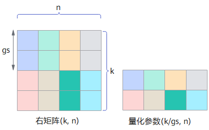

# 量化相关概念

## 量化

量化是指对模型的权重（weight）和激活（activation）进行低比特处理，让最终生成的网络模型更加轻量化，从而达到节省网络模型存储空间、降低传输时延、提高计算效率，达到性能提升与优化的目标。

AMCT将量化和模型转换分开，实现对模型中可量化算子的独立量化，并输出量化后的部署模型。该模型可以在昇腾AI处理器上运行，达到提升推理性能的目的。

## 权重（weight）量化

权重量化是指根据权重的数值分布情况，将权重处理到低比特。

## 激活（activation）量化

激活量化又称为数据量化，是指根据数据的数值分布情况，将输入的数据（activation）处理到低比特。每一层的数据分布是未知且巨大的，只能在前向过程（推理或者训练）中确定，因此数据量化是基于推理或者训练过程的。

## 量化类型

根据量化后低比特类型大小分为常见的int8、int4量化等。

- int8量化：使用8比特的int8数据来表示比如32比特的float32数据，将float32的卷积运算过程（乘加运算）转换为int8的卷积运算，加速运算和实现模型压缩。
- int4量化：使用4比特的int4数据来表示比如32比特的float32数据。相较于int8量化，int4量化可以实现更优的量化效果，但可能带来更大的精度损失。

## 校准数据集

量化场景中，做前向推理使用的数据集。该数据集的分布代表着所有数据集的分布，获取校准集时应该具有代表性，推荐使用测试集的子集作为校准数据集。如果数据集不是模型匹配的数据集或者代表性不够，则根据校准集计算得到的量化因子，在全数据集上表现较差，量化损失大，量化后精度低。

## 量化因子

将浮点数量化为整数的参数，包括缩放因子（scale），偏移量（offset）。将浮点数量化为整数（以INT8为例）的公式如下：
$$
int\_val=clip(round(float\_val/scale+offset),-128,127)
$$

- scale：量化因子，浮点数的缩放因子，该参数又分为：
  - scale_d：数据量化scale因子，仅支持对数据进行统一量化。
  - scale_w：权重量化scale因子，支持标量（对当前层的权重进行统一量化）、向量两种模式。
- offset：量化因子，偏移量，该参数又分为：
  - offset_d：数据量化offset因子，仅支持对数据进行统一量化。
  - offset_w：权重量化offset因子，同scale_w一样支持标量和向量两种模式，且需要同scale_w维度一致。

## 量化粒度

是指对神经网络中Matmul等矩阵类算子的不同输入Tensor采用不同的量化计算级别，常见的量化计算粒度包括：

>说明：
>
>- m、n、k变量分别表示Tensor计算的不同轴大小。
>- 左矩阵、右矩阵分别指cube算子中用于矩阵乘法计算的两个输入Tensor，一般左矩阵代表激活activation、右矩阵代表权重weight，请用户按实际情况理解和使用。

### per-channel量化

简称C量化，量化对象是右矩阵，每个channel分别使用独立的量化参数。假设右矩阵shape为(k, n)，k为reduce轴，生成量化参数的shape为(n, )。

### per-group量化

简称G量化，量化对象既可以是左矩阵，也可以是右矩阵（AMCT仅支持右矩阵），在reduce轴上对数据分组，每组使用独立的量化参数。

假设右矩阵shape为(k, n)，k为reduce轴，在k轴上分组，group size为gs，生成量化参数的shape为(k/gs, n)。

### per-tensor量化

简称T量化，量化对象既可以是左矩阵，也可以是右矩阵，每个Tensor共用一个相同的量化参数。

假设左矩阵shape为(m, k)，右矩阵shape为(k, n)，k为reduce轴，生成量化参数的shape为(1, )。

### per-token量化

简称K量化，量化对象是左矩阵，每个token分别使用独立的量化参数。

假设左矩阵shape为(m, k)，k为reduce轴，生成量化参数的shape为(m, )。

