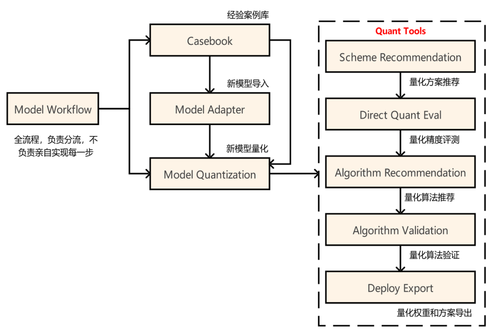
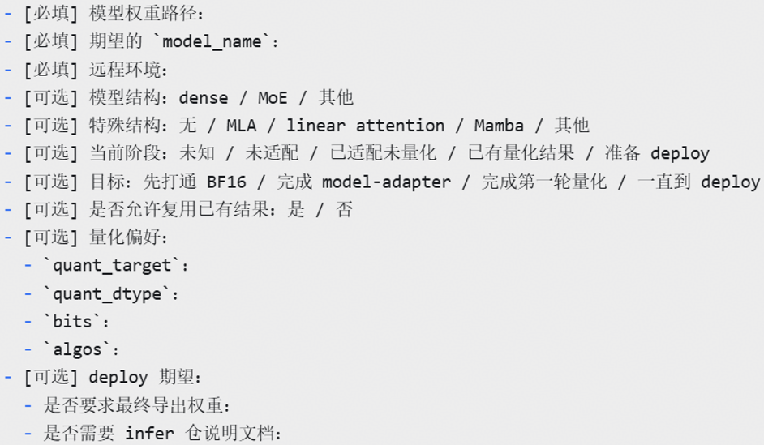

# AMCT Low-Precision Quantization Agent Quantization Practice

AMCT provides an end-to-end workflow for the Ascend platform, covering model onboarding, quantization scheme selection, quantization experiments, accuracy validation, and deployment weight export. Through its Agent workflow, AMCT can recommend schemes based on the existing Casebook, invoke quantization tools to run experiments, and preserve schemes and process data as reusable assets.

## 1. Background and Objectives

Converting original model weights into quantized weights that can be deployed directly on Ascend typically involves model structure analysis, quantization algorithm selection, accuracy evaluation, weight format conversion, and deployment adaptation. Traditional workflows rely heavily on manual experience, making iteration expensive and successful solutions difficult to reuse.

The AMCT Agent aims to orchestrate this process as a traceable automated workflow:

> Model onboarding -> Capability checks -> Scheme recommendation -> Automated quantization -> Accuracy validation -> Weight export -> Experience capture

## 2. Agent Workflow and Module Architecture



### 2.1 Model Adapter

The Model Adapter handles onboarding of new models, including:

- Model registration and structural adaptation;
- BF16 baseline testing;
- Floating-point equivalence testing with quantization disabled;
- Minimal PTQ smoke testing.

Its responsibility is to confirm that the model runs reliably through the quantization pipeline and to establish a trustworthy baseline for subsequent accuracy comparisons.

### 2.2 Model Quantization

Model Quantization coordinates the quantization stage, including:

- **Quantization scheme recommendation**: Recommending feasible schemes from the Casebook or accepting a user-specified scheme;
- **Direct-conversion quantization evaluation**: Quickly converting and evaluating the model based on an existing scheme;
- **Quantization algorithm recommendation and validation**: Recommending candidate algorithms and validating them automatically;
- **Quantized weight export**: Generating deployment weights and scheme documentation.

### 2.3 Casebook and Quant Tools

The Casebook stores historical models, quantization configurations, experiment traces, and evaluation results, providing searchable experience for the Agent. Quant Tools execute quantization experiments, algorithms, accuracy evaluations, and deployment-format exports. Together, they close the loop from decision-making to execution and continuously accumulate reusable knowledge for future tasks.

## 3. End-to-End Workflow

### 3.1 Identify the Use Case

Clarify the original weights, target Ascend hardware, target quantization format, and deployment runtime. Confirm that the final deliverables are loadable quantized weights and their scheme documentation.

### 3.2 Select a Scheme

Check whether the model is already adapted, whether reference schemes are available, and whether the target operators and quantization formats are supported. The Agent can recommend a scheme from the Casebook or accept a user-specified configuration.

### 3.3 Quantization and Validation

Use Quant Tools to run quantization experiments, compare results with the BF16 baseline, and analyze accuracy changes. For abnormal results, preserve configurations and traces to facilitate troubleshooting and repeatable experiments.

### 3.4 Delivery and Knowledge Capture

Export deployment weights, quantization configurations, and scheme documentation. Update validated schemes and their process data in the Casebook to create reusable assets for subsequent model adaptation.

## 4. DSV4.1-Flash-HiFloat8 Practice

This practice validates the complete path from AMCT offline quantization to vLLM-ascend deployment and evaluation.

```text
Official weights (block-wise FP8)
          ↓
AMCT offline quantization (HiFloat8)
          ↓
HiFloat8 weights written to disk
          ↓
vLLM-ascend loading and deployment
          ↓
AisBench accuracy evaluation
```

### 4.1 Weight Conversion and Persistence

During offline conversion, weight files are read one by one. Only weights requiring quantization are converted; the remaining weights are written back unchanged. The core logic covers model conversion, HiFloat8 quantization, configuration conversion, and end-to-end self-testing. The workflow can be automated through the following input template based on the AMCT Agent workflow.



### 4.2 Deployment Adaptation

Based on the official vLLM version, HiFloat8 data is passed through using the uint8 data format. With the adaptation patch applied, vLLM-ascend can load the converted offline weights for inference deployment.

### 4.3 Accuracy Results

| Dataset | BF16 | HiFloat8 | Change |
|---|---:|---:|---:|
| LiveCodeBench v5 (pass@1) | 67.07 | 67.37 | +0.30 |
| LongBench-v2 | 47.51 | 47.32 | -0.19 |
| MATH-500 | 96.80 | 97.20 | +0.40 |
| CMMLU (acc) | 90.11 | 89.83 | -0.28 |
| MMLU-Pro (acc) | 83.98 | 84.25 | +0.27 |
| HumanEval+ (pass@1) | 91.46 | 91.46 | 0.00 |
| GPQA-Diamond | 76.77 | 76.77 | 0.00 |

The results show that HiFloat8 is generally close to BF16, with metric changes within a reasonable range. This validates the quantization, weight-loading, and evaluation pipeline. HiFloat8 also provides a high-accuracy, low-bit-width option for efficient large-model deployment on Ascend while preserving model capability.

## 5. Workflow Advantages

### Ease of Use

Model adaptation, quantization, algorithm optimization, and deployment export are integrated into one workflow, lowering the barrier to entry for developers.

### Context Efficiency

Repo-Map focuses on key anchor files. When introducing a new model or algorithm, the Agent does not need to scan the entire codebase, reducing context consumption while retaining an understanding of the overall tool framework.

### Reusability

Schemes, traces, and results are captured in the Casebook, allowing one successful experiment to support subsequent models and tasks.

### Verifiability

BF16 baselines, floating-point equivalence tests, PTQ smoke tests, and AisBench evaluations make the quantization results and deployment path verifiable and traceable.

## 6. Conclusion

The AMCT Agent transforms model quantization from fragmented manual operations into an understandable, executable, verifiable, and reusable automated workflow. This practice has completed the full path of AMCT offline quantization, HiFloat8 weight persistence, vLLM-ascend deployment, and AisBench evaluation, providing a practical approach to model compression and inference deployment on Ascend.
