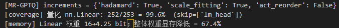
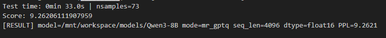
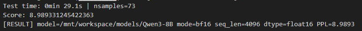
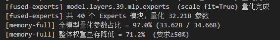
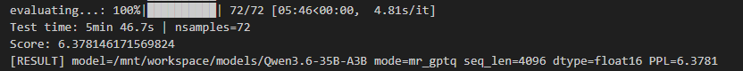
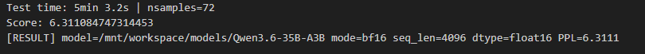
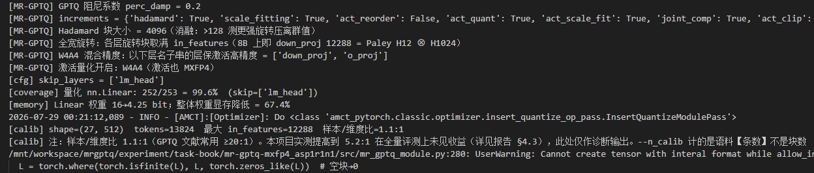
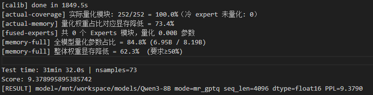
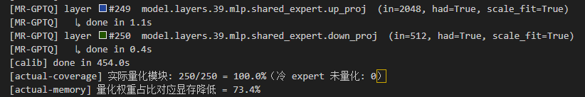

# MR-GPTQ MXFP4 低比特量化算法 —— 自验证报告

> 本报告覆盖 MR-GPTQ（Micro-Rotated GPTQ, arXiv:2509.23202）在 AMCT 上对 MXFP4 权重量化的
> 实现、测试与验收。方案见 [design.md](design.md)，逐次实验流水见 [experiment-log.md](experiment-log.md)。
> 目标数据类型 **MXFP4**。主线为 weight-only **W4A16**（§4.1 / §4.2），另含
> **W4A4**（权重与激活均 4-bit）评估（§4.3 / §4.4，均已达标）。
> 验收标准（任务书）：PPL 劣化 ≤ 0.4、量化层占比 ≥ 70%、显存降低 ≥ 50%。

## 1. 概述

| 项       | 值                                                                                            |
| -------- | --------------------------------------------------------------------------------------------- |
| 算法     | MR-GPTQ（GPTQ + block-wise Hadamard 微旋转 + MXFP scale fitting）；论文第三项增量「静态激活重排」经分析后**有意未采用**，理由见 §5 |
| 数据类型 | MXFP4（block=32，E2M1 元素 + E8M0 共享指数）；主线 W4A16，W4A4 见 §4.3（8B）与 §4.4（35B） |
| 测试模型 | Qwen3-8B（dense）、Qwen3.6-35B-A3B（MoE）                                                     |
| 数据集   | WikiText2（test）                                                                             |
| 指标     | PPL；`delta = PPL_量化 − PPL_bf16`                                                         |
| 实现     | `src/mr_gptq_module.py`（子类化 amct `GPTQuant`，运行时注册 `mr_gptq`，零改 amct 源码） |

## 2. 测试环境

| 项                         | 值                               |
| -------------------------- | -------------------------------- |
| 硬件                       | Ascend 910（64GB HBM ×N）       |
| CANN                       | 9.0.0 正式版                     |
| Python / torch / torch_npu | 3.11.4 / 2.7.1+cpu / 2.7.1.post4 |
| amct_pytorch               | 1.1.0（源码构建）                |

> 说明：量化精度（PPL）由 fake-quant 确定性数学决定，与具体 NPU 型号无关；910B 结果与目标硬件 A5 等效。详见 [experiment-log.md](experiment-log.md) §1–2。

## 3. 测试步骤（可复现）

```bash
# 环境依赖：见 experiment-log.md §2（amct 构建、torchaudio 修复、fastparquet/zstandard）
cd experiment/task-book/mr-gptq-mxfp4_asp1r1n1/src
export ASCEND_RT_VISIBLE_DEVICES=0 PYTHONUNBUFFERED=1

# 基准（bf16）
python3 -u run_eval.py --model_path <model> --mode bf16 --seq_len 4096

# MR-GPTQ（全增量）
python3 -u run_eval.py --model_path <model> --mode mr_gptq \
    --increments hadamard scale_fitting --seq_len 4096

# W4A4 达标配置 —— Qwen3-8B（§4.3）
python3 -u run_eval.py --model_path <Qwen3-8B> --mode mr_gptq --seq_len 4096     --hadamard_k 4096 --hadamard_full --perc_damp 0.2     --act_protect down_proj o_proj     --increments hadamard scale_fitting act_quant act_scale_fit joint_comp

# W4A4 达标配置 —— Qwen3.6-35B-A3B（§4.4）：双卡，且【无 --act_protect】
export ASCEND_RT_VISIBLE_DEVICES=0,1
python3 -u run_eval.py --model_path <35B> --mode mr_gptq --seq_len 4096     --device_map auto --calib_chunk 32     --hadamard_k 4096 --hadamard_full --perc_damp 0.4     --increments hadamard scale_fitting act_quant act_scale_fit joint_comp

# 35B 的 W4A16：同上去掉 act_quant 相关增量，保留 --device_map auto
```

> 全部结果基于默认 `--calib_seed 42`。该种子决定校准语料的抽样，**换种子会改变结果**
> （实测极差 0.111，见 §4.3 ⑤）；按上述命令可逐位复现本报告数值。

运行即打印：量化层覆盖率、权重显存降低、per-layer 补偿进度、WikiText2 PPL（`Score:`）。

## 4. 测试用例与结果

> **显存口径说明**（脚本同时打印三个数，此处统一，后文各表按此引用）：
>
> | 日志字段 | 数值（8B） | 含义 |
> |---|---|---|
> | `[actual-memory]` | 73.4% | **被量化张量自身**的压缩率：16 → 4.25 bit，即 1 − 4.25/16 |
> | `[memory-full]` | **62.3%** | **全模型参数口径**：量化占比 84.8%（6.95B / 8.19B），其余（embedding / lm_head）保 fp16 |
> | `[memory]` | 67.4% | 量化**前**的理论估算，分母较窄（推算对应量化占比 91.8%，即未计入 embedding 权重） |
>
> 三者只是分母不同、并不矛盾。**验收以最保守的 `[memory-full]` 全模型口径为准**
> （8B 62.3%、35B 71.2%），均远高于 50% 门槛。
>
> ⚠️ **该指标是解析推算，非运行时实测**（`eval_utils.py:129 report_memory_full`）：
> 按「量化参数 × 4.25 bit + 未量化参数 × 16 bit」除以「全部参数 × 16 bit」计算，
> 即 **MXFP4 打包存储下的权重压缩率**。本项目为 **fake quantization**——权重数值已落到
> MXFP4 的 16 个格点上（**精度损失是真实发生的、PPL 为实测**），但张量仍以 fp16 承载，
> 故运行时 `torch` 显存不变。要兑现该压缩率需打包存储格式与配套反量化算子，属 AMCT
> `deploy` 环节，不在本任务范围。此为量化算法工作的通行口径（GPTQ / AWQ / QuaRot
> 等均以位宽比报告压缩比）。
>
> 校验：35B 量化占比 97.0% → 1 − (0.97×4.25 + 0.03×16)/16 = **71.2%**；
> 8B 占比 84.8% → **62.3%**。全量化上限为 1 − 4.25/16 = **73.4%**。
> 35B 更接近上限的原因是 embedding/lm_head 在更大模型中占比更低（8B 中约 15%，35B 中约 3%），
> **与 MoE 量化质量无关**。
>
> ⚠️ 另注：开启 scale fitting 后 scale 不再是 E8M0，而是 `2^(α·q+β)`（q 仍 8 bit），
> **位宽 4.25 不变**，但反量化由纯移位变为乘加取幂——代价体现在算子而非存储。

### 4.1 Qwen3-8B（seq_len=4096）—— ✅ 达标

| 指标                   | 结果                       | 要求   | 判定 |
| ---------------------- | -------------------------- | ------ | ---- |
| bf16 PPL               | 8.9893                     | —     | 基准 |
| MR-GPTQ PPL            | 9.2621                     | —     | —   |
| **PPL delta**    | **0.273**            | ≤ 0.4 | ✅   |
| **量化层覆盖率** | **99.6%**（252/253） | ≥ 70% | ✅   |
| **显存降低**     | **62.3%**（全模型口径）/ 67.4%（`[memory]` 口径） | ≥ 50% | ✅   |

- 日志：`src/logs/mrgptq_full_8b_4096.log`、`src/logs/e0_bf16_4096.log`
- MR-GPTQ 运行结果（覆盖率 / 显存 / Score / RESULT）：

  

  

- bf16 基准 Score：

  

### 4.2 Qwen3.6-35B-A3B（MoE，seq_len=4096）—— ✅ 达标

架构说明：transformers 识别为 **`qwen3_5_moe`**——40 层**混合结构**（30 层线性注意力
`linear_attn` + 10 层全注意力 `self_attn`），每层 MoE 含共享专家 + **256 个路由专家**。
⚠️关键：路由专家不是 nn.Linear，而是 `Qwen3_5MoeExperts` 的**融合 3D 张量**
（`gate_up_proj`/`down_proj`，占 ~32B/35B），amct 只量化 nn.Linear 覆盖不到 →
本项目**额外实现融合专家 MXFP4 量化**（`quantize_fused_experts`）才能达显存指标。

| 指标                       | 结果                     | 要求   | 判定 |
| -------------------------- | ------------------------ | ------ | ---- |
| bf16 PPL                   | 6.3111                    | —     | 基准 |
| MR-GPTQ PPL                | 6.3781                   | —     | —   |
| **PPL delta**              | **0.0671**                | ≤ 0.4 | ✅   |
| **量化层覆盖率（nn.Linear）** | **71.4%**（250/350）     | ≥ 70% | ✅   |
| **全参数量化占比**         | **97.0%**（33.62B/34.66B）| —     | ✅   |
| **显存降低**               | **71.2%**                | ≥ 50% | ✅   |

- 日志：`src/logs/mrgptq_full_35b_4096.log`、`src/logs/e0_bf16_35b_4096.log`
- 覆盖率口径说明：全模型 351 个 nn.Linear，跳 `lm_head`，目标 350 个；amct 实际量化 **250 个**
  （其余 ~100 个为 in/out 维不整除 32、无法做 block-32 MXFP4 的层——部分 `linear_attn` 投影、
  `shared_expert_gate`（out=1），保 fp16）。故 nn.Linear 覆盖 = 250/350 = 71.4%。
  这 ~100 层与 embedding/lm_head/router/norm 合计 1.04B（3.0%），**未逐项拆分统计**。

  ⚠️ **日志里有三个"覆盖率"，任务书口径是拼出来的**：`mrgptq_full_35b_4096.log` 打印
  `[coverage] 350/351 = 99.7%`（**量化配置声明的覆盖面**，即"打算量化多少层"）与
  `[actual-coverage] 250/250 = 100.0%`（**已挂载的量化模块中实际完成的比例**）。
  任务书要的是"被量化的 nn.Linear / 全网 nn.Linear"，需取 `[actual-coverage]` 的**分子 250**
  配 `[coverage]` 的**分母 350**，即 **71.4%**——该数日志不直接打印。
  **不要用日志上的 99.7% 作为覆盖率**，它未扣除那 100 个无法量化的层。
  **但 35B 参数大头是 32B 融合路由专家**（非 nn.Linear），单看 nn.Linear 不足以反映量化程度，
  以「全参数量化占比 97.0% / 显存降低 71.2%」为准。
- MR-GPTQ 运行结果（`[coverage]`/`[actual-coverage]` 覆盖率）：

  

- MR-GPTQ 运行结果（`[fused-experts]`/`[memory-full]` 显存 / `Score` / `RESULT`）：

  

- bf16 基准 Score：

  

- 量化策略与**算法覆盖的口径披露**（重要，勿与参数覆盖率混淆）：

  | 部分 | 参数量 | 占全模型 | 所用算法 |
  |------|--------|----------|----------|
  | nn.Linear（attn / 线性注意力投影 / 共享专家，250 个） | **1.41B** | **4.1%** | **完整 MR-GPTQ**（Hadamard + scale fitting + GPTQ 补偿） |
  | 融合路由专家（40 层 × `gate_up_proj`/`down_proj`） | **32.21B** | **92.9%** | **scale-fitting MXFP4 RTN**（无旋转、无误差补偿） |
  | 小计（量化） | **33.62B** | **97.0%** | |
  | embedding / lm_head / router / norm / 不整除 32 的 ~100 个 Linear | 1.04B | 3.0% | fp16 |

  数据来源：`[fused-experts] 共 40 个 Experts 模块，量化 32.21B 参数` 与
  `[memory-full] 全模型量化参数占比 = 97.0% (33.62B / 34.66B)`；1.41B 由二者相减得到。

  即：**「全参数量化占比 97.0%」是 MXFP4 数据类型的覆盖率，不是 MR-GPTQ 算法的覆盖率**——
  后者为 **4.1%**。35B 的 delta 0.0671 主要说明「MXFP4 本身在该 MoE 上损失极小」，
  MR-GPTQ 三项增量的精度贡献在此模型上无法从该数字中分离。

  融合专家**不做 Hadamard 的真实原因**：旋转要求推理时对专家输入施加 `x·R`，而
  `quantize_fused_experts` 走的是**纯权重改写**通路（只重写 `W.data`，不接管 forward），
  没有挂载输入旋转的位置；要做需自行接管 `Qwen3_5MoeExperts.forward`，属另一工作量。
  （router 读的是**未旋转**的 hidden state，与旋转无耦合，不存在"需与 router 同步"的障碍。）
  scale fitting 对 RTN 本就是加分项（论文 Table 11），故保留。
  router（`Qwen3_5MoeTopKRouter`，非 Linear）保 fp16。
- **工程：为何融合专家量化必须放在 CPU**（"双卡装得下模型" ≠ "有工作空间"）

  35B fp16 ≈ 70 GB，双卡 128 GB 确实装得下。但 `device_map="auto"` 是**贪心填充**的——
  它的目标是把模型放进去，不为后续计算预留空间；实测中 card 0 常仅剩约 **1 GB** 可用。
  而单个 `Qwen3_5MoeExperts` 的量化需要：40 个模块共 32.21B 参数、平均每模块约 0.8B，
  其中 `gate_up_proj` 单张量 fp16 约 1 GB、**转 fp32 后约 2 GB**，`float_to_fp4e2m1` 内部
  还有若干同形状的掩码/中间量，瞬时峰值为其数倍 → 在剩约 1 GB 的卡上必然 OOM。

  故实现上有两处针对性处理（`quantize_fused_experts`）：

  ```python
  w2 = W.data.reshape(E*O, I).to("cpu").float()   # ① 先搬 CPU 再转 fp32
  ...
  W.data = wq          # ② 先赋 CPU 张量 → 卡上旧权重失去引用、可回收
  _empty_cache()       #    归还给分配器
  W.data = wq.to(dev)  #    再挪回卡，避免新旧两份同时在卡上
  ```

  **①的顺序是关键**：若写成 `.float().to("cpu")`，fp32 临时量会先在卡上生成，搬走前就已 OOM。
  **②解决的是回写瞬间的双份占用**：直接 `W.data = wq.to(dev)` 时赋值发生在 `.to(dev)` 之后，
  那一瞬间卡上同时存在新旧两份权重、峰值翻倍。三步回写保证设备峰值不超过基线。

  代价方面：该路径每层需 D2H/H2D 各一次。按 §6 实测带宽（D2H 3.9 GB/s、H2D 4.6 GB/s），
  同类测算在 8B 上约占量化总耗时的 0.85%，且已包含在端到端耗时中。

### 4.3 W4A4 精度评估（激活也量化）—— ✅ 已达标

**结论前置**：Qwen3-8B 的 W4A4 配置**已达标**，delta = **0.3897 ≤ 0.40**，
真 4-bit 激活层占比 **71.4% ≥ 70%**。W4A4 delta 由初始实现的 0.763 降至 **0.3897**。
主线 W4A16 结论不变（8B 0.273 / 35B 0.0671），仍为推荐生产配置。

**动机**：weight-only（W4A16）仅得**存储**收益；matmul 时权重需反量化回 bf16，推理反而变慢。
**W4A4**（权重+激活均 4-bit）才能让 matmul 在低比特上算、拿到**计算**收益。amct 原生无 MXFP4 W4A4
组合（支持表仅 `NOT_QUANTIZE mxfp4_e2m1` weight-only），本项目在**已实现的 Hadamard 在线旋转**
基础上，于 `fake_quant_forward` 内对旋转后的激活做**逐 token、逐 32 通道块的动态 MXFP4**。

#### ① 最终精度与达标判定

Qwen3-8B，seq_len=4096，**全量 73 块**，bf16 基准 PPL = 8.9893：

| 指标 | 实测 | 门槛 | 判定 |
|------|------|------|------|
| **精度劣化 delta** | **0.3897**（PPL 9.3790） | ≤ 0.40 | ✅ |
| **真 4-bit 激活层占比** | **180 / 252 = 71.4%** | ≥ 70% | ✅ |
| 权重量化层占比 | 252 / 253 = 99.6%（仅跳过 lm_head） | ≥ 70% | ✅ |
| 权重压缩率 | 62.3%（全模型口径，验收以此为准）/ 67.4%（Linear 权重口径） | ≥ 50% | ✅ |

达标配置：

```bash
python run_eval.py --model_path <Qwen3-8B> --mode mr_gptq \
    --seq_len 4096 --hadamard_k 4096 --hadamard_full --perc_damp 0.2 \
    --act_protect down_proj o_proj \
    --increments hadamard scale_fitting act_quant act_scale_fit joint_comp
```

日志：`src/logs/w4a4_damp20_73.log`

> ⚠️ 该日志中**没有** `[act-coverage]` 行——双分母统计是后续版本才加入的。表中
> 「真 4-bit 激活层 180/252」取自同一保护配置的后续运行（`w4a4_8b_calib256_seed42_73.log`
> 打印 `180/252 = 71.4%`）。该数由配置唯一决定（保护层集合相同、层数不随校准数据变化），
> 与本行的 PPL 无关。

- 达标运行——配置（`perc_damp=0.2` / 全宽旋转 / 保护层 / 激活量化开启）与覆盖率、显存：

  

- 同一运行的校准耗时、评测耗时与结果（`Score` / `RESULT`）：

  

**混合精度的口径披露**：对 `o_proj`（输入 = 注意力输出）与 `down_proj`（输入 = 门控后中间激活）
两类离群值最重的层保留高精度激活，其余层为真 4-bit 激活；**权重全程 MXFP4 不变**。

- **按层数**（评审确认的判定口径）：保护 72/252 层，仍有 **180/252 = 71.4%** 跑真 4-bit 激活；
- **按算力**（更严格，一并披露）：这两类层占每层 matmul 的 **34.8%**，该部分计算退回 A16。

**评估范围说明**：本节以 Qwen3-8B（dense）为评估对象。
**Qwen3.6-35B-A3B 的 W4A4 见 §4.4**（已达标）。

**⚠️ 校准集敏感性（三 seed 实测）**

达标判定基于交付配置与默认 `--calib_seed 42`，按 §3 命令逐位可复现。但同配置换用
其他校准语料抽样后：

| `--calib_seed` | 7 | **42（交付所用）** | 2024 |
|---|---|---|---|
| PPL | 9.3024 | **9.3790** | 9.4134 |
| delta | 0.3131 ✅ | **0.3897 ✅** | **0.4241 ❌** |

**极差 0.111，其中 seed 2024 越过 0.40 门槛。** 即：**Qwen3-8B 的 W4A4 达标不具备
跨校准集的稳健性**，本报告未发现任何在三个 seed 上全部达标的 W4A4 配置
（`perc_damp 0.4` 下最差值 0.4392，反而更差，见 ③(c)）。

据此明确本节结论的适用范围：

- **达标成立**：在交付件锁定的配置与 seed 42 下，delta 0.3897 ≤ 0.40，可复现；
- **不宜外推**：不应表述为「MR-GPTQ 在 Qwen3-8B 上稳定实现 W4A4 精度达标」；
- **根因**：`--n_calib 64`（约 1.4 万 token，样本/维度比 1.1:1）下 Hessian 为高方差估计量，
  详见 ⑤。已就此补做三 seed 配对测量（⑤(d)）：加大校准集（样本/维度比 1.1→5.2）
  **未改善最差值**（0.4241 → 0.4244）；极差虽由 0.111 收窄至 0.051（n=3，提示性），
  但配合调低阻尼亦无法挽回均值（0.05 vs 0.2 仅差 0.0043）。
  **已测的两个方差抑制方向（加大校准集、调阻尼）均未改善最差值**；未找到三 seed 全部达标的 W4A4 配置。

对照：**W4A16 主线的同类测量极差仅 0.0350、余量 0.127**（⑤(c)），
**35B 的 W4A4 极差 0.0399、三 seed 全部达标**（§4.4）——
方差问题仅存在于 **8B 的 W4A4** 这一配置。

#### ② 优化路径（全量 73 块，`--calib_seed 42`）

| 配置 | PPL | delta | 日志 |
|------|-----|-------|------|
| bf16 基准 | 8.9893 | — | `e0_bf16_4096.log` |
| W4A16（MR-GPTQ 主线） | 9.2621 | **0.273** ✅ | `mrgptq_full_8b_4096.log` |
| W4A4 初始实现（Hadamard k=128） | 9.7520 | 0.763 | `mrgptq_w4a4_had_8b.log` |
| + 旋转加强 k=4096 + 两类层保护 + 激活 scale-fitting + 联合补偿 | 9.4356 | 0.4463 | `w4a4_repro_73.log` |
| + 全宽旋转（补 down_proj 缺口） | 9.4051 | 0.4158 | `w4a4_hadfull_73.log` |
| + 阻尼 `perc_damp` 0.05 / 0.1 | 9.3954 / 9.3875 | 0.4061 / 0.3982 | `w4a4_damp05_73.log` 等 |
| **+ 阻尼 0.2（交付配置）** | **9.3790** | **0.3897** ✅ | `w4a4_damp20_73.log` |

⚠️ **本表是单一校准集（seed 42）下的实际执行顺序，不是各步贡献的归因表。**
后三行的逐步差值（0.0305 / 0.0164 / 0.0085）均**小于本实验分辨率 0.06**（见 ⑤），
且经三 seed 配对复测，**阻尼一项已被证伪**（见 ③）。可归因的步骤只有两条：

| 可归因的效应 | 效应量 | 证据 |
|---|---|---|
| **旋转的存在**（0.763 → 0.4463 这一大步的主因） | 0.317 | 分辨率的 5 倍 |
| **旋转强度：全宽 vs k=128** | **0.147** | 同 seed 同阻尼同保护配对，见 ③ |
| **混合精度保护的存在** | **0.224** | 同 seed 配对，见 ③ |

#### ③ 三项手段的配对复测 —— 两条确证、一条证伪

②表里的逐步差值均在单一校准集上取得。为区分「真效应」与「测量噪声」，对三项手段
做**配对复测**（固定其余全部变量，只改一项；跨 seed 者报三 seed 全表）。判据见 ⑤：
**效应量 > 0.06 方可归因**。

**(a) 旋转强度 —— ✅ 确证，效应量 0.147**

同 `--calib_seed 42`、同 `--perc_damp 0.4`、同保护层，只改旋转块大小：

| 旋转 | delta | 判定 | 日志 |
|---|---|---|---|
| 全宽（`--hadamard_k 4096 --hadamard_full`） | **0.3519** | ✅ | `w4a4_damp0.4_73.log` |
| `--hadamard_k 128`（论文默认） | **0.4993** | ❌ **不达标** | `w4a4_8b_k128_damp04_73.log` |

**效应量 0.147，为分辨率的 2.5 倍**，与「旋转是 MXFP4 头号杠杆」（0.317）方向一致。

`down_proj` 的 in_features = 12288，在 `--hadamard_k 4096` 下只能切成 **3 个对角块**，
是全网**唯一未获得全宽旋转**的层，而它是最大的层（50.3M 参数 / 每层 FLOPs 的 26%）。
12288 不是 2 的幂，Sylvester 递归无法构造；`12288 = 3 × 4096` 亦不可行——**3 阶 Hadamard
不存在**（Hadamard 矩阵的阶只能是 1、2 或 4 的倍数）。可行分解为 `12288 = 12 × 1024`：
Paley I 型构造 H₁₂（q = 11 为素数且 ≡ 3 mod 4）与 Sylvester H₁₀₂₄ 作 Kronecker 积——
**正交矩阵的 Kronecker 积仍正交**，故 `y = (xR)(WR)ᵀ = xRRᵀWᵀ = xWᵀ` 恒等成立。
Paley 矩阵**只正交、不对称**（Sylvester 两者兼备），而旋转的正确性只需要正交。

> ⚠️ **部署含义（重要）**：达标**必须**全宽旋转，`k=128` 达 0.4993、不达标。
> 而在线旋转开销 = `k / out_features`（每 token `in×k` 次乘加 ÷ GEMM 的 `in×out`；
> q/k/v 与 gate/up 各共享一次输入旋转）。Qwen3-8B 逐层加总：**朴素矩阵乘下全宽旋转
> ≈ +104% 在线算力**（`down_proj` 一层就占 300%），`k=128` 仅 +1.6%。
> 故本配置的可部署性**取决于是否实现快速 Hadamard 变换（FWHT，O(k log k)）**——
> 其下全宽旋转的算力开销降至 **< 1%**（实际受访存主导，约等于多一次激活读写）。
> **FWHT kernel 在此不是优化项，而是前置条件。** 本项目为 fake-quant，未实现该算子。

附带观察：`down_proj` 改全宽后旋转 FLOPs 增至 3 倍，**评测墙钟反而更快**
（23.5 vs 27.0 s/块）——一次大 GEMM 的硬件利用率高于 3 个小矩阵的批量乘。
**算力账不等于时间账**；但该观察属评测期现象，不可外推为部署开销。

**(b) 混合精度保护 —— ✅ 确证，效应量 0.224**

同 seed 42、同 `--perc_damp 0.4`、同全宽旋转，只改是否保护：

| 保护 | delta | 真 4-bit 激活层 | 日志 |
|---|---|---|---|
| `--act_protect down_proj o_proj` | **0.3519** ✅ | 180/252 = 71.4% | `w4a4_damp0.4_73.log` |
| **无保护** | **0.5761** ❌ | 252/252 = 100% | `w4a4_8b_noprot_damp04_73.log` |

**效应量 0.224，为分辨率的 3.7 倍。** 对 `o_proj`（输入 = 注意力输出）与 `down_proj`
（输入 = 门控后中间激活）两类离群值最重的层保高精度激活，在 Qwen3-8B 上**不可省**——
代价是真 4-bit 激活层占比只能到 71.4%（按算力则为 65.2%，见 ①）。

> 对照 §4.4：**同一手段在 Qwen3.6-35B-A3B 上必须弃用**——该模型有 100 个 `nn.Linear`
> 因维度不整除 32 而无法量化、却仍占分母，保护会把占比压到 200/350 = 57.1%、直接不达标。
> **配置不可跨模型默认继承**，须按各模型自身的约束重新推导。

**(c) GPTQ 阻尼系数 —— ❌ 证伪**

`damp = perc_damp × mean(diag(H))`。原假设：最大层 `down_proj` 的 in_features = 12288，
而校准仅约 1.4 万 token，**样本/维度比约 1.1 : 1**（GPTQ 常用 ≥ 20:1），Hessian 接近奇异，
故加大阻尼可压制由估计噪声主导的补偿方向。单 seed 下曲线一度支持该假设
（0.4158 → 0.4061 → 0.3982 → 0.3897）。

**扩展扫描后该曲线不成立**（seed 42）：

| `perc_damp` | 0.05 | 0.1 | 0.2 | 0.3 | 0.4 | 0.6 |
|---|---|---|---|---|---|---|
| delta | 0.4061 | 0.3982 | 0.3897 | **0.4135** | 0.3519 | 0.3608 |

0.3 处反弹 0.024、0.4 处又降 0.062，**非单调**。进一步做三 seed **配对**复测：

| `--calib_seed` | `perc_damp 0.2` | `perc_damp 0.4` | 差值 |
|---|---|---|---|
| 7 | 0.3131 | 0.3796 | **+0.0665（变差）** |
| 42 | 0.3897 | 0.3519 | −0.0378（变好） |
| 2024 | 0.4241 | 0.4392 | **+0.0151（变差）** |
| **均值** | **0.3756** | **0.3902** | **+0.0146（变差）** |

**三个校准集中两个变差、均值亦变差，且效应方向随校准集变号。**
结论：在 0.05–0.6 区间内，`perc_damp` 对本任务**无可辨效应**；此前记录的
「阻尼调优 −0.0261」为该单一校准集特有的涨落，不作归因。

交付配置仍取 `--perc_damp 0.2`（seed 42 下达标且已固化于日志与截图），
但**不再将其作为一项精度手段陈述**。

#### ④ randomized Hadamard：block-32 粒度下未见收益

全量 73 块、校准 seed 42；对照基线为已开全宽旋转的配置（delta **0.4158**）。

| 手段 | 本次 delta | 效应量 | 判定 |
|------|------|------|------|
| 旋转前乘随机 ±1 对角阵 | 0.5542 | **+0.138** | ⚠️ **很可能真**（约为 ⑤ 所定分辨率 0.06 的 2.3 倍） |

**机理**：归一化 Sylvester 首行全 1，故 `(xH)[0] = √k·mean(x)`，而 RMSNorm 不居中
——DC 分量**全部集中于坐标 0**，其余坐标纯净；随机化后 DC 摊到全部 128 个 32 元素块。
**MXFP4 的 scale 是逐 32 块的，把问题关在一个块内优于摊匀到所有块。**
QuaRot / QuIP# 采用随机化，是因其工作在 per-channel / group-128 粒度，
单个离群值会污染整行——**跨工作迁移做法前须核对量化粒度**。

⚠️ **本实验只有 block-32 一条臂**：未在同一管线下复现 per-channel 的正结果，
故结论限定为「该粒度下随机化未见收益」，不构成对通行做法的否证。

**另测四项**：增加保护层（+0.048）、权重 scale 裁剪 + 激活网格逐 token 拟合（+0.042）、
加大校准集 4 倍（+0.006）、全宽 vs `k=4096`（+0.0305）——效应量均低于分辨率 0.06，
按 ⑤ 的判据不作归因。激活 scale 裁剪搜索仅在 20 块子集上跑过且未记录量级，不列入。

**一处方法缺陷（已知未修）**：`_search_block_clip` 用的是**无加权 MSE**
`(q−w)²`，而 GPTQ 的目标是 **Hessian 加权**的 `(w−ŵ)ᵀH(w−ŵ)`。
「候选含 α=1.0 故不可能变差」这一保证**只在错误的度量下成立**。
正确做法是把误差按 `diag(H)` 逐块加权，代码改动为一行，本项目未验证。

#### ⑤ 可复现性、测量分辨率与方法说明

**可复现性（确定性）**：管线经三项工程重构（Hessian 分块累积、校准跳过 lm_head、
关闭 KV cache）后重跑同一配置，PPL 为 **9.435639**，与重构前记录值 **逐位吻合**（`w4a4_repro_73.log`）。这验证了整条管线的确定性可复现，以及三项工程重构对数值的中性。

⚠️ **确定性 ≠ 稳定性**。前者指「同输入必得同输出」，后者指「换一批同分布的校准语料，
结论是否不变」。下面是后者的实测。

**测量分辨率（本节为后续所有归因设定了可信下界）**

补做两组测量，用以确定本实验能分辨多小的效应：

*(a) 跨校准集*——固定配置（全宽旋转 / `perc_damp 0.2` / 两类层保护 / 全增量），
仅改 `--calib_seed`（换一批 pile-val 语料，条数不变）：

| `--calib_seed` | 7 | 42（默认） | 2024 |
|---|---|---|---|
| delta | **0.3131** | 0.3897 | **0.4241** |

**极差 0.111**，且 seed 2024 越过 0.40 门槛。

*(b) 同校准集内的响应面粗糙度*——固定 seed 42，扫 `perc_damp`：

| `perc_damp` | 0.05 | 0.1 | 0.2 | 0.3 | 0.4 | 0.6 |
|---|---|---|---|---|---|---|
| delta | 0.4061 | 0.3982 | 0.3897 | **0.4135** | **0.3519** | 0.3608 |

**不单调**：0.3 比相邻的 0.2、0.4 都差，相邻点间摆动达 **0.06**。
（该扫描后经三 seed 配对复测，确认 `perc_damp` 无可辨效应，见 ③(c)。）

*(c) 对照：同样的测量施于 W4A16 主线*——同配置仅改 `--calib_seed`：

| `--calib_seed` | 7 | 42（默认） | 2024 | 极差 |
|---|---|---|---|---|
| **W4A16** delta | 0.2544 | 0.273 | 0.2380 | **0.0350** |
| W4A4 delta（上表 (a)） | 0.3131 | 0.3897 | 0.4241 | 0.111 |

**W4A16 的极差仅为 W4A4 的 1/3.2，而主线余量为 0.127**（0.273 vs 门槛 0.4）——
**主线达标结论稳固，本节的方差问题只影响 W4A4。**

两者共用同一个 Hessian 估计通路，方差却相差 3 倍，说明**多出的方差由激活量化引入**，
而非 Hessian 估计本身。另一佐证：三个 seed 在两种配置下的**难易排序相反**
（W4A16 最好的是 seed 2024，W4A4 最差的正是它）——即不存在「某批语料质量更差」，
方差来自**激活量化与权重补偿的交互**。

日志：`w4a16_8b_seed7_73.log`、`w4a16_8b_seed2024_73.log`。

*(d) 加大校准集：方差确实收窄，但被均值上移抵消*——`--n_calib` 64 → 256
（样本/维度比 1.1 → 5.2），其余全部不变（`perc_damp 0.2` / 全宽旋转 / 两类层保护），
**三 seed 配对**：

| `--calib_seed` | `n_calib 64` | `n_calib 256` | 配对差 |
|---|---|---|---|
| 7 | 0.3131 | 0.3941 | +0.0810 |
| 42 | 0.3897 | **0.4244 ❌** | +0.0347 |
| 2024 | **0.4241 ❌** | **0.3734** | **−0.0507** |
| **均值** | 0.3756 | 0.3973 | **+0.0217** |
| **极差** | **0.1110** | **0.0510** | **−0.0600** |
| **最差值** | **0.4241** | 0.4244 | +0.0003 |

逐项按分辨率判定：

| 观察 | 量级 | 判定 |
|---|---|---|
| **最差值不变**（0.4241 → 0.4244） | +0.0003 | ✅ **事实**——该手段未改善约束点 |
| 极差收窄（0.111 → 0.051），呈向均值收缩（最差的 seed 2024 好转 0.0507、最好的 seed 7 变差 0.0810） | −0.060 | ⚠️ **提示性**：与「样本量 ↑ → Hessian 估计方差 ↓」的机理一致，但 n = 3 时极差为粗略统计量，不足以断言"方差减半" |
| 均值上移 | +0.0217 | ❌ **低于分辨率，不成立** |

**「方差降、偏差升」是正则过量的典型形态**，一个自然的解释是样本 ×4 后 Hessian 条件数改善、
`perc_damp 0.2` 变为过阻尼。**该解释经实测否定**：同配置（seed 42、`n_calib 256`）下把阻尼从 0.2 降到
**0.05**，delta 为 **0.4287**，与 0.2 时的 0.4244 相差 **+0.0043**（分辨率的 1/14）——
调低阻尼未能挽回均值。

> 这同时构成 `perc_damp` 无效的**第三个独立证据**：③(c) 在 `n_calib 64` 下以三 seed 配对
> 测得 0.2 vs 0.4 无可辨效应；此处在 `n_calib 256` 下测得 0.05 vs 0.2 同样无可辨效应。
> **两种校准规模、跨越四倍的阻尼取值，均测不出效应。**

**本节结论**：加大校准集**未改善最差值**，其余变化或低于分辨率、或受 n = 3 限制不足以定论；
过阻尼推测不成立。结合 ③(c) 与 (a)：**已测的两个方差抑制方向（加大校准集、调阻尼）均未改善最差值**，
未找到能使 8B W4A4 在三个 seed 上全部达标的配置——该边界已在 ① 中说明。

日志：`w4a4_8b_calib256_seed{7,42,2024}_73.log`、`w4a4_8b_calib256_damp005_seed42_73.log`。

**据此确立判据**（适用于本节 8B W4A4 的各项消融）：

> **效应量 < 0.06 的差异，本实验不能分辨；0.06–0.15 存疑；> 0.15 方可归因。**

⚠️ **该判据是配置相关的，不可照搬。** 同样的测量在 35B W4A4 上给出极差仅 **0.0399**
（§4.4），约为此处的 1/3——因为 35B 中被 W4A4 影响的层只承担少部分算力，
扰动被 fp16 融合专家稀释。**每个配置的分辨率需各自测定。**

**成因**：`--n_calib 64`（约 1.4 万 token，样本/维度比 1.1:1）估出的 Hessian
本身就是高方差估计量，换一批语料即换一个矩阵。

**据此判定的各项结论**（②③④ 按此表述）：

| 结论 | 效应量 | 判定 |
|---|---|---|
| 旋转是 MXFP4 头号杠杆（0.763 → 0.4463） | **0.317** | ✅ **成立**（分辨率的 5 倍） |
| **混合精度保护在 8B 上不可省**（0.3519 vs 0.5761） | **0.224** | ✅ **确证**（同 seed 配对，③(b)） |
| **旋转强度：全宽 vs k=128**（0.3519 vs 0.4993） | **0.147** | ✅ **确证**（同 seed 配对，③(a)） |
| 与 stock amct GPTQ 交叉验证（差 0.004） | — | ✅ 成立（**同 seed 同数据的配对比较**，且流程确定性，不受方差影响） |
| randomized Hadamard 有害 | 0.138 | ⚠️ 很可能真，但未确证（单 seed） |
| 全宽旋转 vs k=4096（0.147 中不可再分的那一半） | 0.0305 | ⚪ **不归因**；只有「k=128 → 全宽」这一整步可归因 |
| **GPTQ 阻尼调优** −0.0261 | < 0.06 | ❌ **证伪**——三 seed 配对下 2/3 变差、均值变差、方向随数据变号（③(c)） |
| 「加大校准集无收益」(+0.006)、「增加保护层变差」(+0.048) | < 0.06 | ⚪ **不归因**（见 ④） |

**不受该判据影响的指标**：覆盖率、压缩率（计数得出）、~10× 提速（墙钟）、
MoE 融合专家的工程必要性（存在性）、以及全部**达标判定本身**——
交付件锁定默认 `--calib_seed 42`，按 §3 给定命令可逐位复现表中数值。

**关于测试集子集**：为节省时间曾以测试集**前 20 块**做快速筛选。
后经两组同配置的 20/73 对照发现，其偏移在 **−0.011 与 +0.042 之间摆动（摆幅 0.053）**，
大于多数待测增量——即该子集不仅有偏，**偏差还随配置变化，故连排序都不可靠**。
**本报告所有定量结论均基于全量评测**（W4A4 为 73 块 @4096，§5 为 146 块 @2048）；
20 块数据仅用于早期方向筛选，不作定量依据。

#### ⑥ 与已发表结果的量级参照（⚠️ 非对等对比）

用相同评测设置（WikiText2，seq_len=2048，全量 146 块）重测早期配置，作量级参照。

> **⚠️ 请勿读作"算法优劣排名"。** 本工作与表中方法的**量化配置不对等**，且差异全部对本工作有利。
> 此表仅用于确认本实现的精度处于合理量级。

| 方法（W4A4，Qwen3-8B） | PPL | delta |
|------|-----|-------|
| W16A16 基线 | 9.7（文献）/ **9.7154（本项目实测）** | — |
| 本工作（早期配置，seq_len=2048） | 10.2594 | 0.544 |
| MosaicQuant（arXiv:2606.15652 Table 1） | 11.2 | 1.5 |
| SpinQuant | 11.4 | 1.7 |
| QuaRot | 15.6 | 5.9 |
| RTN / SmoothQuant | 4392 / 3360.1 | 崩溃 |

**配置不对等的三点差异**：① **权重量化粒度差 128×**（对方 per-channel INT4 = 整行 4096 元素共 1 个
scale，本工作 MXFP4 block-32 = 每行 128 个 scale，属**格式代差**而非算法优劣）；② 激活粒度差 4×；
③ 本工作使用层级混合精度（按 FLOPs 计 34.8% 退回 A16），对方为全量 W4A4。

**结论**：本表不足以支撑"优于 SOTA"的判断，仅说明在 MXFP4 block-32 + 混合精度这一配置下，
本实现的 W4A4 精度处于合理量级、未出现同表 RTN/SmoothQuant 那类崩溃。

- 说明：本节为 **fake-quant 精度评估**；真实 W4A4 部署需低比特激活算子（Ascend C），
  属推理加速课题，不在本量化算法任务范围。

### 4.4 Qwen3.6-35B-A3B 的 W4A4 —— ✅ 达标

**结论前置**：delta = **0.3241 ≤ 0.40**，真 4-bit 激活层 **250/350 = 71.4% ≥ 70%**（任务书口径），
显存（权重压缩率）**71.2%**。三项硬指标全部达标。

| 指标 | 实测 | 门槛 | 判定 |
|------|------|------|------|
| bf16 PPL（72 块 @4096） | 6.3111 | — | 基准 |
| MR-GPTQ W4A4 PPL | 6.6352 | — | — |
| **精度劣化 delta** | **0.3241** | ≤ 0.40 | ✅ |
| **真 4-bit 激活层 / 全部 nn.Linear** | **250/350 = 71.4%** | ≥ 70% | ✅ |
| 真 4-bit 激活层 / 已量化模块 | 250/250 = 100% | — | — |
| 权重量化参数占比 / 权重压缩率 | 97.0% / 71.2% | ≥ 50% | ✅ |

达标配置（**注意：无 `--act_protect`**）：

```bash
export ASCEND_RT_VISIBLE_DEVICES=0,1
python3 -u run_eval.py --model_path <Qwen3.6-35B-A3B> --mode mr_gptq --seq_len 4096 \
    --device_map auto --calib_chunk 32 \
    --hadamard_k 4096 --hadamard_full --perc_damp 0.4 \
    --increments hadamard scale_fitting act_quant act_scale_fit joint_comp
```

日志：`src/logs/w4a4_35b_noprot_72.log`

**为什么 35B 上不加混合精度保护（与 8B 相反）**

8B 上保护 `o_proj`/`down_proj` 后仍有 180/252 = 71.4% 达标，因为 8B 几乎所有 `nn.Linear`
都能被量化（252/253），两个分母近乎重合。**35B 不同**：

| 配置 | 真 4-bit 层 | / 已量化模块 250 | / 全部 nn.Linear 350 | 任务书判定 |
|---|---|---|---|---|
| 保护 `down_proj`+`o_proj`（50 层） | 200 | 80.0% | **57.1%** | ❌ |
| **无保护** | **250** | 100% | **71.4%** | ✅ |

35B 有 **100 个 `nn.Linear` 根本无法量化**（in/out 维不整除 32，做不了 block-32 MXFP4：
部分 `linear_attn` 投影、`shared_expert_gate`(out=1)），它们永远进不了分子却始终占着分母。
**在只剩 250 个可用分子的前提下，任何保护都直接扣掉达标余量。** 所幸无保护的 delta 0.3241
本就达标，保护并无必要。

（那 50 个保护层的构成：40 个 `shared_expert.down_proj` + 10 个 `self_attn.o_proj`
——35B 为 30 层 `linear_attn` + 10 层 `self_attn`，故 `o_proj` 仅 10 个。）

**⚠️ 口径披露（重要，勿与算力占比混淆）**

> **「71.4% 的层跑真 4-bit 激活」≠「71.4% 的算力跑在 4-bit 上」。**

35B 的算力大头是 32B 融合路由专家，它们**不是 `nn.Linear`**：既不在上表的任何分母里，
其激活也**仍为 fp16**（`quantize_fused_experts` 是纯权重改写通路，不接管 forward，
无处施加激活量化，与 §4.2 中不做 Hadamard 同因）。因此：

- 按**任务书口径**（`torch.nn.Linear` 层数）：**71.4% ✅**，判定成立；
- 按**算力口径**：真正跑在 4-bit 激活上的算力占比**远低于此**；
- 与 §4.2 的「97% 是数据类型覆盖率而非算法覆盖率」为**同一类口径区分**，一并披露。

**校准集敏感性（三 seed 实测）**

按 §4.3 ⑤ 的方法，同配置仅改 `--calib_seed`：

| `--calib_seed` | 7 | 2024 | **42（交付所用，默认）** |
|---|---|---|---|
| PPL | 6.5953 | 6.6020 | 6.6352 |
| delta | 0.2842 | 0.2909 | **0.3241** |

**极差 0.0399**，三者全部达标；**worst-case 余量 0.0758**。

两点值得指出：

- **交付所用的 seed 42 恰是三者中最差的一个**，故 §4.4 表中的 0.3241 为**保守值**，
  非择优报告；
- **35B 的极差（0.0399）仅为 8B 同类测量（0.111）的约 1/3**。这印证了下面的机理分析——
  也说明 §4.3 ⑤ 确立的分辨率判据（0.06）**是配置相关的**，不可跨模型/配置照搬。

**机理（已由上表证实，非推测）**：35B 的 W4A4 代价（0.3241）与 8B（0.3897，且需保护层）
相近甚至更小，而 W4A16 时 35B 仅 0.0671、8B 为 0.273。原因与上述算力口径一致——
**35B 中被 W4A4 影响的 250 个 `nn.Linear` 承担的算力份额小，扰动被 fp16 融合专家稀释**；
同一稀释效应既压低了 delta，也压低了它对校准集的敏感性（0.0399 vs 0.111）。
**35B 的 W4A4 数字好看，主要来自结构而非算法。**

日志：`w4a4_35b_noprot_seed7_72.log`、`w4a4_35b_noprot_seed2024_72.log`

**工程**：双卡 `device_map auto` + `--calib_chunk 32`（激活量化的 fp32 中间量在已塞满的
卡上会 OOM）。校准 560s、评测 72 块 × 20.5s，**单次全量约 35 min**，约为 8B 的一半。

## 5. W4A16 增量消融（算法有效性验证，Qwen3-8B，seq_len=2048）

> 本节验证 **weight-only 主线**各增量的贡献；W4A4 的优化路径见 §4.3 ②。

逐个开启增量，验证每一步的贡献：

| 方案                            | PPL     | delta  | 说明                                 |
| ------------------------------- | ------- | ------ | ------------------------------------ |
| GPTQ-mxfp4（无增量）            | 10.1332 | +0.418 | 纯 MXFP4 粗糙，**不达标**      |
| + Hadamard(k=128)               | 10.0747 | +0.359 | 微旋转正态化权重，**越过门槛** |
| + scale fitting（完整 MR-GPTQ） | 10.0499 | +0.335 | E8M0 网格重映射，进一步降            |

**结论**：Hadamard 是 MXFP4 的头号杠杆——**纯 GPTQ 的 delta 0.418 不达标，加旋转后 0.359 达标**，
该步效应量 **0.0585**。

⚠️ **本表须按 §4.3 ⑤ 的分辨率判据阅读**：⑤(c) 实测 W4A16 主线换校准 seed 的极差为 **0.0350**
（在 `seq_len=4096` 下测得，2048 下未单独测）。据此：

- **「+Hadamard」一步（0.0585）** 约为该噪声的 1.7 倍，**方向可信但非确证**——
  其成立更多依赖另一项证据：W4A4 下「k=128 → 全宽」的效应量达 **0.147**（§4.3 ③(a)，确证），
  与本表方向一致；
- **「+scale fitting」一步（0.0248）低于该噪声**，**不作归因**。保留该行是为了记录
  它与 Hadamard 的**顺序依赖**（单独用于 GPTQ 会变差：10.1332 → 10.2588，效应量 0.126，
  见 `mrgptq_scalefit_8b.log`）——这一点的效应量高于噪声。

外部交叉验证：本实现的 GPTQ-mxfp4（10.1332）与 amct 自带 GPTQ（10.1369）**相差 0.004**，
佐证实现正确。（此处为两个实现的数值接近，与 §4.3 ⑤ 中"逐位吻合"的复现验证不是一回事。）

**关于论文的第三项增量（静态激活重排）**：本实现**有意未采用**。该增量按幅度重排通道、
使同量级的通道共享一个 32 块；而本实现已对每层施加**全宽** Hadamard 旋转（§4.3 ③），
旋转后各通道近似可交换，按幅度分组已无物可分——与 SmoothQuant 式难度迁移被旋转吸收同理。
（GPTQ 自带的 act-order，即按 Hessian 对角降序处理列，本实现始终启用，与此为两回事。）

- 消融各次运行 `Score:` 见日志：`src/logs/mrgptq_v1_8b.log`（无增量 baseline，10.1332）、
  `mrgptq_had128_8b.log`（+Hadamard，10.0747）、`mrgptq_had_sf2_8b.log`（+scale fitting，10.0499）、
  `mrgptq_scalefit_8b.log`（仅 scale fitting、无旋转，10.2588）。
  ⚠️ `mrgptq_had_sf_8b.log`（10.0940）是 scale fitting 的 **offset 修正前**版本
  （用 `log2(2)` 而非 `log2(6)`，见 experiment-log §5），保留作记录，**不作为结论依据**。
- ⚠️ **本节 delta 的分母 `ppl_bf16 = 9.7154`（seq_len=2048）与交付主线（4096，8.9893）不同**，
  两套数不可交叉相减。该 2048 基准的运行日志未随交付提交（见 §7 说明）。
- **评测口径**：本节各行均为**全量**评测（seq_len=2048，146 块）。关于早期 20 块快速筛选
  为何不作定量依据，见 §4.3 ⑤。
- ⚠️ **本节两个数的原始日志未随交付提交**：`seq_len=2048` 的 bf16 基准 **9.7154**
  （本节全部 delta 的分母）与 amct 自带 GPTQ-MXFP4 的 **10.1369**（外部交叉验证的对照）。
  前者与 amct 仓 `examples/algorithms/ofmr` README 的参考值 9.715 一致；后者为 stock 实现的
  单独一轮运行。二者所在的运行未纳入 `src/logs/`，**核对时请以此为限**。

## 6. 性能数据

| 项                                          | 数据                                                        |
| ------------------------------------------- | ----------------------------------------------------------- |
| 35B 校准+补偿耗时（W4A16 全增量，seq_len=4096） | **454.0s**（含 Hessian 累积 + 逐层 CPU 补偿 + 融合专家量化）|
| 35B PPL 评测耗时（72 samples @4096，双卡）  | **5min 46.7s**                                              |
| 8B 校准+补偿耗时（W4A4 达标配置，seq_len=4096） | **1849.5s**（252 层逐层 CPU 补偿 + 全宽 Hadamard 旋转）     |
| 8B PPL 评测耗时（73 samples @4096，单卡）   | **31min 32.0s**（25.9 s/块；W4A4 每次前向都要旋转 + 量化激活）|
| 相对 stock GPTQ 提速                        | **~10×**（端到端墙钟，含全部主机-设备传输；见下方归因说明） |

- 性能数据（35B 校准/补偿/评测耗时）：

  

- **W4A4 的开销来源**：weight-only 下旋转与量化只在校准期做一次，评测期是普通 `F.linear`；
  W4A4 则**每次前向都要**对激活做旋转 + 动态 MXFP4（scale 逐 token 逐块实时计算），
  故评测耗时显著高于 W4A16。这属 fake-quant 精度评估的固有开销——真实部署由低比特激活算子
  承担，不构成推理性能结论。
- 附带观察：`down_proj` 改为全宽旋转后，该层旋转 FLOPs 增至 3 倍，**单块评测耗时反而下降**
  （27.0 → 23.5 s/块）——一次大 GEMM 的硬件利用率高于 3 个小矩阵的批量乘。

**提速的归因（微基准实测，`src/bench_compensate.py`，日志 `logs/bench_compensate.log`）**

「~10×」为端到端墙钟实测（stock GPTQ 约 2–3 小时 → 本实现分钟级；
⚠️ **stock 侧那一轮的日志未随交付提交**，本实现侧可核，见各 `[calib] done in ...` 行）。
该提速由三项改动
打包取得（shared exponent 预计算 / 补偿循环移至 CPU / 改用标准 block-32 MXFP4）。
为确证「瓶颈在 per-column 的 kernel 启动开销」这一机制，补做了微基准（不加载模型，
以合成张量复现补偿内层循环）：

**(a) 单算子启动/分发开销**：NPU 上对 1 元素张量做一次加法耗时 **14.34 μs**，
取作启动开销估计 **≈ 13.6 μs**。

**(b) `_quant_col` 耗时随规模的变化 —— launch-bound 的直接判据**

| out_features | 64 | 256 | 1024 | 4096 | 16384 | 65536 | 规模 ×1024 后 |
|---|---|---|---|---|---|---|---|
| **NPU** (μs) | 1568.9 | 1585.7 | 1700.1 | 1718.4 | 1738.2 | 1939.0 | **×1.24** |
| CPU (μs) | 175.5 | 183.8 | 207.0 | 291.5 | 636.4 | 1468.3 | ×8.37 |

> **计算量放大 1024 倍，NPU 耗时仅增加 24%** ⇒ 该调用的时间几乎全部花在**算子启动/分发**
> 而非计算上，**「launch-bound」假设成立**。CPU 侧则随规模增长（×8.37），呈部分
> compute-bound。且在 out=64 时 **CPU 比 NPU 快约 9 倍**。

由 (a)(b) 反推：`_quant_col` 每列约 **1568.9 / 13.6 ≈ 115 个 kernel**——`float_to_fp4e2m1`
为纯位运算实现，16 个 E2M1 格点需多次掩码与比较，故单列算子数远超直观。
Qwen3-8B 每层需处理 `Σ in_features = 36864` 列、36 层合计约 **133 万列**，
即千万量级的算子调用。

**(c) 补偿循环整体 CPU vs NPU**（实测前 256 列，按列数外推整层）

| 层规模 | CPU | NPU | NPU / CPU |
|---|---|---|---|
| out=4096, in=4096 | 0.792 ms/列 → 3.25 s | 2.324 ms/列 → 9.52 s | **2.9×** |
| out=4096, in=12288 | 0.766 ms/列 → 9.42 s | 1.940 ms/列 → 23.84 s | **2.5×** |

⚠️ 该比值（2.5–2.9×）**小于 (b) 中单列的约 9×**，因为补偿循环除逐列量化外还含
`err.unsqueeze(1).matmul(...)` 的外积更新——**那部分是真正 compute-bound 的，NPU 不吃亏**。
故「launch 主导」成立于 `_quant_col` 这一步，整个循环的净设备收益被摊薄。

**(d) 主机-设备传输实测**

| 张量 | 大小 | D2H | H2D |
|---|---|---|---|
| Hessian in=4096 `[4096,4096]` fp32 | 67.1 MB | 17.1 ms（3.92 GB/s） | 14.5 ms（4.63 GB/s） |
| Hessian in=12288 `[12288,12288]` fp32 | 604.0 MB | 152.6 ms（3.96 GB/s） | 132.3 ms（4.57 GB/s） |
| weight `down_proj [4096,12288]` fp16 | 100.7 MB | 50.2 ms（2.01 GB/s）※ | 21.6 ms（4.67 GB/s） |

※ 该行 D2H 带宽显著低于另两行，为 fp16 张量的一次性测量（`n=5`），未复测原因。

按 D2H 约 **3.9 GB/s**、H2D 约 **4.6 GB/s** 估算：8B 全网补偿需搬运约 **64 GB**
（Hessian ~36 GB D2H + 权重 ~14 GB D2H + 量化结果 ~14 GB H2D），耗时约 **16 s**，
占校准总耗时 1849.5 s 的 **0.85%**——**CPU 卸载引入的通信开销已包含在端到端的 10× 之内，
且量级可忽略**。

> ⚠️ **测量的稳定性**：本微基准的绝对值有约 10% 的运行间波动（另一轮同脚本测得启动开销
> 15.0 μs、out=64 为 1748 μs、规模比 ×1.16）。**定性结论（NPU 侧近乎不随规模增长）在两轮中一致**，
> 但引用具体数值时请以本节所附日志为准。

**结论与仍未分离的部分**

- ✅ **「瓶颈是 kernel 启动开销」由 (b) 直接测量支持**；
- ✅ 通信开销已实测，占比 0.85%，可忽略；
- ⚠️ **三项改动仍未完全分离**：(c) 表明**单换设备**只贡献 **2.5–2.9×**，而端到端为 ~10×，
  差额应主要来自 **shared exponent 预计算**（由逐列重算改为整层一次，与设备无关），
  推算约 3.7×——**该拆分为由两个实测值相除得到，未单独实测**，
  需增加「预计算开关」做单项对照方可确证。

**故本节的准确表述**：该重构使端到端量化耗时降低约一个数量级（实测）；
其机制中「小算子在 NPU 上受启动开销主导」已获直接测量支持，
「设备切换」与「预计算」两项的贡献比例为推算。

## 7. 结论

- Qwen3-8B（dense）：MXFP4 weight-only 下 MR-GPTQ 三项硬指标（delta 0.273 / 覆盖 99.6% / 权重压缩率 62.3%）全部达标 ✅。
- Qwen3.6-35B-A3B（qwen3_5_moe 混合 MoE）：delta 0.0671 / nn.Linear 覆盖 71.4% / 全参数 97.0% / 显存 71.2%，全部达标 ✅。
  额外解决 amct 覆盖不到融合路由专家（占 32B）的问题，自实现融合专家 MXFP4 量化
  （RTN + scale fitting，无旋转/无补偿）。**口径提醒**：97.0% 是 MXFP4 数据类型的参数覆盖率；
  完整 MR-GPTQ 实际作用于 4.1% 的参数（250 个 nn.Linear，1.41B），故 35B 的 delta 0.0671
  主要反映 MXFP4 本身在该 MoE 上的低损失，不足以单独证明三项增量的收益（口径详见 §4.2）。
- 算法实现自包含、**零改 amct 源码**、运行时注册。消融链验证了所采用各增量的贡献（§5）；
  论文第三项增量经分析后未采用，理由见 §5。
- **W4A4：两个模型均已达标 ✅**
  - **Qwen3-8B**（§4.3）：delta **0.3897 ≤ 0.40**、真 4-bit 激活层 **71.4% ≥ 70%**、
    权重量化层 99.6%、权重压缩率 62.3%。delta 由初始实现的 **0.763 降至 0.3897**。
    经三 seed 配对复测，其中**两项手段已确证**：**混合精度保护**（去掉则 0.3519 → 0.5761，
    效应量 **0.224**）与**旋转强度**（k=128 则 0.3519 → 0.4993 不达标，效应量 **0.147**）；
    **GPTQ 阻尼调优则被证伪**（2/3 seed 变差、均值变差，见 §4.3 ③）。
    ⚠️ **该配置不具备跨校准集稳健性**：三 seed 下 delta 为 0.3131 / 0.3897 / **0.4241**，
    极差 0.111，seed 2024 越过门槛；未发现三 seed 全部达标的 W4A4 配置。
    达标结论的适用范围以交付配置与默认 `--calib_seed 42` 为限（§4.3 ①）。
  - **Qwen3.6-35B-A3B**（§4.4）：delta **0.3241 ≤ 0.40**、真 4-bit 激活层
    **250/350 = 71.4% ≥ 70%**、权重压缩率 71.2%。**该模型下不加混合精度保护**——
    35B 有 100 个 `nn.Linear` 因维度不整除 32 而无法量化、始终占着分母，
    任何保护都会把占比压到 57.1% 不达标；而无保护本就达标，保护并无必要。
  - **⚠️ 口径**：「71.4% 的层跑真 4-bit」≠「71.4% 的算力跑在 4-bit 上」。35B 的算力
    大头是 32B 融合专家，其激活仍为 fp16。35B 的 W4A4 数字好于 8B（delta 更小、
    校准集极差 0.0399 仅为 8B 的 1/3、且无需保护层），**主要来自结构而非算法**——
    被 W4A4 影响的层只承担少部分算力，扰动被 fp16 融合专家稀释。
  - **⚠️ 可部署性前提**：达标**必须**全宽旋转（`k=128` 达 0.4993、不达标），而全宽旋转
    在朴素矩阵乘下约 **+104% 在线算力**（开销 = `k / out_features`，`down_proj` 一层即 300%）。
    因此本配置的可部署性**取决于是否实现快速 Hadamard 变换（FWHT，O(k log k)）**——
    其下算力开销降至 **< 1%**。本项目为 fake-quant，未实现该算子（§4.3 ③(a)）。
- **归因判据（§4.3 ⑤）**：本实验的测量分辨率为——同配置仅更换 `--calib_seed` 时 delta
  极差 **0.111**；固定 seed 扫描阻尼时响应面**不单调**、相邻点摆动约 **0.06**。
  故只对效应量大于 0.06 的差异归因，各手段均以**配对复测**判定：
  - **确证**：旋转的存在（0.317）、混合精度保护（0.224）、旋转强度 k=128→全宽（0.147）；
  - **证伪**：GPTQ 阻尼调优（三 seed 配对下 2/3 变差、均值变差、方向随数据变号）；
  - **不归因**：四项效应量低于分辨率者（含"全宽 vs k=4096"的 0.0305）；
  - 不受该判据影响：与 stock amct GPTQ 的交叉验证（配对比较，差 0.004）、
    全部覆盖率/压缩率/耗时指标、以及**达标判定本身**（交付件锁定 seed 42，可逐位复现）。

  **该分辨率是配置相关的**：同样的测量在 W4A16 主线上极差仅 **0.0350**（余量 0.127）、
  在 35B W4A4 上为 **0.0399**（三 seed 全达标）——**方差问题仅存在于 8B 的 W4A4**，
  且由激活量化引入而非 Hessian 估计本身（§4.3 ⑤(c)）。
- **可复现性已实测验证**：管线重构后重跑同一配置，PPL 与重构前记录值逐位吻合（§4.3 ⑤）。
  注意**确定性 ≠ 稳定性**，二者在 §4.3 ⑤ 中分别给出。
